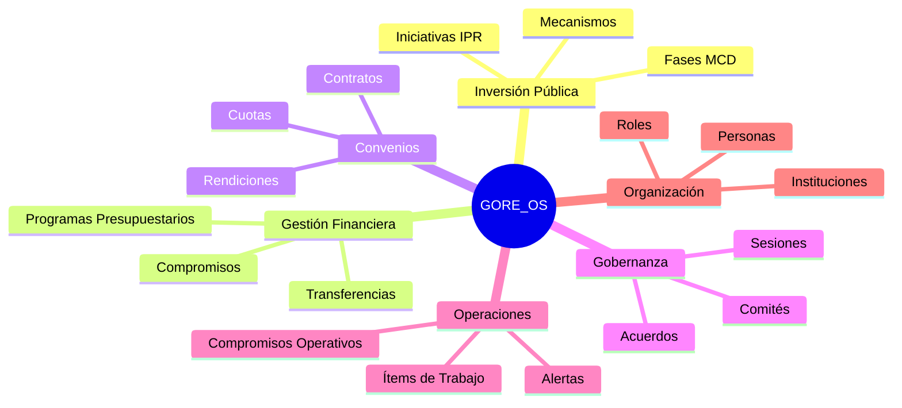
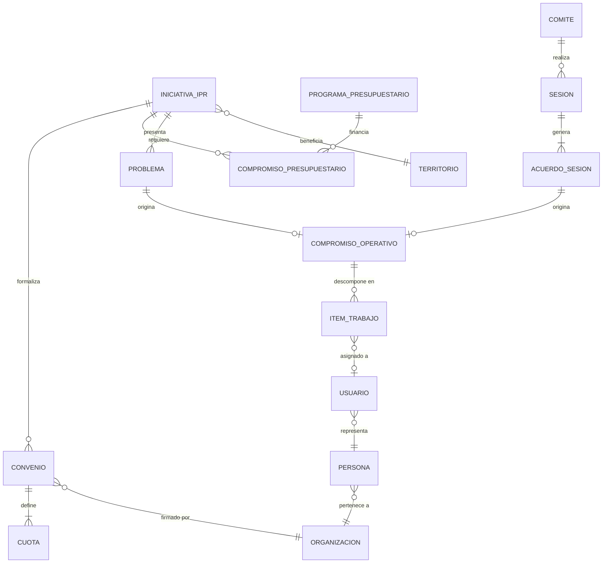
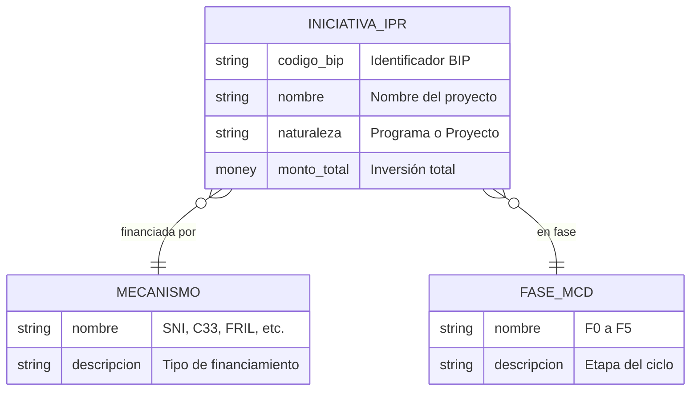
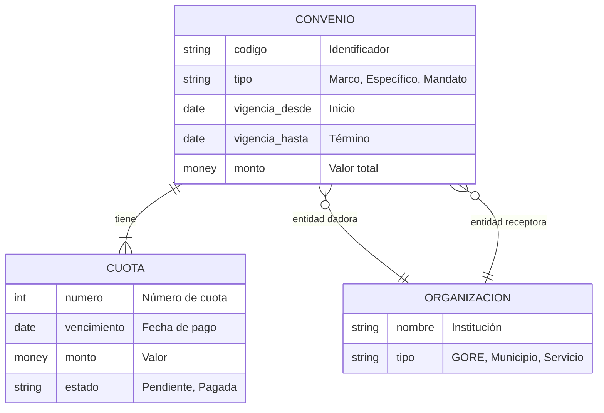
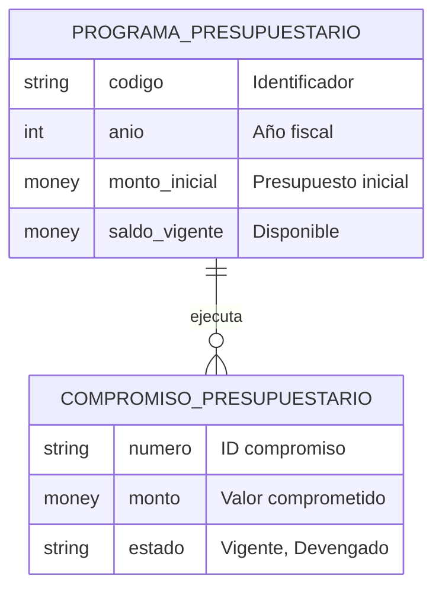
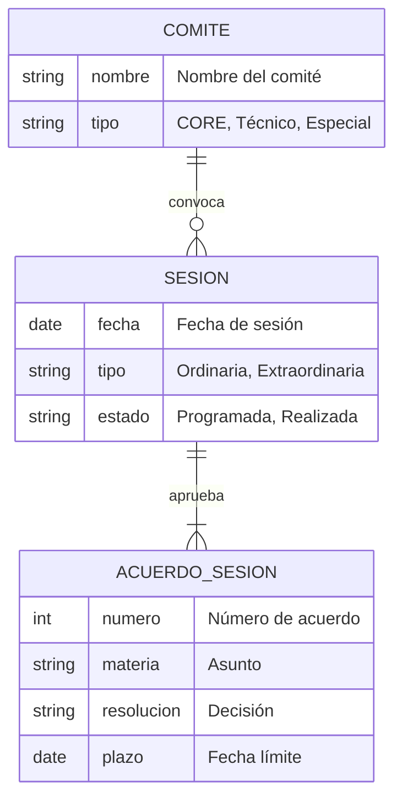
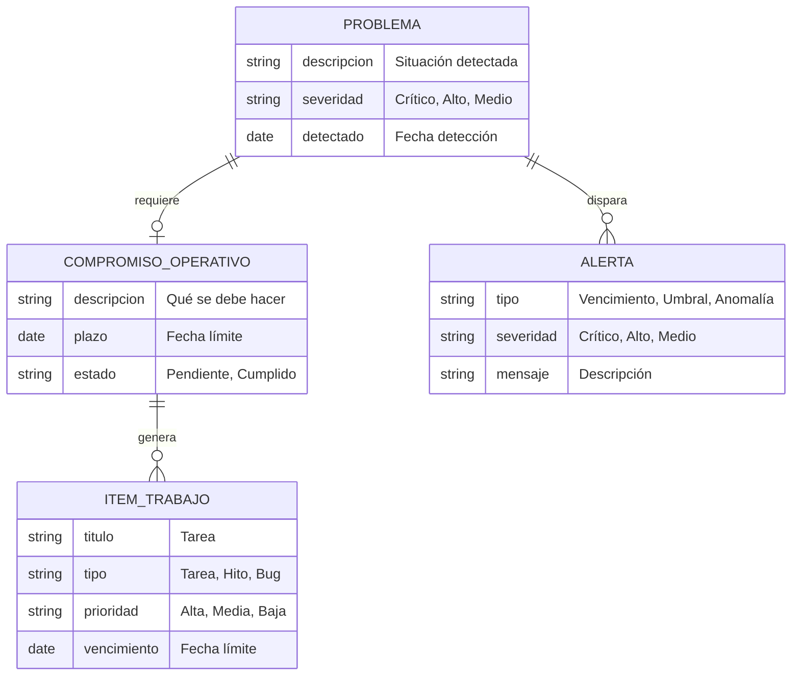
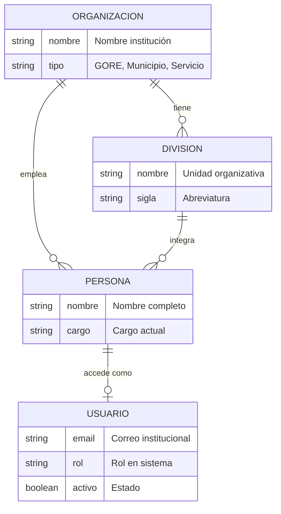
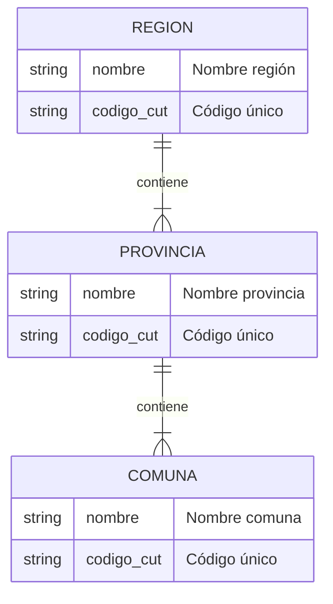

# Modelo Conceptual: GORE_OS v3.0

**Sistema**: Gestión Institucional para Gobiernos Regionales
**Nivel**: Conceptual (Business View)
**Fecha**: 2026-01-27
**Audiencia**: Stakeholders de negocio, analistas, gerentes

---

## Vista General del Dominio



---

## Modelo Conceptual Principal



---

## Dominios de Negocio

### 1. Inversión Pública Regional



**Conceptos clave:**
- **IPR**: Iniciativa de inversión pública regional
- **Mecanismo**: Fuente de financiamiento (SNI, C33, FRIL, FNDR, etc.)
- **Fase MCD**: Etapa en el ciclo de vida de inversión (F0-F5)

---

### 2. Gestión de Convenios



**Conceptos clave:**
- **Convenio**: Acuerdo legal entre instituciones
- **Cuota**: Calendario de transferencias
- **Dadora/Receptora**: Partes del convenio

---

### 3. Gestión Presupuestaria



**Conceptos clave:**
- **Programa**: Línea presupuestaria anual
- **Compromiso**: Reserva de recursos para una obligación

---

### 4. Gobernanza Regional



**Conceptos clave:**
- **Comité**: Órgano colegiado (CORE, comités técnicos)
- **Sesión**: Reunión formal con acta
- **Acuerdo**: Resolución vinculante

---

### 5. Gestión Operativa



**Conceptos clave:**
- **Compromiso operativo**: Obligación de acción
- **Ítem de trabajo**: Tarea ejecutable
- **Problema**: Situación que requiere atención
- **Alerta**: Notificación automática

---

### 6. Estructura Organizacional



**Conceptos clave:**
- **Organización**: Institución (GORE, municipios, servicios)
- **División**: Unidad interna
- **Persona**: Funcionario
- **Usuario**: Cuenta de acceso al sistema

---

### 7. Territorio



**Conceptos clave:**
- Jerarquía territorial estándar de Chile
- CUT: Código Único Territorial

---

## Flujos de Negocio Principales

### Ciclo de Vida IPR

```
┌─────────────┐     ┌─────────────┐     ┌─────────────┐
│   IDEA      │────▶│  DISEÑO     │────▶│  EJECUCIÓN  │
│   (F1-F2)   │     │   (F3-F4)   │     │   (F5-F7)   │
└─────────────┘     └─────────────┘     └─────────────┘
                                               │
                                               ▼
                                        ┌─────────────┐
                                        │  OPERACIÓN  │
                                        │    (F8)     │
                                        └─────────────┘
```

### Flujo de Convenio

```
┌─────────────┐     ┌─────────────┐     ┌─────────────┐
│  BORRADOR   │────▶│   FIRMADO   │────▶│  VIGENTE    │
└─────────────┘     └─────────────┘     └─────────────┘
                                               │
                          ┌────────────────────┼────────────────────┐
                          ▼                    ▼                    ▼
                   ┌─────────────┐     ┌─────────────┐     ┌─────────────┐
                   │  CUOTA 1    │     │  CUOTA 2    │     │  CUOTA N    │
                   │  Pagada     │     │  Pendiente  │     │  Pendiente  │
                   └─────────────┘     └─────────────┘     └─────────────┘
```

### Ciclo Problema → Resolución

```
┌─────────────┐     ┌─────────────┐     ┌─────────────┐     ┌─────────────┐
│  DETECTADO  │────▶│  ANALIZADO  │────▶│ COMPROMISO  │────▶│  RESUELTO   │
│  (Problema) │     │  (Evaluar)  │     │  (Acción)   │     │  (Cerrado)  │
└─────────────┘     └─────────────┘     └─────────────┘     └─────────────┘
       │
       ▼
┌─────────────┐
│   ALERTA    │
│ (Automática)│
└─────────────┘
```

---

## Relaciones Clave entre Dominios

| Desde | Hacia | Relación | Descripción |
|-------|-------|----------|-------------|
| IPR | Convenio | 1:N | Una IPR puede formalizarse en múltiples convenios |
| IPR | Compromiso Presupuestario | 1:N | Una IPR requiere múltiples compromisos de gasto |
| IPR | Territorio | N:1 | Una IPR beneficia a un territorio |
| Convenio | Organización | N:2 | Todo convenio tiene dadora y receptora |
| Sesión | Acuerdo | 1:N | Una sesión genera múltiples acuerdos |
| Acuerdo | Compromiso Operativo | 1:1 | Un acuerdo puede originar un compromiso |
| Problema | Compromiso Operativo | 1:1 | Un problema puede requerir un compromiso |
| Compromiso Operativo | Ítem de Trabajo | 1:N | Un compromiso se descompone en tareas |
| Usuario | Ítem de Trabajo | 1:N | Un usuario tiene múltiples tareas asignadas |

---

## Glosario de Términos

| Término | Definición |
|---------|------------|
| **IPR** | Iniciativa Pública Regional - proyecto o programa de inversión |
| **BIP** | Código del Banco Integrado de Proyectos |
| **MCD** | Metodología de Ciclo de Desarrollo (F0-F5) |
| **FNDR** | Fondo Nacional de Desarrollo Regional |
| **FRIL** | Fondo Regional de Iniciativa Local |
| **SNI** | Sistema Nacional de Inversiones |
| **C33** | Fondo sectorial artículo 33 |
| **CORE** | Consejo Regional |
| **CUT** | Código Único Territorial |
| **Dadora** | Organización que transfiere recursos |
| **Receptora** | Organización que recibe recursos |

---

## Notas para Stakeholders

### Decisiones de Negocio Reflejadas

1. **Centralización IPR**: Todas las iniciativas se gestionan con un modelo unificado
2. **Trazabilidad completa**: Todo cambio queda registrado (auditoría)
3. **Flexibilidad territorial**: Soporta cualquier nivel (región, provincia, comuna)
4. **Gobernanza formal**: Sesiones y acuerdos tienen peso legal

### Próximos Pasos Recomendados

1. Validar entidades con usuarios clave de cada dominio
2. Confirmar flujos de estado con áreas operativas
3. Revisar cardinalidades con casos reales

---

*Modelo Conceptual generado para GORE_OS v3.0*
