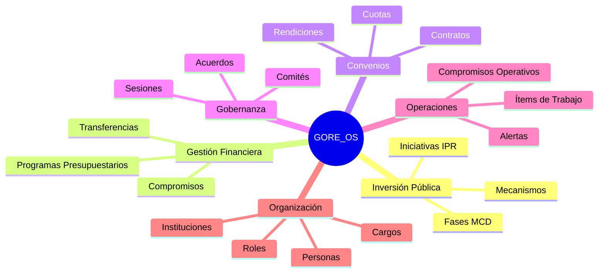
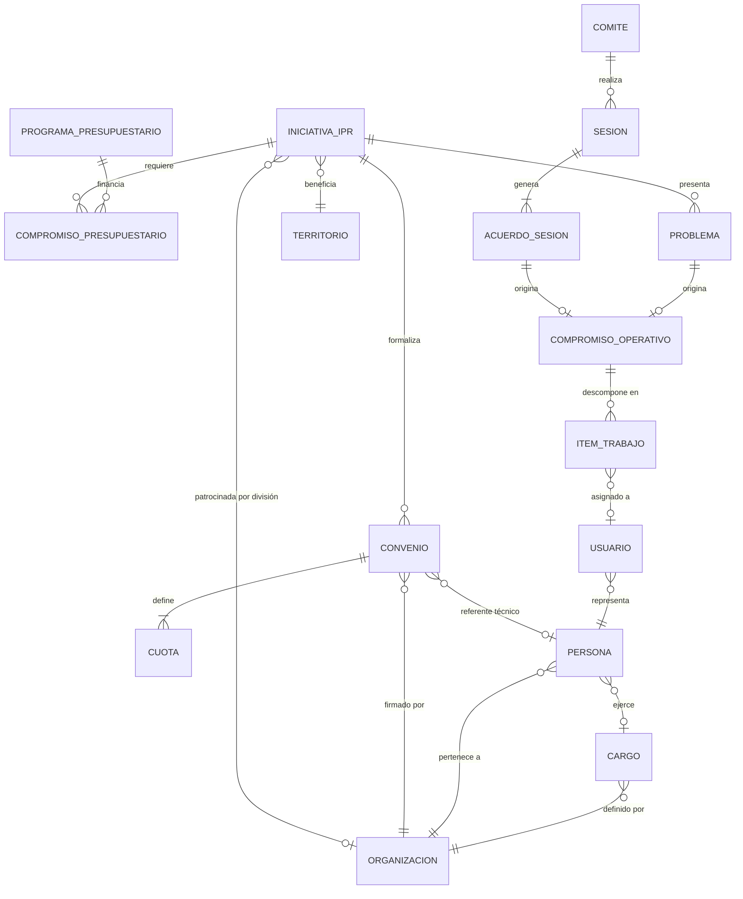
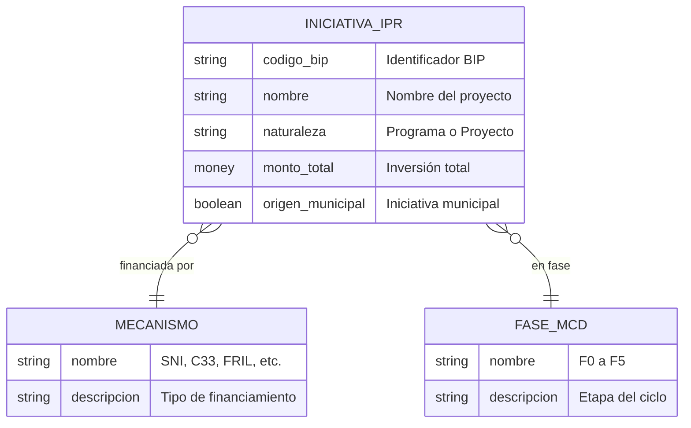
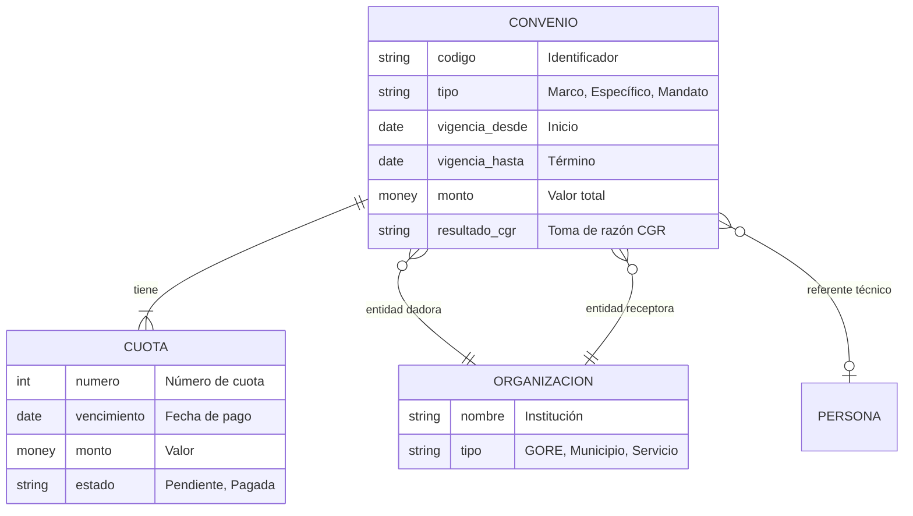
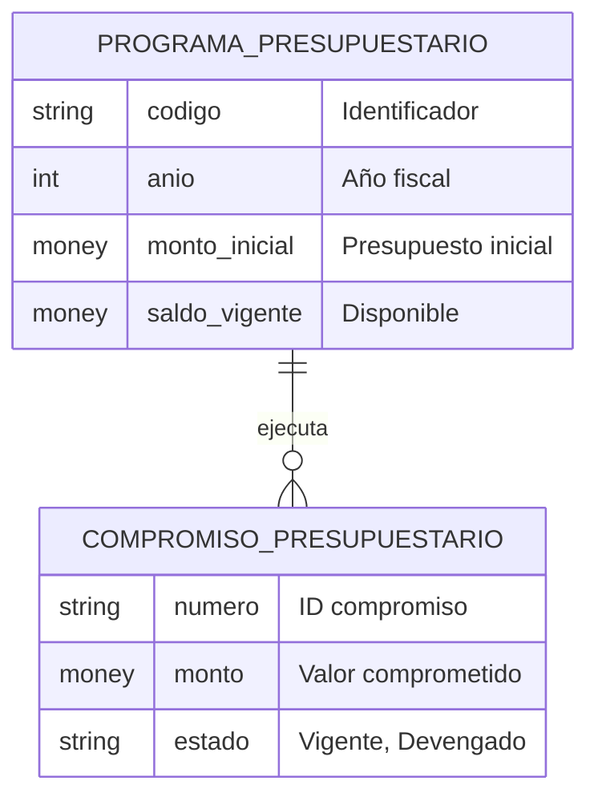
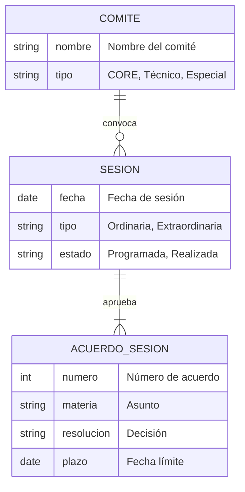
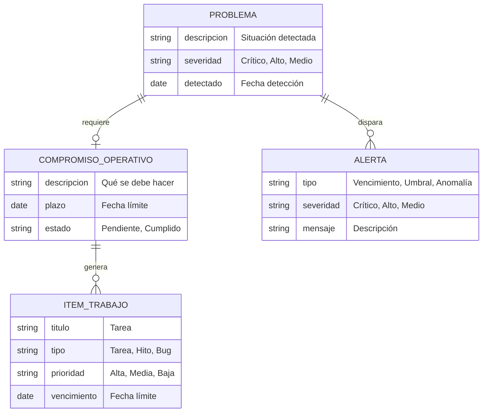
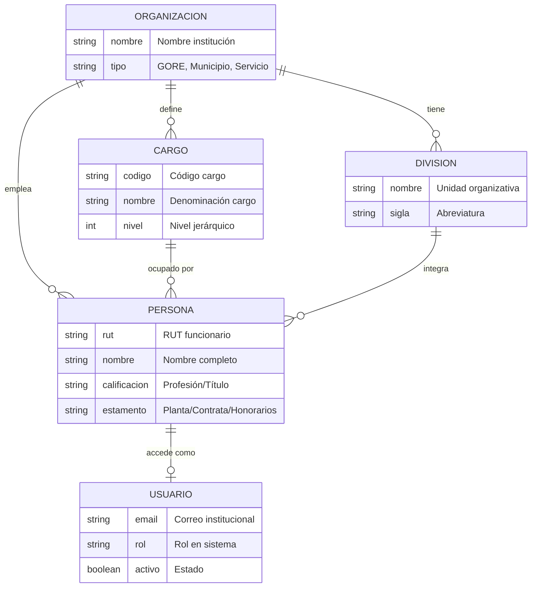
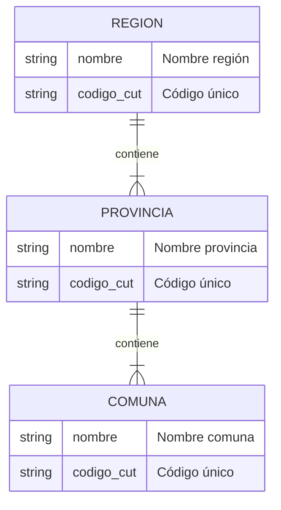

# Modelo Conceptual: GORE_OS v3.2

> **Note**: This document describes the conceptual model. The ERD in [GOREOS_ERD_v3.md](GOREOS_ERD_v3.md) tracks normalization milestones through v3.4. The system version is v3.2.0 per [CLAUDE.md](../../../CLAUDE.md).

**Sistema**: Gestión Institucional para Gobiernos Regionales
**Nivel**: Conceptual (Business View)
**Fecha**: 2026-01-30
**Audiencia**: Stakeholders de negocio, analistas, gerentes

---

## Vista General del Dominio


```mermaid
mindmap
  root((GORE_OS))
    Inversión Pública
      Iniciativas IPR
      Mecanismos
      Fases MCD
    Gestión Financiera
      Programas Presupuestarios
      Compromisos
      Transferencias
    Convenios
      Contratos
      Cuotas
      Rendiciones
    Gobernanza
      Comités
      Sesiones
      Acuerdos
    Operaciones
      Ítems de Trabajo
      Compromisos Operativos
      Alertas
    Organización
      Instituciones
      Personas
      Cargos
      Roles
```

---

## Modelo Conceptual Principal


```mermaid
erDiagram
    INICIATIVA_IPR ||--o{ CONVENIO : "formaliza"
    INICIATIVA_IPR ||--o{ COMPROMISO_PRESUPUESTARIO : "requiere"
    INICIATIVA_IPR ||--o{ PROBLEMA : "presenta"
    INICIATIVA_IPR }o--|| TERRITORIO : "beneficia"
    INICIATIVA_IPR }o--o| ORGANIZACION : "patrocinada por división"

    CONVENIO ||--|{ CUOTA : "define"
    CONVENIO }o--|| ORGANIZACION : "firmado por"
    CONVENIO }o--o| PERSONA : "referente técnico"

    PROGRAMA_PRESUPUESTARIO ||--o{ COMPROMISO_PRESUPUESTARIO : "financia"

    SESION ||--|{ ACUERDO_SESION : "genera"
    COMITE ||--o{ SESION : "realiza"

    ACUERDO_SESION ||--o| COMPROMISO_OPERATIVO : "origina"
    PROBLEMA ||--o| COMPROMISO_OPERATIVO : "origina"

    COMPROMISO_OPERATIVO ||--o{ ITEM_TRABAJO : "descompone en"

    PERSONA }o--|| ORGANIZACION : "pertenece a"
    PERSONA }o--o| CARGO : "ejerce"
    CARGO }o--|| ORGANIZACION : "definido por"
    USUARIO }o--|| PERSONA : "representa"

    ITEM_TRABAJO }o--o| USUARIO : "asignado a"
```

---

## Dominios de Negocio

### 1. Inversión Pública Regional


```mermaid
erDiagram
    INICIATIVA_IPR {
        string codigo_bip "Identificador BIP"
        string nombre "Nombre del proyecto"
        string naturaleza "Programa o Proyecto"
        money monto_total "Inversión total"
        boolean origen_municipal "Iniciativa municipal"
    }

    MECANISMO {
        string nombre "SNI, C33, FRIL, etc."
        string descripcion "Tipo de financiamiento"
    }

    FASE_MCD {
        string nombre "F0 a F5"
        string descripcion "Etapa del ciclo"
    }

    INICIATIVA_IPR }o--|| MECANISMO : "financiada por"
    INICIATIVA_IPR }o--|| FASE_MCD : "en fase"
```

**Conceptos clave:**
- **IPR**: Iniciativa de inversión pública regional
- **Mecanismo**: Fuente de financiamiento (SNI, C33, FRIL, FNDR, etc.)
- **Fase MCD**: Etapa en el ciclo de vida de inversión (F0-F5)

---

### 2. Gestión de Convenios


```mermaid
erDiagram
    CONVENIO {
        string codigo "Identificador"
        string tipo "Marco, Específico, Mandato"
        date vigencia_desde "Inicio"
        date vigencia_hasta "Término"
        money monto "Valor total"
        string resultado_cgr "Toma de razón CGR"
    }

    CUOTA {
        int numero "Número de cuota"
        date vencimiento "Fecha de pago"
        money monto "Valor"
        string estado "Pendiente, Pagada"
    }

    ORGANIZACION {
        string nombre "Institución"
        string tipo "GORE, Municipio, Servicio"
    }

    CONVENIO ||--|{ CUOTA : "tiene"
    CONVENIO }o--|| ORGANIZACION : "entidad dadora"
    CONVENIO }o--|| ORGANIZACION : "entidad receptora"
    CONVENIO }o--o| PERSONA : "referente técnico"
```

**Conceptos clave:**
- **Convenio**: Acuerdo legal entre instituciones
- **Cuota**: Calendario de transferencias
- **Dadora/Receptora**: Partes del convenio
- **Referente técnico**: Persona responsable del seguimiento del convenio
- **Resultado CGR**: Dictamen de toma de razón de Contraloría

---

### 3. Gestión Presupuestaria


```mermaid
erDiagram
    PROGRAMA_PRESUPUESTARIO {
        string codigo "Identificador"
        int anio "Año fiscal"
        money monto_inicial "Presupuesto inicial"
        money saldo_vigente "Disponible"
    }

    COMPROMISO_PRESUPUESTARIO {
        string numero "ID compromiso"
        money monto "Valor comprometido"
        string estado "Vigente, Devengado"
    }

    PROGRAMA_PRESUPUESTARIO ||--o{ COMPROMISO_PRESUPUESTARIO : "ejecuta"
```

**Conceptos clave:**
- **Programa**: Línea presupuestaria anual
- **Compromiso**: Reserva de recursos para una obligación

---

### 4. Gobernanza Regional


```mermaid
erDiagram
    COMITE {
        string nombre "Nombre del comité"
        string tipo "CORE, Técnico, Especial"
    }

    SESION {
        date fecha "Fecha de sesión"
        string tipo "Ordinaria, Extraordinaria"
        string estado "Programada, Realizada"
    }

    ACUERDO_SESION {
        int numero "Número de acuerdo"
        string materia "Asunto"
        string resolucion "Decisión"
        date plazo "Fecha límite"
    }

    COMITE ||--o{ SESION : "convoca"
    SESION ||--|{ ACUERDO_SESION : "aprueba"
```

**Conceptos clave:**
- **Comité**: Órgano colegiado (CORE, comités técnicos)
- **Sesión**: Reunión formal con acta
- **Acuerdo**: Resolución vinculante

---

### 5. Gestión Operativa


```mermaid
erDiagram
    COMPROMISO_OPERATIVO {
        string descripcion "Qué se debe hacer"
        date plazo "Fecha límite"
        string estado "Pendiente, Cumplido"
    }

    ITEM_TRABAJO {
        string titulo "Tarea"
        string tipo "Tarea, Hito, Bug"
        string prioridad "Alta, Media, Baja"
        date vencimiento "Fecha límite"
    }

    PROBLEMA {
        string descripcion "Situación detectada"
        string severidad "Crítico, Alto, Medio"
        date detectado "Fecha detección"
    }

    ALERTA {
        string tipo "Vencimiento, Umbral, Anomalía"
        string severidad "Crítico, Alto, Medio"
        string mensaje "Descripción"
    }

    COMPROMISO_OPERATIVO ||--o{ ITEM_TRABAJO : "genera"
    PROBLEMA ||--o| COMPROMISO_OPERATIVO : "requiere"
    PROBLEMA ||--o{ ALERTA : "dispara"
```

**Conceptos clave:**
- **Compromiso operativo**: Obligación de acción
- **Ítem de trabajo**: Tarea ejecutable
- **Problema**: Situación que requiere atención
- **Alerta**: Notificación automática

---

### 6. Estructura Organizacional


```mermaid
erDiagram
    ORGANIZACION {
        string nombre "Nombre institución"
        string tipo "GORE, Municipio, Servicio"
    }

    DIVISION {
        string nombre "Unidad organizativa"
        string sigla "Abreviatura"
    }

    CARGO {
        string codigo "Código cargo"
        string nombre "Denominación cargo"
        int nivel "Nivel jerárquico"
    }

    PERSONA {
        string rut "RUT funcionario"
        string nombre "Nombre completo"
        string calificacion "Profesión/Título"
        string estamento "Planta/Contrata/Honorarios"
    }

    USUARIO {
        string email "Correo institucional"
        string rol "Rol en sistema"
        boolean activo "Estado"
    }

    ORGANIZACION ||--o{ DIVISION : "tiene"
    ORGANIZACION ||--o{ CARGO : "define"
    ORGANIZACION ||--o{ PERSONA : "emplea"
    CARGO ||--o{ PERSONA : "ocupado por"
    PERSONA ||--o| USUARIO : "accede como"
    DIVISION ||--o{ PERSONA : "integra"
```

**Conceptos clave:**
- **Organización**: Institución (GORE, municipios, servicios)
- **División**: Unidad interna
- **Cargo**: Puesto de trabajo definido en la estructura organizacional
- **Persona**: Funcionario con RUT, calificación profesional y estamento
- **Usuario**: Cuenta de acceso al sistema
- **Estamento**: Clasificación del funcionario (Planta/Contrata/Honorarios)

---

### 7. Territorio


```mermaid
erDiagram
    REGION {
        string nombre "Nombre región"
        string codigo_cut "Código único"
    }

    PROVINCIA {
        string nombre "Nombre provincia"
        string codigo_cut "Código único"
    }

    COMUNA {
        string nombre "Nombre comuna"
        string codigo_cut "Código único"
    }

    REGION ||--|{ PROVINCIA : "contiene"
    PROVINCIA ||--|{ COMUNA : "contiene"
```

**Conceptos clave:**
- Jerarquía territorial estándar de Chile
- CUT: Código Único Territorial

---

## Flujos de Negocio Principales

### Ciclo de Vida IPR

```
┌─────────────┐     ┌─────────────┐     ┌─────────────┐
│   IDEA      │────▶│  DISEÑO     │────▶│  EJECUCIÓN  │
│   (F1-F2)   │     │   (F3-F4)   │     │   (F5-F7)   │
└─────────────┘     └─────────────┘     └─────────────┘
                                               │
                                               ▼
                                        ┌─────────────┐
                                        │  OPERACIÓN  │
                                        │    (F8)     │
                                        └─────────────┘
```

### Flujo de Convenio

```
┌─────────────┐     ┌─────────────┐     ┌─────────────┐
│  BORRADOR   │────▶│   FIRMADO   │────▶│  VIGENTE    │
└─────────────┘     └─────────────┘     └─────────────┘
                                               │
                          ┌────────────────────┼────────────────────┐
                          ▼                    ▼                    ▼
                   ┌─────────────┐     ┌─────────────┐     ┌─────────────┐
                   │  CUOTA 1    │     │  CUOTA 2    │     │  CUOTA N    │
                   │  Pagada     │     │  Pendiente  │     │  Pendiente  │
                   └─────────────┘     └─────────────┘     └─────────────┘
```

### Ciclo Problema → Resolución

```
┌─────────────┐     ┌─────────────┐     ┌─────────────┐     ┌─────────────┐
│  DETECTADO  │────▶│  ANALIZADO  │────▶│ COMPROMISO  │────▶│  RESUELTO   │
│  (Problema) │     │  (Evaluar)  │     │  (Acción)   │     │  (Cerrado)  │
└─────────────┘     └─────────────┘     └─────────────┘     └─────────────┘
       │
       ▼
┌─────────────┐
│   ALERTA    │
│ (Automática)│
└─────────────┘
```

---

## Relaciones Clave entre Dominios

| Desde | Hacia | Relación | Descripción |
|-------|-------|----------|-------------|
| IPR | Convenio | 1:N | Una IPR puede formalizarse en múltiples convenios |
| IPR | Compromiso Presupuestario | 1:N | Una IPR requiere múltiples compromisos de gasto |
| IPR | Territorio | N:1 | Una IPR beneficia a un territorio |
| Convenio | Organización | N:2 | Todo convenio tiene dadora y receptora |
| Convenio | Persona | N:1 | Todo convenio puede tener un referente técnico |
| Sesión | Acuerdo | 1:N | Una sesión genera múltiples acuerdos |
| Persona | Cargo | N:1 | Una persona ocupa un cargo |
| IPR | División | N:1 | Una IPR puede ser patrocinada por una división |
| Acuerdo | Compromiso Operativo | 1:1 | Un acuerdo puede originar un compromiso |
| Problema | Compromiso Operativo | 1:1 | Un problema puede requerir un compromiso |
| Compromiso Operativo | Ítem de Trabajo | 1:N | Un compromiso se descompone en tareas |
| Usuario | Ítem de Trabajo | 1:N | Un usuario tiene múltiples tareas asignadas |

---

## Glosario de Términos

| Término | Definición |
|---------|------------|
| **IPR** | Iniciativa Pública Regional - proyecto o programa de inversión |
| **BIP** | Código del Banco Integrado de Proyectos |
| **MCD** | Metodología de Ciclo de Desarrollo (F0-F5) |
| **FNDR** | Fondo Nacional de Desarrollo Regional |
| **FRIL** | Fondo Regional de Iniciativa Local |
| **SNI** | Sistema Nacional de Inversiones |
| **C33** | Fondo sectorial artículo 33 |
| **CORE** | Consejo Regional |
| **CUT** | Código Único Territorial |
| **Dadora** | Organización que transfiere recursos |
| **Receptora** | Organización que recibe recursos |
| **CGR** | Contraloría General de la República |
| **Estamento** | Clasificación funcionaria (Planta, Contrata, Honorarios) |
| **Calificación Profesional** | Título profesional o técnico del funcionario |

---

## Notas para Stakeholders

### Decisiones de Negocio Reflejadas

1. **Centralización IPR**: Todas las iniciativas se gestionan con un modelo unificado
2. **Trazabilidad completa**: Todo cambio queda registrado (auditoría)
3. **Flexibilidad territorial**: Soporta cualquier nivel (región, provincia, comuna)
4. **Gobernanza formal**: Sesiones y acuerdos tienen peso legal

### Próximos Pasos Recomendados

1. Validar entidades con usuarios clave de cada dominio
2. Confirmar flujos de estado con áreas operativas
3. Revisar cardinalidades con casos reales

---

## Esquemas de Referencia (ref.category)

El sistema utiliza vocabularios controlados para categorizar entidades. A continuación, los esquemas principales:

### Organización y Personal

| Esquema | Descripción | Códigos Ejemplo |
|---------|-------------|-----------------|
| **org_type** | Tipo de organización | GORE, MUNICIPALIDAD, SERVICIO, UNIVERSIDAD, ORG_COMUNITARIA |
| **estamento** | Clasificación funcionaria | PLANTA, CONTRATA, HONORARIOS, CODIGO_TRABAJO, SUPLENTE, REEMPLAZO, DIRECTIVO |
| **professional_qualification** | Títulos profesionales/técnicos | ARQUITECTO, INGENIERO_CIVIL, ABOGADO, ASISTENTE_SOCIAL, TECNICO_AGRICOLA, CONTADOR_AUDITOR, PROFESOR, MEDICO, ENFERMERA, PSICOLOGO, PERIODISTA, GEOGRAFO, BIOLOGO, OTRO_PROFESIONAL |

### IPR y Financiamiento

| Esquema | Descripción | Códigos Ejemplo |
|---------|-------------|-----------------|
| **ipr_type** | Tipo de iniciativa IPR | INFRAESTRUCTURA, EQUIPAMIENTO, PROGRAMA_8PCT, TRANSFERENCIA, PROGRAMA_SOCIAL, CONSERVACION, ESTUDIO |
| **funding_source** | Fuente financiamiento (no-8%) | FNDR, FRIL, FRPD, ISAR |
| **fondo_8pct** | Categorías Programas 8% | DEPORTE, CULTURA, SEGURIDAD, ADULTO_MAYOR, EDUCACION, SALUD, MEDIO_AMBIENTE, CONECTIVIDAD, INFRAESTRUCTURA_COMUNITARIA, DISCAPACIDAD |
| **investment_sector** | Sector de inversión | SPORTS, CULTURE, EDUCATION, HEALTH, ENVIRONMENT, INFRASTRUCTURE, CONNECTIVITY, SECURITY, SOCIAL, PRODUCTIVE |
| **mechanism** | Mecanismo de inversión | SNI, FRIL, SUBV8, CONVENIO_TRANSFERENCIA |

### Convenios y Presupuesto

| Esquema | Descripción | Códigos Ejemplo |
|---------|-------------|-----------------|
| **agreement_type** | Tipo de convenio | CONVENIO_MARCO, CONVENIO_ESPECIFICO, MANDATO |
| **cgr_outcome** | Resultado toma de razón CGR | TOMADO_RAZON, REPRESENTADO, PENDIENTE, EXENTO, RECHAZADO, NO_APLICA, EN_REVISION |
| **budget_subtitle** | Subtítulo presupuestario | SUBTITULO_24, SUBTITULO_31, SUBTITULO_33 |
| **rendition_state** | Estado de rendición | COMPLETADO, PENDIENTE, EN_PROCESO |

### Relaciones y Magnitudes

| Esquema | Descripción | Códigos Ejemplo |
|---------|-------------|-----------------|
| **ipr_party_role** | Rol organización en IPR | MANDANTE, EJECUTOR, BENEFICIARIO, UNIDAD_TECNICA |
| **magnitude_aspect** | Aspecto de magnitud | MONETARY, PERCENTAGE, QUANTITY, TIME_DURATION |
| **currency** | Moneda | CLP, USD, UF |

### Territorio

| Esquema | Descripción | Códigos Ejemplo |
|---------|-------------|-----------------|
| **territory_level** | Nivel territorial | REGION, PROVINCIA, COMUNA |

---

## Cambios en v3.4 (2026-01-30)

### Nuevas Entidades
- **CARGO (Position)**: Puestos de trabajo en estructura organizacional
  - Atributos: codigo, nombre, nivel jerárquico
  - Relación: CARGO → ORGANIZACION (many-to-one)

### Actualizaciones de Entidades Existentes

**PERSONA**:
- + `rut` (VARCHAR): RUT del funcionario
- + `calificacion` (FK → professional_qualification): Título profesional/técnico
- + `cargo` (FK → CARGO): Cargo que ocupa
- + `estamento` (FK → estamento): Planta/Contrata/Honorarios

**CONVENIO**:
- + `referente_tecnico` (FK → PERSONA): Responsable técnico del convenio
- + `resultado_cgr` (FK → cgr_outcome): Dictamen CGR

**INICIATIVA_IPR**:
- + `origen_municipal` (BOOLEAN): Indica si es iniciativa municipal
- + `division_patrocinadora` (FK → ORGANIZACION): División que patrocina

**IPR_PARTY** (junction table):
- + `agreement_id` (FK → CONVENIO): Vínculo con convenio
- + `sponsor_division_id` (FK → ORGANIZACION): División patrocinadora

### Nuevos Esquemas de Referencia
- `professional_qualification`: 14 códigos (títulos profesionales/técnicos)
- `cgr_outcome`: 7 códigos (resultados toma de razón CGR)
- `estamento`: 7 códigos (clasificación funcionaria)
- `magnitude_aspect`: 4 códigos (aspectos de magnitudes)
- `currency`: 3 códigos (monedas)

---

*Modelo Conceptual generado para GORE_OS v3.4*
