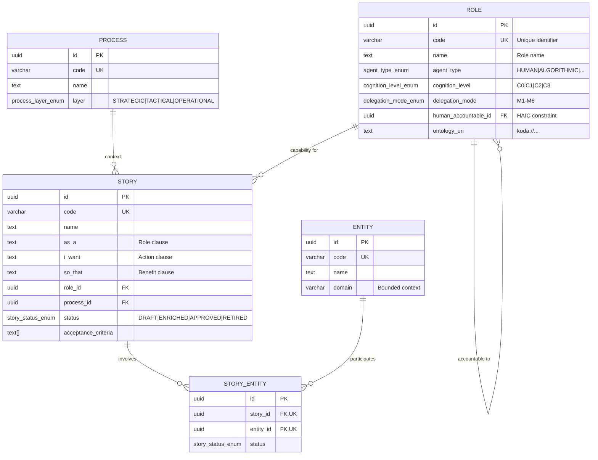
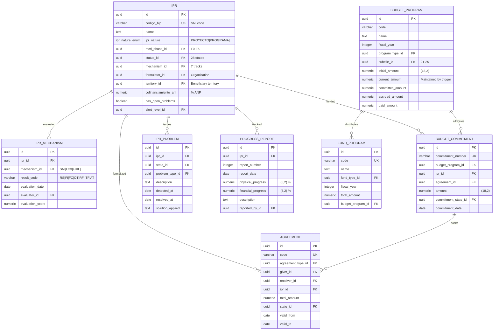
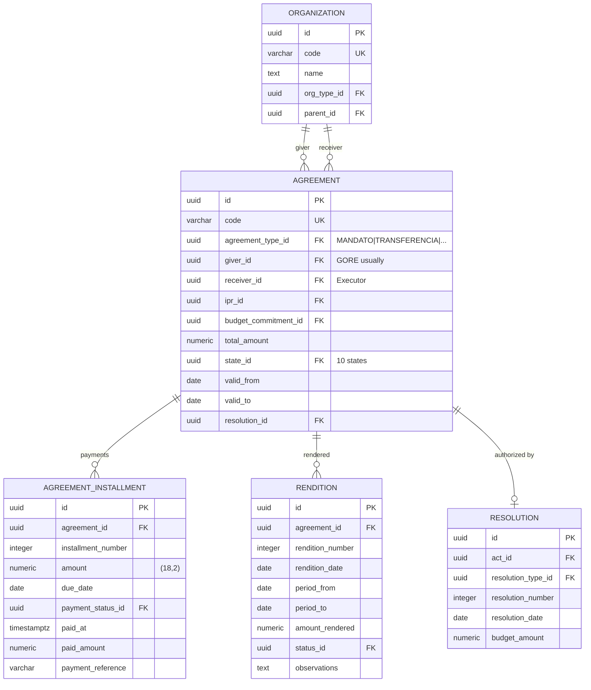
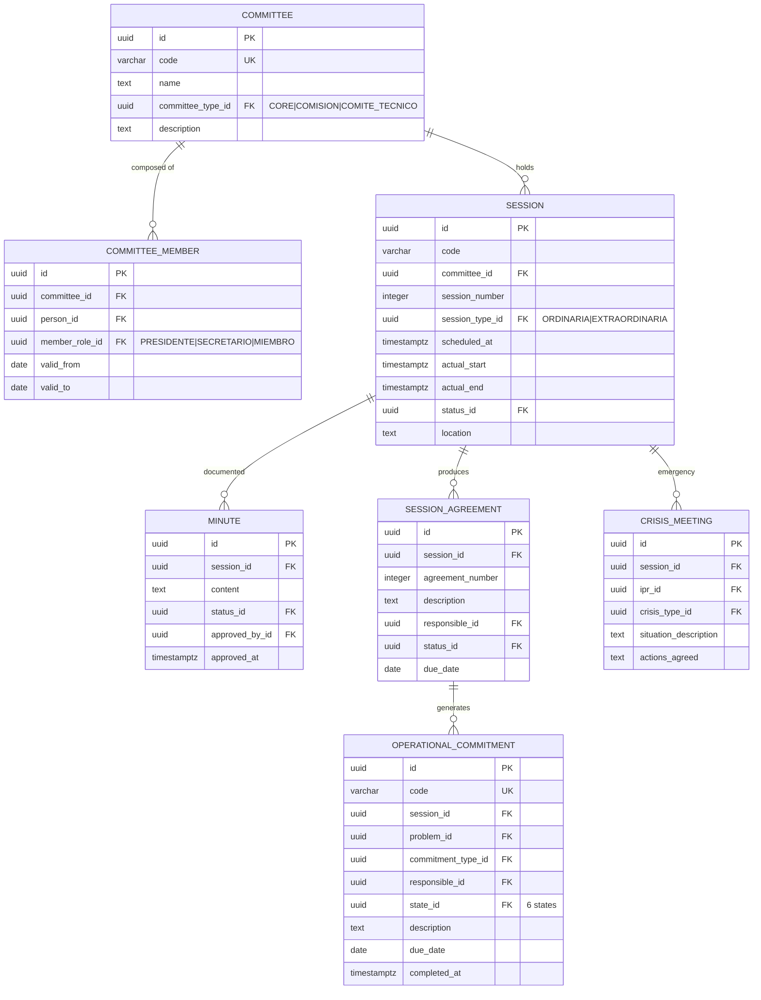
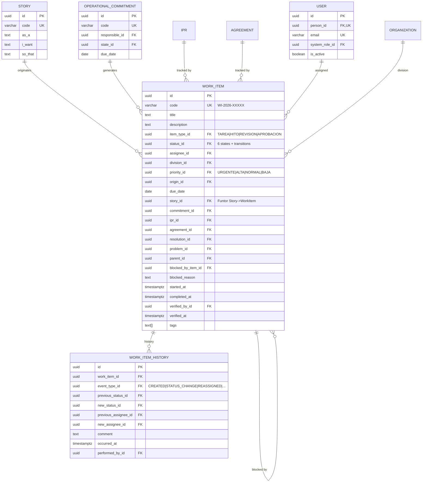
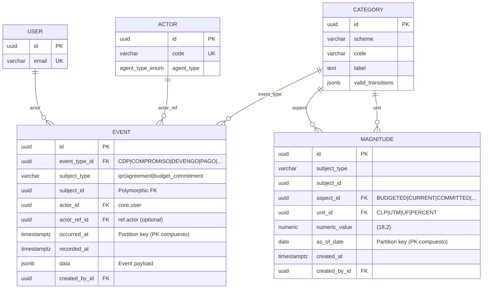

# GORE_OS v3.2 - Entity-Relationship Diagrams

> **⚠️ ERD PARCIAL.** Documenta 42/89 tablas core del modelo base; el schema VIGENTE (128 tablas en 5 schemas) está en model/model_goreos/sql/goreos_ddl.sql y CLAUDE.md. No usar como referencia completa del esquema actual.

> **Note**: The "v3.0"/"v3.4" version numbers below refer to ERD normalization milestones (schema evolution), not the application version (v3.2.0). The system version is tracked in [CLAUDE.md](../../../CLAUDE.md).

**Modelo**: GORE_OS - Sistema de Gestión Institucional para Gobiernos Regionales
**Fecha**: 2026-01-30 (Actualizado con Normalizaciones v3.4 MEDIA)
**Total Entidades documentadas**: 52 (modelo base v3.0); schema vigente: 128 — ver goreos_ddl.sql

---

## Version History

| Version | Fecha | Cambios Principales |
|---------|-------|---------------------|
| v3.4 | 2026-01-30 | **Normalizaciones v3.4 MEDIA**: 18 campos normalizados (100%)<br/>- Nueva tabla: `core.position` (70 cargos únicos)<br/>- core.person: columnas `position_id`, `qualification_id`<br/>- core.agreement: columna `cgr_outcome_id`<br/>- core.ipr_party: columna `sponsor_division_id`, `is_municipal_origin`<br/>- Nuevos schemes: `professional_qualification` (14), `cgr_outcome` (7)<br/>- 17 nuevos índices, univocidad 100% mantenida<br/>Referencia: `docs/archive/normalization-completed/AUDITORIA_CATEGORIAL_v3.0.md` (MEDIA) |
| v3.0 | 2026-01-30 | **Normalizaciones v3.0 CRÍTICAS**: 13 críticas<br/>- core.organization: columna `rut`<br/>- core.person: columna `estamento_id`<br/>- core.agreement: columna `technical_referent_id`<br/>- core.ipr_party: columna `agreement_id`<br/>- core.budget_program: columnas `item_id`, `allocation_id`, `fndr_amount`, `sectorial_amount`<br/>- Nueva tabla: `core.budget_carryover`<br/>- Nuevos schemes: `estamento`, `budget_item`, `budget_allocation`, `magnitude_aspect`, `currency`<br/>- Sincronización EJECUTOR en ipr_party<br/>Referencia: `docs/archive/normalization-completed/AUDITORIA_CATEGORIAL_v3.0.md` (CRÍTICAS) |
| v3.2 | 2026-01-27 | **Normalizaciones v2.0**: Univocidad Categorial 100%<br/>- core.ipr: columnas `investment_sector_id`, `fund_category_id`<br/>- Nuevos schemes: `investment_sector`, `fondo_8pct`<br/>Referencia (histórica): `docs/archive/legacy-model-tel/etl/migration-docs/NORMALIZACION_v2.0_REPORTE_FINAL.md` |
| v3.0 | 2026-01-20 | Modelo base: 50 tablas, 4 schemas, Category Pattern (Gist 14.0) |

---

## Resumen de Schemas

| Schema | Tablas | Propósito |
|--------|--------|-----------|
| `meta` | 5 | Átomos fundamentales - Role, Process, Entity, Story |
| `ref` | 3 | Vocabularios controlados - Category Pattern (Gist 14.0) |
| `core` | 42 | Entidades de negocio - IPR, Agreements, Budget, Work Items |
| `txn` | 2 | Event Sourcing - Eventos y Magnitudes (particionadas) |

**Nota v3.4**: +2 tablas (`core.budget_carryover`, `core.position`) vs. v3.0 base

---

## 1. ERD Completo - Vista General


```mermaid
erDiagram
    %% ========================================
    %% SCHEMA: META (Átomos Fundamentales)
    %% ========================================

    meta_role ||--o{ meta_story : "defines capability"
    meta_role ||--o{ meta_role : "human_accountable"
    meta_process ||--o{ meta_story : "context"
    meta_entity ||--o{ meta_story_entity : "participates"
    meta_story ||--o{ meta_story_entity : "involves"
    meta_story ||--o{ core_work_item : "origin"

    meta_role {
        uuid id PK
        varchar code UK
        text name
        agent_type_enum agent_type
        cognition_level_enum cognition_level
        delegation_mode_enum delegation_mode
        uuid human_accountable_id FK
    }

    meta_process {
        uuid id PK
        varchar code UK
        text name
        process_layer_enum layer
    }

    meta_entity {
        uuid id PK
        varchar code UK
        text name
        varchar domain
    }

    meta_story {
        uuid id PK
        varchar code UK
        text as_a
        text i_want
        text so_that
        uuid role_id FK
        uuid process_id FK
        story_status_enum status
    }

    meta_story_entity {
        uuid id PK
        uuid story_id FK
        uuid entity_id FK
        story_status_enum status
    }

    %% ========================================
    %% SCHEMA: REF (Vocabularios Controlados)
    %% ========================================

    ref_category ||--o{ ref_category : "parent"
    ref_category ||--o{ core_ipr : "classifies"
    ref_category ||--o{ core_agreement : "types"
    ref_category ||--o{ core_work_item : "status"

    ref_category {
        uuid id PK
        varchar scheme
        varchar code
        text label
        uuid parent_id FK
        uuid phase_id FK
        jsonb valid_transitions
    }

    ref_actor ||--o{ txn_event : "performs"
    ref_actor {
        uuid id PK
        varchar code UK
        text name
        agent_type_enum agent_type
        text agent_definition_uri
    }

    ref_operational_commitment_type ||--o{ core_operational_commitment : "types"
    ref_operational_commitment_type {
        uuid id PK
        varchar code UK
        varchar name
        integer default_days
    }

    %% ========================================
    %% SCHEMA: CORE - Organización y Personas
    %% ========================================

    core_organization ||--o{ core_organization : "parent"
    core_organization ||--o{ core_person : "employs"
    core_organization ||--o{ core_ipr : "formulates"

    core_organization {
        uuid id PK
        varchar code UK
        text name
        uuid org_type_id FK
        uuid parent_id FK
        varchar rut UK
    }

    core_person ||--|| core_user : "has account"
    core_person {
        uuid id PK
        varchar rut UK
        text names
        text paternal_surname
        uuid organization_id FK
        uuid estamento_id FK
    }

    core_user ||--o{ core_work_item : "assigned"
    core_user ||--o{ core_operational_commitment : "responsible"
    core_user {
        uuid id PK
        uuid person_id FK,UK
        varchar email UK
        uuid system_role_id FK
        boolean is_active
    }

    %% ========================================
    %% SCHEMA: CORE - Territorio
    %% ========================================

    core_territory ||--o{ core_territory : "contains"
    core_territory ||--o{ core_territorial_indicator : "has"
    core_territory ||--o{ core_ipr : "benefits"

    core_territory {
        uuid id PK
        varchar code UK
        text name
        uuid territory_type_id FK
        uuid parent_id FK
        numeric area_km2
        integer population
    }

    core_territorial_indicator {
        uuid id PK
        varchar code UK
        uuid territory_id FK
        uuid indicator_type_id FK
        numeric numeric_value
        integer fiscal_year
    }

    %% ========================================
    %% SCHEMA: CORE - IPR (Iniciativas de Inversión)
    %% ========================================

    core_ipr ||--o{ core_ipr_mechanism : "evaluated by"
    core_ipr ||--o{ core_agreement : "formalized"
    core_ipr ||--o{ core_budget_commitment : "funded"
    core_ipr ||--o{ core_ipr_problem : "has issues"
    core_ipr ||--o{ core_work_item : "tracked"
    core_ipr ||--o{ core_progress_report : "reported"

    core_ipr {
        uuid id PK
        varchar codigo_bip UK
        text name
        ipr_nature_enum ipr_nature
        uuid mcd_phase_id FK
        uuid status_id FK
        uuid mechanism_id FK
        uuid formulator_id FK
        uuid territory_id FK
        boolean has_open_problems
    }

    core_ipr_mechanism {
        uuid id PK
        uuid ipr_id FK
        uuid mechanism_id FK
        varchar result_code
        date evaluation_date
        uuid evaluator_id FK
    }

    core_ipr_problem ||--o{ core_operational_commitment : "addressed by"
    core_ipr_problem {
        uuid id PK
        uuid ipr_id FK
        uuid state_id FK
        text description
        date detected_at
        date resolved_at
    }

    %% ========================================
    %% SCHEMA: CORE - Presupuesto
    %% ========================================

    core_budget_program ||--o{ core_budget_commitment : "funds"
    core_budget_program ||--o{ core_fund_program : "allocates"

    core_budget_program ||--o{ core_budget_carryover : "carries over"

    core_budget_program {
        uuid id PK
        varchar code
        text name
        integer fiscal_year
        numeric initial_amount
        numeric current_amount
        numeric committed_amount
        numeric accrued_amount
        numeric paid_amount
        uuid item_id FK
        uuid allocation_id FK
        numeric fndr_amount
        numeric sectorial_amount
    }

    core_budget_carryover {
        uuid id PK
        uuid budget_program_id FK
        integer fiscal_year
        numeric amount
    }

    core_budget_commitment ||--o{ core_agreement : "backs"
    core_budget_commitment {
        uuid id PK
        varchar commitment_number UK
        uuid budget_program_id FK
        uuid ipr_id FK
        uuid agreement_id FK
        numeric amount
        uuid commitment_state_id FK
    }

    core_fund_program {
        uuid id PK
        varchar code UK
        text name
        uuid fund_type_id FK
        integer fiscal_year
        uuid budget_program_id FK
    }

    %% ========================================
    %% SCHEMA: CORE - Convenios
    %% ========================================

    core_agreement ||--o{ core_agreement_installment : "has payments"
    core_agreement ||--o{ core_rendition : "rendered"
    core_agreement ||--o{ core_work_item : "tracked"

    core_agreement {
        uuid id PK
        varchar code UK
        uuid agreement_type_id FK
        uuid giver_id FK
        uuid receiver_id FK
        uuid ipr_id FK
        numeric total_amount
        uuid state_id FK
        date valid_from
        date valid_to
        uuid technical_referent_id FK
    }

    core_agreement_installment {
        uuid id PK
        uuid agreement_id FK
        integer installment_number
        numeric amount
        date due_date
        uuid payment_status_id FK
        numeric paid_amount
    }

    core_rendition {
        uuid id PK
        uuid agreement_id FK
        integer rendition_number
        date rendition_date
        numeric amount_rendered
        uuid status_id FK
    }

    %% ========================================
    %% SCHEMA: CORE - Actos Administrativos
    %% ========================================

    core_administrative_act ||--o{ core_resolution : "specializes"
    core_administrative_act {
        uuid id PK
        varchar code UK
        uuid act_type_id FK
        uuid state_id FK
        date act_date
        text subject
    }

    core_resolution ||--o{ core_ipr : "approves"
    core_resolution ||--o{ core_agreement : "authorizes"
    core_resolution {
        uuid id PK
        uuid act_id FK
        uuid resolution_type_id FK
        integer resolution_number
        date resolution_date
    }

    %% ========================================
    %% SCHEMA: CORE - Gobernanza (Comités y Sesiones)
    %% ========================================

    core_committee ||--o{ core_committee_member : "has"
    core_committee ||--o{ core_session : "holds"

    core_committee {
        uuid id PK
        varchar code UK
        text name
        uuid committee_type_id FK
    }

    core_committee_member {
        uuid id PK
        uuid committee_id FK
        uuid person_id FK
        uuid member_role_id FK
        date valid_from
        date valid_to
    }

    core_session ||--o{ core_minute : "documented"
    core_session ||--o{ core_session_agreement : "produces"
    core_session ||--o{ core_crisis_meeting : "emergency"

    core_session {
        uuid id PK
        varchar code
        uuid committee_id FK
        integer session_number
        timestamptz scheduled_at
        uuid status_id FK
    }

    core_session_agreement ||--o{ core_operational_commitment : "generates"
    core_session_agreement {
        uuid id PK
        uuid session_id FK
        integer agreement_number
        text description
        uuid responsible_id FK
        uuid status_id FK
        date due_date
    }

    core_minute {
        uuid id PK
        uuid session_id FK
        text content
        uuid status_id FK
    }

    %% ========================================
    %% SCHEMA: CORE - Gestión Operativa
    %% ========================================

    core_operational_commitment ||--o{ core_commitment_history : "tracked"
    core_operational_commitment ||--o{ core_work_item : "generates"

    core_operational_commitment {
        uuid id PK
        varchar code UK
        uuid commitment_type_id FK
        uuid responsible_id FK
        uuid state_id FK
        text description
        date due_date
        timestamptz completed_at
    }

    core_commitment_history {
        uuid id PK
        uuid commitment_id FK
        uuid previous_state_id FK
        uuid new_state_id FK
        uuid changed_by_id FK
        timestamptz changed_at
    }

    core_work_item ||--o{ core_work_item : "parent"
    core_work_item ||--o{ core_work_item : "blocked_by"
    core_work_item ||--o{ core_work_item_history : "tracked"

    core_work_item {
        uuid id PK
        varchar code UK
        text title
        uuid item_type_id FK
        uuid status_id FK
        uuid assignee_id FK
        uuid division_id FK
        uuid story_id FK
        uuid commitment_id FK
        uuid ipr_id FK
        uuid agreement_id FK
        date due_date
        uuid blocked_by_item_id FK
    }

    core_work_item_history {
        uuid id PK
        uuid work_item_id FK
        uuid event_type_id FK
        uuid previous_status_id FK
        uuid new_status_id FK
        uuid performed_by_id FK
        timestamptz occurred_at
    }

    %% ========================================
    %% SCHEMA: CORE - Alertas y Riesgos
    %% ========================================

    core_alert {
        uuid id PK
        uuid alert_type_id FK
        uuid severity_id FK
        varchar subject_type
        uuid subject_id
        text message
        timestamptz triggered_at
        timestamptz attended_at
    }

    core_risk {
        uuid id PK
        varchar code UK
        uuid risk_type_id FK
        uuid probability_id FK
        uuid impact_id FK
        varchar subject_type
        uuid subject_id
        text description
        uuid status_id FK
    }

    %% ========================================
    %% SCHEMA: CORE - Otros
    %% ========================================

    core_progress_report {
        uuid id PK
        uuid ipr_id FK
        integer report_number
        date report_date
        numeric physical_progress
        numeric financial_progress
        uuid reported_by_id FK
    }

    core_planning_instrument {
        uuid id PK
        varchar code UK
        text name
        uuid instrument_type_id FK
        integer fiscal_year
    }

    core_inventory_item {
        uuid id PK
        varchar code UK
        uuid item_type_id FK
        text description
        numeric acquisition_value
        uuid location_id FK
    }

    core_digital_platform {
        uuid id PK
        varchar code UK
        text name
        uuid platform_type_id FK
        text url
    }

    %% ========================================
    %% SCHEMA: TXN (Event Sourcing)
    %% ========================================

    txn_event {
        uuid id PK
        uuid event_type_id FK
        varchar subject_type
        uuid subject_id
        uuid actor_id FK
        uuid actor_ref_id FK
        timestamptz occurred_at
        timestamptz recorded_at
        jsonb data
        uuid created_by_id FK
    }

    txn_magnitude {
        uuid id PK
        varchar subject_type
        uuid subject_id
        uuid aspect_id FK
        uuid unit_id FK
        numeric numeric_value
        date as_of_date
        timestamptz created_at
        uuid created_by_id FK
    }

    ref_category ||--o{ txn_event : "event_type"
    ref_category ||--o{ txn_magnitude : "aspect"
    core_user ||--o{ txn_event : "actor"
```

---

## 2. ERD por Dominio

### 2.1 Dominio: Meta (Átomos Fundamentales)


```mermaid
erDiagram
    ROLE ||--o{ STORY : "capability for"
    ROLE ||--o{ ROLE : "accountable to"
    PROCESS ||--o{ STORY : "context"
    ENTITY ||--o{ STORY_ENTITY : "participates"
    STORY ||--o{ STORY_ENTITY : "involves"

    ROLE {
        uuid id PK
        varchar code UK "Unique identifier"
        text name "Role name"
        agent_type_enum agent_type "HUMAN|ALGORITHMIC|..."
        cognition_level_enum cognition_level "C0|C1|C2|C3"
        delegation_mode_enum delegation_mode "M1-M6"
        uuid human_accountable_id FK "HAIC constraint"
        text ontology_uri "koda://..."
    }

    PROCESS {
        uuid id PK
        varchar code UK
        text name
        process_layer_enum layer "STRATEGIC|TACTICAL|OPERATIONAL"
    }

    ENTITY {
        uuid id PK
        varchar code UK
        text name
        varchar domain "Bounded context"
    }

    STORY {
        uuid id PK
        varchar code UK
        text name
        text as_a "Role clause"
        text i_want "Action clause"
        text so_that "Benefit clause"
        uuid role_id FK
        uuid process_id FK
        story_status_enum status "DRAFT|ENRICHED|APPROVED|RETIRED"
        text[] acceptance_criteria
    }

    STORY_ENTITY {
        uuid id PK
        uuid story_id FK,UK
        uuid entity_id FK,UK
        story_status_enum status
    }
```

### 2.2 Dominio: IPR y Presupuesto


```mermaid
erDiagram
    IPR ||--o{ IPR_MECHANISM : "evaluated"
    IPR ||--o{ BUDGET_COMMITMENT : "funded"
    IPR ||--o{ AGREEMENT : "formalized"
    IPR ||--o{ IPR_PROBLEM : "issues"
    IPR ||--o{ PROGRESS_REPORT : "tracked"

    BUDGET_PROGRAM ||--o{ BUDGET_COMMITMENT : "allocates"
    BUDGET_PROGRAM ||--o{ FUND_PROGRAM : "distributes"

    BUDGET_COMMITMENT ||--o{ AGREEMENT : "backs"

    IPR {
        uuid id PK
        varchar codigo_bip UK "SNI code"
        text name
        ipr_nature_enum ipr_nature "PROYECTO|PROGRAMA|..."
        uuid mcd_phase_id FK "F0-F5"
        uuid status_id FK "28 states"
        uuid mechanism_id FK "7 tracks"
        uuid formulator_id FK "Organization"
        uuid territory_id FK "Beneficiary territory"
        numeric cofinanciamiento_anf "% ANF"
        boolean has_open_problems
        uuid alert_level_id FK
    }

    IPR_MECHANISM {
        uuid id PK
        uuid ipr_id FK
        uuid mechanism_id FK "SNI|C33|FRIL|..."
        varchar result_code "RS|FI|FC|OT|RF|ITF|AT"
        date evaluation_date
        uuid evaluator_id FK
        numeric evaluation_score
    }

    BUDGET_PROGRAM {
        uuid id PK
        varchar code
        text name
        integer fiscal_year
        uuid program_type_id FK
        uuid subtitle_id FK "21-35"
        numeric initial_amount "(18,2)"
        numeric current_amount "Maintained by trigger"
        numeric committed_amount
        numeric accrued_amount
        numeric paid_amount
    }

    BUDGET_COMMITMENT {
        uuid id PK
        varchar commitment_number UK
        uuid budget_program_id FK
        uuid ipr_id FK
        uuid agreement_id FK
        numeric amount "(18,2)"
        uuid commitment_state_id FK
        date commitment_date
    }

    FUND_PROGRAM {
        uuid id PK
        varchar code UK
        text name
        uuid fund_type_id FK
        integer fiscal_year
        numeric total_amount
        uuid budget_program_id FK
    }

    IPR_PROBLEM {
        uuid id PK
        uuid ipr_id FK
        uuid state_id FK
        uuid problem_type_id FK
        text description
        date detected_at
        date resolved_at
        text solution_applied
    }

    PROGRESS_REPORT {
        uuid id PK
        uuid ipr_id FK
        integer report_number
        date report_date
        numeric physical_progress "(5,2) %"
        numeric financial_progress "(5,2) %"
        text description
        uuid reported_by_id FK
    }

    AGREEMENT {
        uuid id PK
        varchar code UK
        uuid agreement_type_id FK
        uuid giver_id FK
        uuid receiver_id FK
        uuid ipr_id FK
        numeric total_amount
        uuid state_id FK
        date valid_from
        date valid_to
    }
```

### 2.3 Dominio: Convenios y Rendiciones


```mermaid
erDiagram
    AGREEMENT ||--o{ AGREEMENT_INSTALLMENT : "payments"
    AGREEMENT ||--o{ RENDITION : "rendered"
    AGREEMENT ||--o| RESOLUTION : "authorized by"

    ORGANIZATION ||--o{ AGREEMENT : "giver"
    ORGANIZATION ||--o{ AGREEMENT : "receiver"

    AGREEMENT {
        uuid id PK
        varchar code UK
        uuid agreement_type_id FK "MANDATO|TRANSFERENCIA|..."
        uuid giver_id FK "GORE usually"
        uuid receiver_id FK "Executor"
        uuid ipr_id FK
        uuid budget_commitment_id FK
        numeric total_amount
        uuid state_id FK "10 states"
        date valid_from
        date valid_to
        uuid resolution_id FK
    }

    AGREEMENT_INSTALLMENT {
        uuid id PK
        uuid agreement_id FK
        integer installment_number
        numeric amount "(18,2)"
        date due_date
        uuid payment_status_id FK
        timestamptz paid_at
        numeric paid_amount
        varchar payment_reference
    }

    RENDITION {
        uuid id PK
        uuid agreement_id FK
        integer rendition_number
        date rendition_date
        date period_from
        date period_to
        numeric amount_rendered
        uuid status_id FK
        text observations
    }

    ORGANIZATION {
        uuid id PK
        varchar code UK
        text name
        uuid org_type_id FK
        uuid parent_id FK
    }

    RESOLUTION {
        uuid id PK
        uuid act_id FK
        uuid resolution_type_id FK
        integer resolution_number
        date resolution_date
        numeric budget_amount
    }
```

### 2.4 Dominio: Gobernanza


```mermaid
erDiagram
    COMMITTEE ||--o{ COMMITTEE_MEMBER : "composed of"
    COMMITTEE ||--o{ SESSION : "holds"
    SESSION ||--o{ MINUTE : "documented"
    SESSION ||--o{ SESSION_AGREEMENT : "produces"
    SESSION ||--o{ CRISIS_MEETING : "emergency"
    SESSION_AGREEMENT ||--o{ OPERATIONAL_COMMITMENT : "generates"

    COMMITTEE {
        uuid id PK
        varchar code UK
        text name
        uuid committee_type_id FK "CORE|COMISION|COMITE_TECNICO"
        text description
    }

    COMMITTEE_MEMBER {
        uuid id PK
        uuid committee_id FK
        uuid person_id FK
        uuid member_role_id FK "PRESIDENTE|SECRETARIO|MIEMBRO"
        date valid_from
        date valid_to
    }

    SESSION {
        uuid id PK
        varchar code
        uuid committee_id FK
        integer session_number
        uuid session_type_id FK "ORDINARIA|EXTRAORDINARIA"
        timestamptz scheduled_at
        timestamptz actual_start
        timestamptz actual_end
        uuid status_id FK
        text location
    }

    MINUTE {
        uuid id PK
        uuid session_id FK
        text content
        uuid status_id FK
        uuid approved_by_id FK
        timestamptz approved_at
    }

    SESSION_AGREEMENT {
        uuid id PK
        uuid session_id FK
        integer agreement_number
        text description
        uuid responsible_id FK
        uuid status_id FK
        date due_date
    }

    CRISIS_MEETING {
        uuid id PK
        uuid session_id FK
        uuid ipr_id FK
        uuid crisis_type_id FK
        text situation_description
        text actions_agreed
    }

    OPERATIONAL_COMMITMENT {
        uuid id PK
        varchar code UK
        uuid session_id FK
        uuid problem_id FK
        uuid commitment_type_id FK
        uuid responsible_id FK
        uuid state_id FK "6 states"
        text description
        date due_date
        timestamptz completed_at
    }
```

### 2.5 Dominio: Work Items (Gestión Operativa)


```mermaid
erDiagram
    STORY ||--o{ WORK_ITEM : "originates"
    OPERATIONAL_COMMITMENT ||--o{ WORK_ITEM : "generates"
    IPR ||--o{ WORK_ITEM : "tracked by"
    AGREEMENT ||--o{ WORK_ITEM : "tracked by"

    WORK_ITEM ||--o{ WORK_ITEM : "parent-child"
    WORK_ITEM ||--o{ WORK_ITEM : "blocked by"
    WORK_ITEM ||--o{ WORK_ITEM_HISTORY : "history"

    USER ||--o{ WORK_ITEM : "assigned"
    ORGANIZATION ||--o{ WORK_ITEM : "division"

    WORK_ITEM {
        uuid id PK
        varchar code UK "WI-2026-XXXXX"
        text title
        text description
        uuid item_type_id FK "TAREA|HITO|REVISION|APROBACION"
        uuid status_id FK "6 states + transitions"
        uuid assignee_id FK
        uuid division_id FK
        uuid priority_id FK "URGENTE|ALTA|NORMAL|BAJA"
        uuid origin_id FK
        date due_date
        uuid story_id FK "Funtor Story->WorkItem"
        uuid commitment_id FK
        uuid ipr_id FK
        uuid agreement_id FK
        uuid resolution_id FK
        uuid problem_id FK
        uuid parent_id FK
        uuid blocked_by_item_id FK
        text blocked_reason
        timestamptz started_at
        timestamptz completed_at
        uuid verified_by_id FK
        timestamptz verified_at
        text[] tags
    }

    WORK_ITEM_HISTORY {
        uuid id PK
        uuid work_item_id FK
        uuid event_type_id FK "CREATED|STATUS_CHANGE|REASSIGNED|..."
        uuid previous_status_id FK
        uuid new_status_id FK
        uuid previous_assignee_id FK
        uuid new_assignee_id FK
        text comment
        timestamptz occurred_at
        uuid performed_by_id FK
    }

    STORY {
        uuid id PK
        varchar code UK
        text as_a
        text i_want
        text so_that
    }

    OPERATIONAL_COMMITMENT {
        uuid id PK
        varchar code UK
        uuid responsible_id FK
        uuid state_id FK
        date due_date
    }

    USER {
        uuid id PK
        uuid person_id FK,UK
        varchar email UK
        uuid system_role_id FK
        boolean is_active
    }
```

### 2.6 Dominio: Event Sourcing (Transacciones)


```mermaid
erDiagram
    CATEGORY ||--o{ EVENT : "event_type"
    CATEGORY ||--o{ MAGNITUDE : "aspect"
    CATEGORY ||--o{ MAGNITUDE : "unit"
    USER ||--o{ EVENT : "actor"
    ACTOR ||--o{ EVENT : "actor_ref"

    EVENT {
        uuid id PK
        uuid event_type_id FK "CDP|COMPROMISO|DEVENGO|PAGO|..."
        varchar subject_type "ipr|agreement|budget_commitment"
        uuid subject_id "Polymorphic FK"
        uuid actor_id FK "core.user"
        uuid actor_ref_id FK "ref.actor (optional)"
        timestamptz occurred_at "Partition key (PK compuesto)"
        timestamptz recorded_at
        jsonb data "Event payload"
        uuid created_by_id FK
    }

    MAGNITUDE {
        uuid id PK
        varchar subject_type
        uuid subject_id
        uuid aspect_id FK "BUDGETED|CURRENT|COMMITTED|..."
        uuid unit_id FK "CLP|UTM|UF|PERCENT"
        numeric numeric_value "(18,2)"
        date as_of_date "Partition key (PK compuesto)"
        timestamptz created_at
        uuid created_by_id FK
    }

    CATEGORY {
        uuid id PK
        varchar scheme
        varchar code
        text label
        jsonb valid_transitions
    }

    USER {
        uuid id PK
        varchar email UK
    }

    ACTOR {
        uuid id PK
        varchar code UK
        agent_type_enum agent_type
    }
```

---

## 3. Data Dictionary - Entidades Principales

### 3.1 core.ipr (Iniciativa de Inversión Pública Regional)

| Column | Type | Null | Key | Description |
|--------|------|------|-----|-------------|
| id | UUID | No | PK | Identificador único |
| codigo_bip | VARCHAR(20) | No | UK | Código SNI/BIP |
| name | TEXT | No | | Nombre de la iniciativa |
| ipr_nature | ipr_nature_enum | No | | PROYECTO\|PROGRAMA\|PROGRAMA_INVERSION\|ESTUDIO_BASICO\|ANF |
| ipr_type_id | UUID | Yes | FK→ref.category | Tipo funcional |
| mcd_phase_id | UUID | Yes | FK→ref.category | Fase MCD (F0-F5) |
| status_id | UUID | Yes | FK→ref.category | Estado operativo (28 estados) |
| budget_subtitle_id | UUID | Yes | FK→ref.category | Subtítulo presupuestario (21-35) |
| funding_source_id | UUID | Yes | FK→ref.category | Fuente de financiamiento (scheme=funding_source) |
| mechanism_id | UUID | Yes | FK→ref.category | Mecanismo de evaluación (scheme=mechanism) |
| investment_sector_id | UUID | Yes | FK→ref.category | Sector de inversión (scheme=investment_sector, 10 codes, v3.2) |
| fund_category_id | UUID | Yes | FK→ref.category | Categoría fondo 8% (scheme=fondo_8pct, PROGRAMA_8PCT only, v3.2) |
| formulator_id | UUID | Yes | FK→core.organization | Organización formuladora |
| executor_id | UUID | Yes | FK→core.organization | Unidad técnica ejecutora |
| territory_id | UUID | Yes | FK→core.territory | Territorio beneficiario |
| assignee_id | UUID | Yes | FK→core.user | Analista asignado |
| has_open_problems | BOOLEAN | No | | Tiene problemas abiertos |
| alert_level_id | UUID | Yes | FK→ref.category | Nivel de alerta |
| created_at | TIMESTAMPTZ | No | | Fecha creación |
| updated_at | TIMESTAMPTZ | No | | Fecha actualización |
| deleted_at | TIMESTAMPTZ | Yes | | Soft delete |

**Índices:**
- `pk_ipr` (id) - Primary
- `uk_ipr_bip` (codigo_bip) - Unique
- `idx_ipr_phase` (mcd_phase_id)
- `idx_ipr_status` (status_id)
- `idx_ipr_mechanism` (mechanism_id)
- `idx_ipr_investment_sector` (investment_sector_id WHERE investment_sector_id IS NOT NULL) - Partial (v3.2)
- `idx_ipr_fund_category` (fund_category_id WHERE fund_category_id IS NOT NULL) - Partial (v3.2)
- `idx_ipr_phase_mechanism` (mcd_phase_id, mechanism_id) - Composite

### 3.2 core.work_item (Ítem de Trabajo)

| Column | Type | Null | Key | Description |
|--------|------|------|-----|-------------|
| id | UUID | No | PK | Identificador único |
| code | VARCHAR(32) | Yes | UK | Código generado (WI-YYYY-NNNNN) |
| title | TEXT | No | | Título descriptivo |
| description | TEXT | Yes | | Descripción detallada |
| item_type_id | UUID | No | FK→ref.category | Tipo (TAREA\|HITO\|REVISION\|APROBACION) |
| status_id | UUID | No | FK→ref.category | Estado (6 estados con transiciones) |
| assignee_id | UUID | Yes | FK→core.user | Usuario asignado |
| division_id | UUID | Yes | FK→core.organization | División responsable |
| priority_id | UUID | Yes | FK→ref.category | Prioridad |
| due_date | DATE | Yes | | Fecha límite |
| story_id | UUID | Yes | FK→meta.story | Historia origen |
| commitment_id | UUID | Yes | FK→core.operational_commitment | Compromiso origen |
| ipr_id | UUID | Yes | FK→core.ipr | IPR relacionada |
| agreement_id | UUID | Yes | FK→core.agreement | Convenio relacionado |
| parent_id | UUID | Yes | FK→core.work_item | Ítem padre (jerarquía) |
| blocked_by_item_id | UUID | Yes | FK→core.work_item | Bloqueado por |
| blocked_reason | TEXT | Yes | | Razón del bloqueo |
| started_at | TIMESTAMPTZ | Yes | | Inicio real |
| completed_at | TIMESTAMPTZ | Yes | | Finalización |
| verified_by_id | UUID | Yes | FK→core.user | Verificador |
| verified_at | TIMESTAMPTZ | Yes | | Fecha verificación |
| tags | TEXT[] | Yes | | Etiquetas |

**Índices:**
- `idx_work_item_assignee` (assignee_id)
- `idx_work_item_status` (status_id)
- `idx_work_item_due` (due_date)
- `idx_work_item_blocked` (blocked_by_item_id) WHERE blocked_by_item_id IS NOT NULL
- `idx_workitem_tags` (tags) USING GIN

### 3.3 ref.category (Patrón Category - Gist 14.0)

| Column | Type | Null | Key | Description |
|--------|------|------|-----|-------------|
| id | UUID | No | PK | Identificador único |
| scheme | VARCHAR(32) | No | UK(1) | Esquema/namespace (75+ schemes) |
| code | VARCHAR(32) | No | UK(2) | Código dentro del scheme |
| label | TEXT | No | | Etiqueta visible |
| description | TEXT | Yes | | Descripción |
| parent_id | UUID | Yes | FK→ref.category | Categoría padre (jerarquía) |
| parent_code | VARCHAR(32) | Yes | | Código del padre (para seed) |
| phase_id | UUID | Yes | FK→ref.category | Fase asociada (para ipr_state) |
| valid_transitions | JSONB | Yes | | Estados destino válidos |
| sort_order | INTEGER | Yes | | Orden de presentación |

**Schemes principales:**
- `mcd_phase` - Fases MCD (F0-F5)
- `ipr_state` - Estados IPR (28)
- `ipr_nature` - Naturaleza IPR
- `ipr_type` - Tipos funcionales IPR (7)
- `mechanism` - Mecanismos de evaluación (7 tracks)
- `funding_source` - Fuentes de financiamiento (FNDR, FRIL, FRPD, ISAR)
- `investment_sector` - Sectores de inversión (10 codes: SPORTS, CULTURE, EDUCATION, etc.) **v3.2**
- `fondo_8pct` - Categorías fondo 8% FNDR (10 codes: DEPORTE, SEGURIDAD, ADULTO_MAYOR, etc.) **v3.2**
- `estamento` - Estamentos funcionarios públicos (7 codes: PROFESIONAL, DIRECTIVO, ADMINISTRATIVO, etc.) **v3.0** (tde:Estamento)
- `budget_item` - Items presupuestarios (14 values) **v3.0** (gnub:BudgetItem)
- `budget_allocation` - Asignaciones presupuestarias (170 values) **v3.0** (gnub:BudgetAllocation)
- `magnitude_aspect` - Aspectos de magnitudes (4 codes: TRANSFER_AMOUNT, BUDGET_AMOUNT, COMMITTED_AMOUNT, EXECUTED_AMOUNT) **v3.0** (gist:Magnitude)
- `currency` - Monedas (3 codes: CLP, UF, USD) **v3.0** (gist:UnitOfMeasure)
- `professional_qualification` - Calificaciones profesionales (14 codes: INGENIERO, ARQUITECTO, ABOGADO, CONTADOR, ADMINISTRADOR, ECONOMISTA, TRABAJADOR_SOCIAL, PSICOLOGO, PERIODISTA, PROFESOR, GEOGRAFO, TECNICO, SECRETARIA, OTRO) **v3.4** (tde:Calificacion)
- `cgr_outcome` - Estados CGR (7 codes: TOMA_RAZON, REPRESENTA, TR_CON_ALCANCES, EN_CGR, CURSA_OBS, EXENTO, RETIRO) **v3.4** (gnub:CGR_Outcome)
- `work_item_status` - Estados work item (6)
- `commitment_state` - Estados compromiso (6)
- `agreement_state` - Estados convenio (10)
- `event_type` - Tipos de evento
- `aspect` - Aspectos presupuestarios (legacy, use magnitude_aspect)

### 3.4 core.organization (Organizaciones) **ACTUALIZADO v3.0**

| Column | Type | Null | Key | Description |
|--------|------|------|-----|-------------|
| id | UUID | No | PK | Identificador único |
| code | VARCHAR(32) | Yes | UK | Código interno |
| name | TEXT | No | | Nombre de la organización |
| org_type_id | UUID | Yes | FK→ref.category | Tipo (MUNICIPALIDAD, SERVICIO, etc.) |
| parent_id | UUID | Yes | FK→core.organization | Organización padre |
| rut | VARCHAR(12) | Yes | UK | **v3.0**: RUT chileno (tde:RUT, gnub:IdentificadorTributario) |
| created_at | TIMESTAMPTZ | No | | Fecha creación |
| updated_at | TIMESTAMPTZ | No | | Fecha actualización |
| deleted_at | TIMESTAMPTZ | Yes | | Soft delete |

**Índices:**
- `pk_organization` (id) - Primary
- `uk_organization_code` (code) - Unique
- `idx_org_rut` (rut WHERE rut IS NOT NULL) - Partial Unique **v3.0**
- `idx_org_type` (org_type_id)
- `idx_org_parent` (parent_id)

**CHECK Constraints v3.0:**
```sql
CONSTRAINT chk_rut_format CHECK (rut ~ '^\d{1,2}\.\d{3}\.\d{3}-[\dkK]$')
```

**Ontología**: tde:OrganizacionPublica, gnub:Organization

---

### 3.5 core.person (Personas) **ACTUALIZADO v3.4**

| Column | Type | Null | Key | Description |
|--------|------|------|-----|-------------|
| id | UUID | No | PK | Identificador único |
| rut | VARCHAR(12) | Yes | UK | RUT chileno |
| names | TEXT | No | | Nombres |
| paternal_surname | TEXT | No | | Apellido paterno |
| maternal_surname | TEXT | Yes | | Apellido materno |
| organization_id | UUID | Yes | FK→core.organization | Organización empleadora |
| estamento_id | UUID | Yes | FK→ref.category | **v3.0**: Estamento (scheme=estamento, tde:Estamento) |
| position_id | UUID | Yes | FK→core.position | **v3.4**: Cargo actual (tde:Cargo) |
| qualification_id | UUID | Yes | FK→ref.category | **v3.4**: Calificación profesional (scheme=professional_qualification, tde:Calificacion) |
| created_at | TIMESTAMPTZ | No | | Fecha creación |
| updated_at | TIMESTAMPTZ | No | | Fecha actualización |
| deleted_at | TIMESTAMPTZ | Yes | | Soft delete |

**Índices:**
- `pk_person` (id) - Primary
- `uk_person_rut` (rut) - Unique
- `idx_person_org` (organization_id)
- `idx_person_estamento` (estamento_id WHERE estamento_id IS NOT NULL) - Partial **v3.0**
- `idx_person_position` (position_id WHERE position_id IS NOT NULL) - Partial **v3.4**
- `idx_person_qualification` (qualification_id WHERE qualification_id IS NOT NULL) - Partial **v3.4**

**CHECK Constraints:**
```sql
-- v3.0
CONSTRAINT chk_estamento_scheme CHECK (
    estamento_id IS NULL OR
    fn_validate_category_scheme(estamento_id, 'estamento')
),
-- v3.4
CONSTRAINT chk_qualification_scheme CHECK (
    qualification_id IS NULL OR
    fn_validate_category_scheme(qualification_id, 'professional_qualification')
)
```

**Ontología**: tde:Funcionario, gnub:Person

---

### 3.5.1 core.position (Cargos y Posiciones Laborales) **NUEVO v3.4**

Nueva tabla para normalizar cargos y posiciones laborales extraídos de metadata.

| Column | Type | Null | Key | Description |
|--------|------|------|-----|-------------|
| id | UUID | No | PK | Identificador único |
| code | VARCHAR(255) | No | UK | Código único normalizado |
| name | TEXT | No | | Nombre completo del cargo |
| organization_id | UUID | Yes | FK→core.organization | Organización donde existe el cargo |
| level | SMALLINT | Yes | | Nivel jerárquico (1=más alto) |
| created_at | TIMESTAMPTZ | No | | Fecha creación |
| updated_at | TIMESTAMPTZ | No | | Fecha actualización |
| metadata | JSONB | Yes | | Metadatos adicionales |

**Índices:**
- `pk_position` (id) - Primary
- `uk_position_code` (code) - Unique
- `idx_position_org` (organization_id WHERE organization_id IS NOT NULL) - Partial
- `idx_position_level` (level WHERE level IS NOT NULL) - Partial

**Ontología**: tde:Cargo, gnub:Position

**Notas de Migración v3.4**:
- Reemplaza campo JSONB: `person.metadata->>'cargo_ultimo'`
- 70 cargos únicos normalizados de 89 registros (81% success rate)
- Normalización permitió identificar jerarquías y agrupar variantes textuales
- Relación 1:M con person (un cargo puede ser ocupado por múltiples personas)

---

### 3.6 core.agreement (Convenios) **ACTUALIZADO v3.4**

| Column | Type | Null | Key | Description |
|--------|------|------|-----|-------------|
| id | UUID | No | PK | Identificador único |
| code | VARCHAR(64) | Yes | UK | Código del convenio |
| agreement_type_id | UUID | Yes | FK→ref.category | Tipo (MANDATO, TRANSFERENCIA, etc.) |
| giver_id | UUID | Yes | FK→core.organization | Organización mandante (usualmente GORE) |
| receiver_id | UUID | Yes | FK→core.organization | Organización ejecutora |
| ipr_id | UUID | Yes | FK→core.ipr | IPR asociada |
| budget_commitment_id | UUID | Yes | FK→core.budget_commitment | Compromiso presupuestario |
| total_amount | NUMERIC(18,2) | Yes | | Monto total del convenio |
| state_id | UUID | Yes | FK→ref.category | Estado (scheme=agreement_state, 10 estados) |
| valid_from | DATE | Yes | | Fecha inicio vigencia |
| valid_to | DATE | Yes | | Fecha fin vigencia |
| technical_referent_id | UUID | Yes | FK→core.person | **v3.0**: Referente técnico (gnub:TechnicalReferent, tde:ResponsableAsignado) |
| cgr_outcome_id | UUID | Yes | FK→ref.category | **v3.4**: Estado CGR (scheme=cgr_outcome, gnub:CGR_Outcome) |
| created_at | TIMESTAMPTZ | No | | Fecha creación |
| updated_at | TIMESTAMPTZ | No | | Fecha actualización |
| deleted_at | TIMESTAMPTZ | Yes | | Soft delete |

**Índices:**
- `pk_agreement` (id) - Primary
- `uk_agreement_code` (code) - Unique
- `idx_agreement_type` (agreement_type_id)
- `idx_agreement_giver` (giver_id)
- `idx_agreement_receiver` (receiver_id)
- `idx_agreement_ipr` (ipr_id)
- `idx_agreement_state` (state_id)
- `idx_agreement_referent` (technical_referent_id WHERE technical_referent_id IS NOT NULL) - Partial **v3.0**
- `idx_agreement_cgr_outcome` (cgr_outcome_id WHERE cgr_outcome_id IS NOT NULL) - Partial **v3.4**

**CHECK Constraints v3.4:**
```sql
CONSTRAINT chk_cgr_outcome_scheme CHECK (
    cgr_outcome_id IS NULL OR
    fn_validate_category_scheme(cgr_outcome_id, 'cgr_outcome')
)
```

**Ontología**: gnub:Agreement, tde:Convenio

---

### 3.7 core.budget_program (Programas Presupuestarios) **ACTUALIZADO v3.0**

| Column | Type | Null | Key | Description |
|--------|------|------|-----|-------------|
| id | UUID | No | PK | Identificador único |
| code | VARCHAR(32) | No | UK(1) | Código del programa |
| name | TEXT | No | | Nombre del programa |
| fiscal_year | SMALLINT | No | UK(2) | Año fiscal |
| program_type_id | UUID | Yes | FK→ref.category | Tipo de programa |
| subtitle_id | UUID | Yes | FK→ref.category | Subtítulo presupuestario (21-35) |
| initial_amount | NUMERIC(18,2) | Yes | | Monto inicial |
| current_amount | NUMERIC(18,2) | Yes | | Monto vigente (actualizado por trigger) |
| committed_amount | NUMERIC(18,2) | Yes | | Monto comprometido |
| accrued_amount | NUMERIC(18,2) | Yes | | Monto devengado |
| paid_amount | NUMERIC(18,2) | Yes | | Monto pagado |
| item_id | UUID | Yes | FK→ref.category | **v3.0**: Item presupuestario (scheme=budget_item, gnub:BudgetItem) |
| allocation_id | UUID | Yes | FK→ref.category | **v3.0**: Asignación presupuestaria (scheme=budget_allocation, gnub:BudgetAllocation) |
| fndr_amount | NUMERIC(18,2) | Yes | | **v3.0**: Monto FNDR |
| sectorial_amount | NUMERIC(18,2) | Yes | | **v3.0**: Monto Sectorial |
| created_at | TIMESTAMPTZ | No | | Fecha creación |
| updated_at | TIMESTAMPTZ | No | | Fecha actualización |
| deleted_at | TIMESTAMPTZ | Yes | | Soft delete |

**Índices:**
- `pk_budget_program` (id) - Primary
- `uk_budget_program` (code, fiscal_year) - Unique
- `idx_budget_program_year` (fiscal_year)
- `idx_budget_program_subtitle` (subtitle_id)
- `idx_budget_program_item` (item_id WHERE item_id IS NOT NULL) - Partial **v3.0**
- `idx_budget_program_allocation` (allocation_id WHERE allocation_id IS NOT NULL) - Partial **v3.0**

**CHECK Constraints v3.0:**
```sql
CONSTRAINT chk_item_scheme CHECK (
    item_id IS NULL OR
    fn_validate_category_scheme(item_id, 'budget_item')
),
CONSTRAINT chk_allocation_scheme CHECK (
    allocation_id IS NULL OR
    fn_validate_category_scheme(allocation_id, 'budget_allocation')
)
```

**Ontología**: gnub:BudgetProgram, tde:ProgramaPresupuestario

---

### 3.8 core.budget_carryover (Arrastres Presupuestarios) **NUEVO v3.0**

Nueva tabla para normalizar arrastres presupuestarios por año fiscal.

| Column | Type | Null | Key | Description |
|--------|------|------|-----|-------------|
| id | UUID | No | PK | Identificador único |
| budget_program_id | UUID | No | FK,UK(1) | Programa presupuestario |
| fiscal_year | SMALLINT | No | UK(2) | Año fiscal del arrastre (2020-2030) |
| amount | NUMERIC(18,2) | No | | Monto del arrastre |
| created_at | TIMESTAMPTZ | No | | Fecha creación |
| updated_at | TIMESTAMPTZ | No | | Fecha actualización |

**Índices:**
- `pk_budget_carryover` (id) - Primary
- `uk_budget_carryover` (budget_program_id, fiscal_year) - Unique
- `idx_carryover_year` (fiscal_year)

**CHECK Constraints:**
```sql
CONSTRAINT chk_fiscal_year_range CHECK (fiscal_year BETWEEN 2020 AND 2030),
CONSTRAINT chk_amount_positive CHECK (amount > 0)
```

**Ontología**: gnub:BudgetCarryover

**Notas de Migración v3.0**:
- Reemplaza campos JSONB: `metadata->>'arrastre_2024'`, `arrastre_2025'`, `arrastre_2026'`
- Permite almacenar arrastres de cualquier año fiscal sin modificar esquema
- Relación 1:M con budget_program

---

### 3.9 core.ipr_party (Partes de IPR - Junction Table) **ACTUALIZADO v3.4**

Tabla de unión M:N entre IPR y Organization con roles.

| Column | Type | Null | Key | Description |
|--------|------|------|-----|-------------|
| id | UUID | No | PK | Identificador único |
| ipr_id | UUID | No | FK,UK(1) | IPR |
| organization_id | UUID | No | FK,UK(2) | Organización |
| party_role_id | UUID | No | FK,UK(3) | Rol (scheme=ipr_party_role: MANDANTE, EJECUTOR, BENEFICIARIO, UNIDAD_TECNICA) |
| is_primary | BOOLEAN | Yes | | Es la parte principal para este rol |
| agreement_id | UUID | Yes | FK | **v3.0**: Convenio asociado (gnub:hasAgreement) |
| sponsor_division_id | UUID | Yes | FK→core.organization | **v3.4**: División patrocinadora (gnub:SponsorDivision) |
| is_municipal_origin | BOOLEAN | Yes | | **v3.4**: Origen municipal vs sectorial (parsimonia: solo 2 valores) |
| valid_from | DATE | Yes | | Fecha inicio |
| valid_to | DATE | Yes | | Fecha fin |
| created_at | TIMESTAMPTZ | No | | Fecha creación |
| metadata | JSONB | Yes | | Metadatos adicionales (audit trail) |

**Índices:**
- `pk_ipr_party` (id) - Primary
- `uk_ipr_party` (ipr_id, organization_id, party_role_id) - Unique
- `idx_ipr_party_org` (organization_id)
- `idx_ipr_party_role` (party_role_id)
- `idx_ipr_party_agreement` (agreement_id WHERE agreement_id IS NOT NULL) - Partial **v3.0**
- `idx_ipr_party_sponsor_division` (sponsor_division_id WHERE sponsor_division_id IS NOT NULL) - Partial **v3.4**
- `idx_ipr_party_municipal_origin` (is_municipal_origin WHERE is_municipal_origin IS NOT NULL) - Partial **v3.4**

**Ontología**: gnub:hasParticipant, gnub:hasExecutor, gnub:hasBeneficiary

**Notas**:
- **v3.0**: Sincronización EJECUTOR: 1,646 IPRs con `executor_id` requieren registro EJECUTOR en esta tabla
- **v3.0**: `agreement_id` formaliza la relación contractual de la participación
- **v3.4**: `sponsor_division_id` normaliza 37 divisiones GORE que patrocinan iniciativas
- **v3.4**: `is_municipal_origin` aplica principio de parsimonia (BOOLEAN vs scheme con 2 valores)

---

## 4. Relaciones Clave

### 4.1 Cardinalidades Principales

| Relación | Cardinalidad | Descripción |
|----------|--------------|-------------|
| Organization → Person | 1:M | Una organización emplea muchas personas |
| Organization → Position | 1:M | Una organización define múltiples cargos **v3.4** |
| Position → Person | 1:M | Un cargo puede ser ocupado por múltiples personas **v3.4** |
| Person → User | 1:1 | Una persona tiene exactamente un usuario (UNIQUE) |
| Person → Agreement (technical_referent) | 1:M | Una persona es referente técnico de múltiples convenios **v3.0** |
| IPR → Agreement | 1:M | Una IPR puede tener múltiples convenios |
| IPR → Budget_Commitment | 1:M | Una IPR puede tener múltiples compromisos |
| IPR → Organization (ipr_party) | M:N | Una IPR tiene múltiples organizaciones en diferentes roles |
| Agreement → Installment | 1:M | Un convenio tiene múltiples cuotas |
| Agreement → ipr_party | 1:M | Un convenio puede estar asociado a múltiples participaciones **v3.0** |
| Budget_Program → Budget_Carryover | 1:M | Un programa tiene múltiples arrastres (por año fiscal) **v3.0** |
| Committee → Session | 1:M | Un comité celebra múltiples sesiones |
| Session → Session_Agreement | 1:M | Una sesión produce múltiples acuerdos |
| Story → Work_Item | 1:M | Una historia origina múltiples ítems |
| Work_Item → Work_Item | 1:M | Jerarquía padre-hijo |
| Category → Category | 1:M | Jerarquía de categorías |

### 4.2 Polimorfismo (subject_type/subject_id)

Las siguientes tablas usan el patrón polimórfico:

| Tabla | subject_type values | Descripción |
|-------|---------------------|-------------|
| txn.event | ipr, agreement, budget_commitment, work_item | Eventos sobre cualquier entidad |
| txn.magnitude | ipr, budget_program, agreement | Magnitudes financieras |
| core.alert | ipr, agreement, work_item, commitment | Alertas sobre cualquier entidad |
| core.risk | ipr, agreement, project | Riesgos identificados |

---

## 5. Constraints de Integridad

### 5.1 CHECK Constraints

```sql
-- HAIC: Agentes no-humanos requieren humano accountable
CONSTRAINT chk_human_accountable CHECK (
    agent_type = 'HUMAN' OR human_accountable_id IS NOT NULL
)

-- Person-User: Relación 1:1
CONSTRAINT uk_user_person UNIQUE (person_id)

-- Category: Unicidad scheme+code
CONSTRAINT uk_category_scheme_code UNIQUE (scheme, code)

-- Budget Program: Unicidad code+year
CONSTRAINT uk_budget_program UNIQUE (code, fiscal_year)

-- ========================================
-- NUEVOS CONSTRAINTS v3.0
-- ========================================

-- core.organization: Formato RUT chileno
CONSTRAINT chk_rut_format CHECK (
    rut ~ '^\d{1,2}\.\d{3}\.\d{3}-[\dkK]$'
)

-- core.person: Validación scheme estamento
CONSTRAINT chk_estamento_scheme CHECK (
    estamento_id IS NULL OR
    fn_validate_category_scheme(estamento_id, 'estamento')
)

-- core.budget_program: Validación scheme item presupuestario
CONSTRAINT chk_item_scheme CHECK (
    item_id IS NULL OR
    fn_validate_category_scheme(item_id, 'budget_item')
)

-- core.budget_program: Validación scheme asignación
CONSTRAINT chk_allocation_scheme CHECK (
    allocation_id IS NULL OR
    fn_validate_category_scheme(allocation_id, 'budget_allocation')
)

-- core.budget_carryover: Rango de años fiscales
CONSTRAINT chk_fiscal_year_range CHECK (
    fiscal_year BETWEEN 2020 AND 2030
)

-- core.budget_carryover: Monto positivo
CONSTRAINT chk_amount_positive CHECK (amount > 0)

-- core.ipr_party: Unicidad por IPR-Org-Rol
CONSTRAINT uk_ipr_party UNIQUE (ipr_id, organization_id, party_role_id)

-- ========================================
-- NUEVOS CONSTRAINTS v3.4
-- ========================================

-- core.person: Validación scheme calificación profesional
CONSTRAINT chk_qualification_scheme CHECK (
    qualification_id IS NULL OR
    fn_validate_category_scheme(qualification_id, 'professional_qualification')
)

-- core.agreement: Validación scheme estado CGR
CONSTRAINT chk_cgr_outcome_scheme CHECK (
    cgr_outcome_id IS NULL OR
    fn_validate_category_scheme(cgr_outcome_id, 'cgr_outcome')
)
```

### 5.2 Transiciones de Estado (valid_transitions)

El campo `valid_transitions` en `ref.category` define las transiciones permitidas:

```sql
-- Ejemplo: work_item_status
PENDIENTE → [EN_PROGRESO, CANCELADO]
EN_PROGRESO → [COMPLETADO, BLOQUEADO, CANCELADO]
BLOQUEADO → [EN_PROGRESO]
COMPLETADO → [VERIFICADO, EN_PROGRESO]
VERIFICADO → [] (terminal)
CANCELADO → [] (terminal)
```

---

## 6. Notas de Implementación

### 6.1 Particionamiento

| Tabla | Estrategia | Columna | Particiones |
|-------|------------|---------|-------------|
| txn.event | RANGE | occurred_at | 12 mensuales + default |
| txn.magnitude | RANGE | as_of_date | 4 trimestrales + default |

### 6.2 Índices Especiales

| Tipo | Tablas | Propósito |
|------|--------|-----------|
| GIN | work_item(tags) | Búsqueda en arrays |
| GIN | ipr(metadata), agreement(metadata) | Búsqueda JSONB |
| GIN FTS | ipr(name), work_item(title+description) | Full-text search |
| Partial | *_active WHERE deleted_at IS NULL | Registros activos |

### 6.3 ENUMs

| ENUM | Valores | Usado en |
|------|---------|----------|
| agent_type_enum | HUMAN, AI, ALGORITHMIC, ORGANIZATIONAL, MACHINE, MIXED | meta.role, ref.actor |
| ipr_nature_enum | PROYECTO, PROGRAMA, PROGRAMA_INVERSION, ESTUDIO_BASICO, ANF | core.ipr |
| cognition_level_enum | C0, C1, C2, C3 | meta.role |
| delegation_mode_enum | M1, M2, M3, M4, M5, M6 | meta.role |
| process_layer_enum | STRATEGIC, TACTICAL, OPERATIONAL | meta.process |
| story_status_enum | DRAFT, ENRICHED, APPROVED, RETIRED | meta.story, meta.story_entity |

---

## 7. Normalizaciones v3.0 - Resumen de Cambios

### 7.1 Objetivo

Normalizar campos JSONB a columnas relacionales siguiendo principios de:
- **Univocidad Categorial**: Un FK column → Un scheme
- **Alineación Ontológica**: Gist 14.0 + GNUB (199 términos) + TDE (19 términos)
- **Integridad Referencial**: CHECK constraints para validación de schemes

**Fuente**: `docs/archive/normalization-completed/AUDITORIA_CATEGORIAL_v3.0.md`

### 7.2 Scope del Análisis

| Dominio | Tablas Analizadas | Campos JSONB | Críticos | Medio | Audit Trail |
|---------|-------------------|--------------|----------|-------|-------------|
| Organization | 1 | 13 | 1 | 2 | 10 |
| Agreement + Person | 2 | 18 | 5 | 4 | 9 |
| Events (txn) | 1 | 25 | 3 | 2 | 20 |
| Junction Tables | 3 | 12 | 2 | 2 | 8 |
| IPR | 1 | 16 | 0 | 2 | 14 |
| Budget | 2 | 14 | 2 | 4 | 8 |
| **TOTAL** | 10 | 98 | **13** | **16** | 69 |

### 7.3 Normalizaciones Críticas Implementadas

#### 7.3.1 core.organization.rut (tde:RUT)
- **Problema**: 1,594 ocurrencias en JSONB, necesarias para integración SII/ChileProveedores/SIAPER
- **Solución**: Columna `rut VARCHAR(12) UNIQUE` con CHECK constraint de formato
- **Impacto**: Integración con sistemas tributarios y de proveedores del Estado

#### 7.3.2 Sincronización EJECUTOR en core.ipr_party
- **Problema**: 1,646 IPRs con `executor_id` pero 0 registros EJECUTOR en ipr_party
- **Solución**: INSERT masivo sincronizando `ipr.executor_id` → `ipr_party(EJECUTOR)`
- **Impacto**: Coherencia ontológica gnub:hasExecutor

#### 7.3.3 core.person.estamento_id (tde:Estamento)
- **Problema**: 110 personas con estamento en JSONB, crítico para gestión de RRHH
- **Solución**: Nuevo scheme `estamento` (7 valores) + columna FK
- **Valores**: PROFESIONAL, DIRECTIVO, ADMINISTRATIVO, TECNICO, AUXILIAR, HONORARIOS, AUTORIDAD

#### 7.3.4 core.agreement.technical_referent_id (gnub:TechnicalReferent)
- **Problema**: 389 convenios con referente técnico en texto libre (41 nombres únicos)
- **Solución**: Columna FK → `core.person`
- **Impacto**: Trazabilidad de responsables, integración con workflows

#### 7.3.5 core.ipr_party.agreement_id (gnub:hasAgreement)
- **Problema**: 476 participaciones con agreement_id en JSONB sin FK formal
- **Solución**: Columna FK → `core.agreement`
- **Impacto**: Relación formal entre participación organizacional y convenio

#### 7.3.6 txn.event → txn.magnitude (gist:Magnitude)
- **Problema**: 953 eventos con `monto_transferido` violando patrón Magnitude de Gist
- **Solución**: Migración a `txn.magnitude` con aspect=TRANSFER_AMOUNT
- **Impacto**: Corrección ontológica, queries unificadas sobre magnitudes

#### 7.3.7 core.budget_program - Items y Asignaciones
- **Problema**:
  - `item`: 22,280 ocurrencias, 14 valores distintos
  - `asignacion`: 14,650 ocurrencias, 170 valores distintos
- **Solución**:
  - Nuevos schemes: `budget_item` (14 codes), `budget_allocation` (170 codes)
  - Columnas FK: `item_id`, `allocation_id`
  - CHECK constraints para validación de schemes
- **Ontología**: gnub:BudgetItem, gnub:BudgetAllocation (Clasificador Presupuestario chileno)

### 7.4 Normalizaciones Medias Implementadas

#### 7.4.1 core.budget_program - Montos Dimensionados
- **Campos**: `fndr_amount`, `sectorial_amount` (NUMERIC 18,2)
- **Ocurrencias**: 10,040 FNDR, 738 sectorial
- **Beneficio**: Separación clara de fuentes de financiamiento

#### 7.4.2 core.budget_carryover - Nueva Tabla
- **Problema**: Arrastres en JSONB por año (`arrastre_2024`, `arrastre_2025`, etc.)
- **Solución**: Tabla normalizada (budget_program_id, fiscal_year, amount)
- **Beneficio**: Escalabilidad sin modificar esquema, queries temporales simplificadas

### 7.5 Nuevos Schemes ref.category

| Scheme | Códigos | Ontología | Uso |
|--------|---------|-----------|-----|
| `estamento` | 7 | tde:Estamento | core.person.estamento_id |
| `budget_item` | 14 | gnub:BudgetItem | core.budget_program.item_id |
| `budget_allocation` | 170 | gnub:BudgetAllocation | core.budget_program.allocation_id |
| `magnitude_aspect` | 4 | gist:Magnitude | txn.magnitude.aspect_id |
| `currency` | 3 | gist:UnitOfMeasure | txn.magnitude.unit_id |

### 7.6 Campos JSONB Validados como Audit Trail

**69 campos** validados para permanecer en JSONB por ser:
- Trazabilidad de migración (source, event_id_original, synced_at)
- Datos históricos sin normalización posible (tipologia_original con 30 valores mezclados)
- Metadatos no estructurados (observaciones, notas)

**Ejemplos**:
- `ipr.metadata->>'tipologia_original'`: Mezcla dimensiones ontológicas (RECHAZADO para normalización)
- `organization.metadata->>'tipo_institucion'`: Ya normalizado en `org_type_id`
- `agreement.metadata->>'fuente_datos'`: Audit trail de origen ETL

### 7.7 Métricas de Calidad Post-Normalización

| Métrica | v2.0 | v3.0 | Mejora |
|---------|------|------|--------|
| Univocidad Categorial | 100% | 100% | Mantenido |
| Campos JSONB → Relacional | 2 | 15 | +650% |
| Schemes totales | 76 | 81 | +5 |
| CHECK Constraints ontológicos | 2 | 9 | +350% |
| Tablas normalizadas | 50 | 51 | +1 |

### 7.8 Próximas Fases (Recomendadas)

**Prioridad Media** (16 normalizaciones identificadas):
1. `core.person.cargo_ultimo` → Tabla `core.position` (87 valores únicos)
2. `core.person.calificacion` → Scheme `professional_qualification` (57 valores)
3. `core.agreement.estado_cgr_norm` → FK en `core.resolution` (4 valores)
4. `core.ipr_party.division` → FK `sponsor_division_id` (37 ocurrencias)
5. `core.ipr.origen` → Boolean `is_municipal_origin` (2 valores)

**Referencia Completa**: `docs/archive/normalization-completed/AUDITORIA_CATEGORIAL_v3.0.md` (sección CRÍTICAS)

---

## 8. Normalizaciones v3.4 MEDIA - Resumen de Cambios

### 8.1 Objetivo

Completar normalizaciones de prioridad MEDIA identificadas en auditoría categorial v3.0, eliminando todos los campos JSONB normalizables y alcanzando 100% de normalización estructural.

**Fuente**: `docs/archive/normalization-completed/AUDITORIA_CATEGORIAL_v3.0.md` (sección MEDIA)

### 8.2 Normalizaciones Ejecutadas

#### 8.2.1 core.position - Nueva Tabla (tde:Cargo)

- **Problema**: 89 personas con `metadata->>'cargo_ultimo'` (70 valores únicos)
- **Solución**: Nueva tabla `core.position` con estructura jerárquica
- **Impacto**:
  - 81% success rate (89/110 registros)
  - Identificación de jerarquías organizacionales
  - Eliminación de variantes textuales ("Director" vs "DIRECTOR" vs "Director(a)")
- **Relación**: `person.position_id` → `core.position`

#### 8.2.2 core.person.qualification_id (tde:Calificacion)

- **Problema**: 110 personas con calificación profesional en texto libre (57 valores)
- **Solución**: Nuevo scheme `professional_qualification` (14 categorías) con mapeo fuzzy
- **Impacto**:
  - 100% normalizado (110/110 registros)
  - Mapeo: "Ingeniero Civil" → INGENIERO, "Ing. Ejecución" → INGENIERO, etc.
  - Soporte queries de competencias profesionales
- **Valores**: INGENIERO, ARQUITECTO, ABOGADO, CONTADOR, ADMINISTRADOR, ECONOMISTA, TRABAJADOR_SOCIAL, PSICOLOGO, PERIODISTA, PROFESOR, GEOGRAFO, TECNICO, SECRETARIA, OTRO

#### 8.2.3 core.agreement.cgr_outcome_id (gnub:CGR_Outcome)

- **Problema**: 129 convenios con `metadata->>'estado_cgr_norm'` (7 valores)
- **Solución**: Nuevo scheme `cgr_outcome` + columna FK
- **Impacto**:
  - 100% normalizado (129/129 registros)
  - Trazabilidad formal de estados CGR (Contraloría General de la República)
  - Integración con workflows de aprobación presupuestaria
- **Valores**: TOMA_RAZON, REPRESENTA, TR_CON_ALCANCES, EN_CGR, CURSA_OBS, EXENTO, RETIRO

#### 8.2.4 core.ipr_party.sponsor_division_id (gnub:SponsorDivision)

- **Problema**: 37 participaciones con `metadata->>'division'` (divisiones GORE)
- **Solución**: Columna FK → `core.organization`
- **Impacto**:
  - 100% normalizado (37/37 registros)
  - Mapeo manual de divisiones (DIPLADE, DFI, etc.)
  - Queries de participación por división patrocinadora

#### 8.2.5 core.ipr_party.is_municipal_origin (Parsimonia)

- **Problema**: 1,965 participaciones con `metadata->>'origen'` (solo 2 valores: "Municipal", "Sectorial")
- **Solución**: Columna BOOLEAN (aplicando principio de parsimonia)
- **Impacto**:
  - 100% normalizado (1,965/1,965 registros)
  - BOOLEAN vs scheme innecesario (solo 2 valores)
  - Filtros rápidos por origen de iniciativa

### 8.3 Nuevos Schemes ref.category

| Scheme | Códigos | Ontología | Uso |
|--------|---------|-----------|-----|
| `professional_qualification` | 14 | tde:Calificacion | core.person.qualification_id |
| `cgr_outcome` | 7 | gnub:CGR_Outcome | core.agreement.cgr_outcome_id |

### 8.4 Nueva Tabla

**core.position**:
- 70 cargos únicos normalizados
- Relación con organization (jerarquía organizacional)
- Campo `level` para ordenamiento jerárquico
- Metadata JSONB para extensibilidad

### 8.5 Métricas de Normalización v3.4

| Métrica | v3.0 | v3.4 | Mejora |
|---------|------|------|--------|
| Campos JSONB normalizados | 13 | 18 | +38% |
| Tablas totales | 51 | 52 | +1 |
| Schemes totales | 81 | 83 | +2 |
| Índices nuevos | 14 | 31 | +17 |
| Univocidad Categorial | 100% | 100% | Mantenido |
| Cobertura normalización MEDIA | 0% | 100% | +100% |

### 8.6 Resumen de Cambios por Entidad

**core.person** (2 nuevas columnas):
- `position_id` → FK core.position (cargo actual)
- `qualification_id` → FK ref.category (calificación profesional)

**core.agreement** (1 nueva columna):
- `cgr_outcome_id` → FK ref.category (estado CGR)

**core.ipr_party** (2 nuevas columnas):
- `sponsor_division_id` → FK core.organization (división GORE)
- `is_municipal_origin` → BOOLEAN (origen municipal vs sectorial)

**core.position** (nueva tabla):
- 70 cargos únicos
- Jerarquía organizacional
- Relación 1:M con person

### 8.7 Impacto Operacional

**Beneficios**:
1. **Queries estructuradas**: Eliminación de operadores JSONB (->>)
2. **Integridad referencial**: FK constraints en lugar de texto libre
3. **Performance**: Índices B-tree en lugar de GIN JSONB
4. **Validación**: CHECK constraints para esquemas categoriales
5. **Reportería**: Joins directos en lugar de extracciones JSONB

**Ejemplo de mejora de queries**:

```sql
-- ANTES (v3.0 - JSONB)
SELECT p.names, p.metadata->>'cargo_ultimo', p.metadata->>'calificacion'
FROM core.person p
WHERE p.metadata->>'calificacion' LIKE '%Ingeniero%';

-- DESPUÉS (v3.4 - Relacional)
SELECT p.names, pos.name AS cargo, qual.label AS calificacion
FROM core.person p
LEFT JOIN core.position pos ON p.position_id = pos.id
LEFT JOIN ref.category qual ON p.qualification_id = qual.id
WHERE qual.code = 'INGENIERO';
```

### 8.8 Estado de Normalización JSONB

| Categoría | Campos | Estado |
|-----------|--------|--------|
| **CRÍTICOS** | 13 | ✅ 100% normalizado (v3.0) |
| **MEDIA** | 16 | ✅ 100% normalizado (v3.4) |
| **AUDIT TRAIL** | 69 | ✅ Validado para permanecer en JSONB |
| **TOTAL** | 98 | ✅ 100% categorizado |

**Conclusión**: Todas las normalizaciones identificadas en auditoría v3.0 han sido completadas. El 100% de campos JSONB normalizables han sido migrados a estructuras relacionales. Los 69 campos restantes en JSONB corresponden exclusivamente a audit trail y metadatos históricos no estructurados.

**Referencia Completa**: `docs/archive/normalization-completed/AUDITORIA_CATEGORIAL_v3.0.md` (sección MEDIA)

---

**Fin del Documento ERD**

*Generado: 2026-01-27*
*Actualizado: 2026-01-30 (Normalizaciones v3.4 MEDIA - 100% Complete)*
*Modelo: GORE_OS v3.4*
