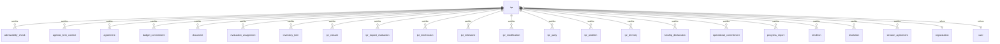

# GORE_OS — ERD y Diccionario de Datos

> **⚠️ Documento generado automáticamente** por `scripts/gen_erd.py` desde `model/model_goreos/sql/goreos_ddl.sql` (2026-06-14).
> La fuente de verdad del esquema es el DDL. Contrato de arquitectura y cambios: [AGENTS.md](../../../AGENTS.md).
> Regenerar tras cambios de schema (`python3 scripts/gen_erd.py`); **no editar a mano** (evita la deriva que afectó a versiones previas).

## Resumen

**110 tablas lógicas** en 5 schemas — 128 `CREATE TABLE` físicos = 110 lógicas + 18 particiones de `txn`:

| Schema | Tablas | Propósito |
|--------|-------:|-----------|
| `core` | 89 | Entidades de negocio (IPR y satélites, presupuesto, convenios, DGI, gates) |
| `txn` | 2 | Event sourcing particionado (`event`, `magnitude`) |
| `public` | 11 | Capa de modelado Story-First (`dim_*`, `fact_user_story`, `bridge_*`) |
| `meta` | 5 | Átomos fundamentales (Role, Process, Entity, Story) |
| `ref` | 3 | Vocabularios controlados (`ref.category`, etc.) |

## Diagrama: hub IPR

Relaciones directas de `core.ipr` derivadas de las FKs del DDL (`ref.category` omitido por ubicuidad).

```mermaid
erDiagram
    ipr ||--o{ admissibility_check : satélite
    ipr ||--o{ agenda_item_context : satélite
    ipr ||--o{ agreement : satélite
    ipr ||--o{ budget_commitment : satélite
    ipr ||--o{ document : satélite
    ipr ||--o{ evaluation_assignment : satélite
    ipr ||--o{ inventory_item : satélite
    ipr ||--o{ ipr_closure : satélite
    ipr ||--o{ ipr_expost_evaluation : satélite
    ipr ||--o{ ipr_mechanism : satélite
    ipr ||--o{ ipr_milestone : satélite
    ipr ||--o{ ipr_modification : satélite
    ipr ||--o{ ipr_party : satélite
    ipr ||--o{ ipr_problem : satélite
    ipr ||--o{ ipr_territory : satélite
    ipr ||--o{ kinship_declaration : satélite
    ipr ||--o{ operational_commitment : satélite
    ipr ||--o{ progress_report : satélite
    ipr ||--o{ rendition : satélite
    ipr ||--o{ resolution : satélite
    ipr ||--o{ session_agreement : satélite
    ipr }o--|| organization : refiere
    ipr }o--|| user : refiere
```

*21 tablas referencian `core.ipr` (satélites); `core.ipr` refiere a 2 entidades (+ `ref.category`).*

## Diccionario de datos

### Schema `core` (89 tablas)

#### `core.administrative_act`

Acto administrativo - manifestacion de voluntad con efectos juridicos

| Columna | Tipo | Null | Default | FK → |
|---------|------|:----:|---------|------|
| 🔑 `id` | uuid |  | gen_random_uuid() |  |
| `act_number` | character varying(32) |  |  |  |
| `act_type_id` | uuid |  |  | `ref.category` |
| `subject` | text |  |  |  |
| `issuer_id` | uuid | ✓ |  | `core.organization` |
| `signer_id` | uuid | ✓ |  | `meta.role` |
| `issued_at` | timestamp with time zone |  |  |  |
| `effective_from` | timestamp with time zone | ✓ |  |  |
| `effective_to` | timestamp with time zone | ✓ |  |  |
| `state_id` | uuid | ✓ |  | `ref.category` |
| `requires_cgr` | boolean | ✓ | false |  |
| `cgr_outcome_id` | uuid | ✓ |  | `ref.category` |
| `cgr_submitted_at` | date | ✓ |  |  |
| `cgr_resolved_at` | date | ✓ |  |  |
| `parent_act_id` | uuid | ✓ |  | `core.administrative_act` |
| `created_at` | timestamp with time zone |  | now() |  |
| `updated_at` | timestamp with time zone |  | now() |  |
| `created_by_id` | uuid | ✓ |  | `core.user` |
| `updated_by_id` | uuid | ✓ |  | `core.user` |
| `deleted_at` | timestamp with time zone | ✓ |  |  |
| `deleted_by_id` | uuid | ✓ |  | `core.user` |
| `metadata` | jsonb | ✓ | '{}'::jsonb |  |

#### `core.administrative_act_history`

Historial de cambios de estado de actos administrativos

| Columna | Tipo | Null | Default | FK → |
|---------|------|:----:|---------|------|
| 🔑 `id` | uuid |  | gen_random_uuid() |  |
| `act_id` | uuid |  |  | `core.administrative_act` |
| `previous_state_id` | uuid | ✓ |  | `ref.category` |
| `new_state_id` | uuid |  |  | `ref.category` |
| `changed_by_id` | uuid |  |  | `core.user` |
| `comment` | text | ✓ |  |  |
| `changed_at` | timestamp with time zone | ✓ | now() |  |

#### `core.administrative_procedure`

Procedimiento administrativo - secuencia de tramites

| Columna | Tipo | Null | Default | FK → |
|---------|------|:----:|---------|------|
| 🔑 `id` | uuid |  | gen_random_uuid() |  |
| `code` | character varying(32) |  |  |  |
| `procedure_type_id` | uuid |  |  | `ref.category` |
| `name` | text |  |  |  |
| `state_id` | uuid | ✓ |  | `ref.category` |
| `initiated_at` | date |  |  |  |
| `resolved_at` | date | ✓ |  |  |
| `initiator_id` | uuid | ✓ |  | `core.organization` |
| `responsible_id` | uuid | ✓ |  | `meta.role` |
| `resolution_id` | uuid | ✓ |  | `core.resolution` |
| `created_at` | timestamp with time zone |  | now() |  |
| `updated_at` | timestamp with time zone |  | now() |  |
| `created_by_id` | uuid | ✓ |  | `core.user` |
| `updated_by_id` | uuid | ✓ |  | `core.user` |
| `deleted_at` | timestamp with time zone | ✓ |  |  |
| `deleted_by_id` | uuid | ✓ |  | `core.user` |
| `metadata` | jsonb | ✓ | '{}'::jsonb |  |

#### `core.admissibility_check`

| Columna | Tipo | Null | Default | FK → |
|---------|------|:----:|---------|------|
| 🔑 `id` | uuid |  | gen_random_uuid() |  |
| `ipr_id` | uuid |  |  | `core.ipr` |
| `item_id` | uuid |  |  | `core.admissibility_item` |
| `verified_by_id` | uuid |  |  | `core.user` |
| `verified_at` | timestamp with time zone |  | now() |  |
| `notes` | text | ✓ |  |  |
| `created_at` | timestamp with time zone | ✓ | now() |  |

#### `core.admissibility_item`

| Columna | Tipo | Null | Default | FK → |
|---------|------|:----:|---------|------|
| 🔑 `id` | uuid |  | gen_random_uuid() |  |
| `financing_track_id` | uuid |  |  | `core.financing_track` |
| `code` | character varying(50) |  |  |  |
| `label` | text |  |  |  |
| `description` | text | ✓ |  |  |
| `responsible_role` | character varying(50) |  |  |  |
| `sort_order` | integer | ✓ | 0 |  |
| `is_required` | boolean | ✓ | true |  |
| `created_at` | timestamp with time zone | ✓ | now() |  |
| `updated_at` | timestamp with time zone | ✓ | now() |  |
| `deleted_at` | timestamp with time zone | ✓ |  |  |

#### `core.agenda_item_context`

| Columna | Tipo | Null | Default | FK → |
|---------|------|:----:|---------|------|
| 🔑 `id` | uuid |  | gen_random_uuid() |  |
| `session_agreement_id` | uuid | ✓ |  | `core.session_agreement` |
| `target_type` | character varying(20) |  |  |  |
| `target_id` | uuid |  |  |  |
| `ipr_id` | uuid | ✓ |  | `core.ipr` |
| `notes` | text | ✓ |  |  |
| `created_at` | timestamp with time zone | ✓ | now() |  |

#### `core.agreement`

Convenio GORE - transferencia, mandato, colaboracion

| Columna | Tipo | Null | Default | FK → |
|---------|------|:----:|---------|------|
| 🔑 `id` | uuid |  | gen_random_uuid() |  |
| `agreement_number` | character varying(32) | ✓ |  |  |
| `agreement_type_id` | uuid | ✓ |  | `ref.category` |
| `state_id` | uuid | ✓ |  | `ref.category` |
| `ipr_id` | uuid | ✓ |  | `core.ipr` |
| `giver_id` | uuid | ✓ |  | `core.organization` |
| `receiver_id` | uuid | ✓ |  | `core.organization` |
| `total_amount` | numeric(18,2) | ✓ |  |  |
| `signed_at` | timestamp with time zone | ✓ |  |  |
| `valid_from` | timestamp with time zone | ✓ |  |  |
| `valid_to` | timestamp with time zone | ✓ |  |  |
| `created_at` | timestamp with time zone |  | now() |  |
| `updated_at` | timestamp with time zone |  | now() |  |
| `created_by_id` | uuid | ✓ |  | `core.user` |
| `updated_by_id` | uuid | ✓ |  | `core.user` |
| `deleted_at` | timestamp with time zone | ✓ |  |  |
| `deleted_by_id` | uuid | ✓ |  | `core.user` |
| `metadata` | jsonb | ✓ | '{}'::jsonb |  |
| `technical_referent_id` | uuid | ✓ |  | `core.person` |
| `cgr_outcome_id` | uuid | ✓ |  | `ref.category` |

#### `core.agreement_history`

| Columna | Tipo | Null | Default | FK → |
|---------|------|:----:|---------|------|
| 🔑 `id` | uuid |  | gen_random_uuid() |  |
| `agreement_id` | uuid |  |  | `core.agreement` |
| `previous_state_id` | uuid | ✓ |  | `ref.category` |
| `new_state_id` | uuid |  |  | `ref.category` |
| `changed_by_id` | uuid |  |  | `core.user` |
| `comment` | text | ✓ |  |  |
| `changed_at` | timestamp with time zone | ✓ | now() |  |

#### `core.agreement_installment`

Cuota de pago programada de un convenio

| Columna | Tipo | Null | Default | FK → |
|---------|------|:----:|---------|------|
| 🔑 `id` | uuid |  | gen_random_uuid() |  |
| `agreement_id` | uuid |  |  | `core.agreement` |
| `installment_number` | integer |  |  |  |
| `amount` | numeric(18,2) |  |  |  |
| `due_date` | date |  |  |  |
| `payment_status_id` | uuid |  |  | `ref.category` |
| `paid_at` | timestamp with time zone | ✓ |  |  |
| `paid_amount` | numeric(18,2) | ✓ |  |  |
| `payment_reference` | character varying(100) | ✓ |  |  |
| `created_at` | timestamp with time zone |  | now() |  |
| `updated_at` | timestamp with time zone |  | now() |  |
| `created_by_id` | uuid | ✓ |  | `core.user` |
| `updated_by_id` | uuid | ✓ |  | `core.user` |
| `deleted_at` | timestamp with time zone | ✓ |  |  |
| `deleted_by_id` | uuid | ✓ |  | `core.user` |
| `metadata` | jsonb | ✓ | '{}'::jsonb |  |

#### `core.alert`

Alerta del sistema nervioso digital

| Columna | Tipo | Null | Default | FK → |
|---------|------|:----:|---------|------|
| 🔑 `id` | uuid |  | gen_random_uuid() |  |
| `alert_type_id` | uuid |  |  | `ref.category` |
| `severity_id` | uuid | ✓ |  | `ref.category` |
| `subject_type` | character varying(32) |  |  |  |
| `subject_id` | uuid |  |  |  |
| `target_type` | character varying(30) | ✓ |  |  |
| `target_id` | uuid | ✓ |  |  |
| `message` | text |  |  |  |
| `triggered_at` | timestamp with time zone | ✓ | now() |  |
| `acknowledged_at` | timestamp with time zone | ✓ |  |  |
| `acknowledged_by_id` | uuid | ✓ |  | `core.user` |
| `attended_by_id` | uuid | ✓ |  | `core.user` |
| `attended_at` | timestamp with time zone | ✓ |  |  |
| `action_taken` | text | ✓ |  |  |
| `resolved_at` | timestamp with time zone | ✓ |  |  |
| `created_at` | timestamp with time zone |  | now() |  |
| `updated_at` | timestamp with time zone |  | now() |  |
| `created_by_id` | uuid | ✓ |  | `core.user` |
| `updated_by_id` | uuid | ✓ |  | `core.user` |
| `deleted_at` | timestamp with time zone | ✓ |  |  |
| `deleted_by_id` | uuid | ✓ |  | `core.user` |
| `metadata` | jsonb | ✓ | '{}'::jsonb |  |

#### `core.budget_carryover`

gnub:BudgetCarryover - Arrastres presupuestarios anuales por programa. Modelo time-series para tracking de saldos arrastrados entre ejercicios fiscales.

| Columna | Tipo | Null | Default | FK → |
|---------|------|:----:|---------|------|
| 🔑 `id` | uuid |  | gen_random_uuid() |  |
| `budget_program_id` | uuid |  |  | `core.budget_program` |
| `fiscal_year` | smallint |  |  |  |
| `amount` | numeric(18,2) |  |  |  |
| `created_at` | timestamp with time zone |  | now() |  |
| `updated_at` | timestamp with time zone |  | now() |  |
| `created_by_id` | uuid | ✓ |  | `core.user` |
| `metadata` | jsonb | ✓ | '{}'::jsonb |  |

#### `core.budget_commitment`

Compromiso presupuestario (CDP, Compromiso, Devengado)

| Columna | Tipo | Null | Default | FK → |
|---------|------|:----:|---------|------|
| 🔑 `id` | uuid |  | gen_random_uuid() |  |
| `commitment_number` | character varying(32) |  |  |  |
| `commitment_type_id` | uuid | ✓ |  | `ref.category` |
| `budget_program_id` | uuid |  |  | `core.budget_program` |
| `ipr_id` | uuid | ✓ |  | `core.ipr` |
| `agreement_id` | uuid | ✓ |  | `core.agreement` |
| `amount` | numeric(18,2) |  |  |  |
| `issued_at` | date |  |  |  |
| `expires_at` | date | ✓ |  |  |
| `status_id` | uuid | ✓ |  | `ref.category` |
| `resolution_id` | uuid | ✓ |  | `core.resolution` |
| `created_at` | timestamp with time zone |  | now() |  |
| `updated_at` | timestamp with time zone |  | now() |  |
| `created_by_id` | uuid | ✓ |  | `core.user` |
| `updated_by_id` | uuid | ✓ |  | `core.user` |
| `deleted_at` | timestamp with time zone | ✓ |  |  |
| `deleted_by_id` | uuid | ✓ |  | `core.user` |
| `metadata` | jsonb | ✓ | '{}'::jsonb |  |

#### `core.budget_cycle_milestone`

| Columna | Tipo | Null | Default | FK → |
|---------|------|:----:|---------|------|
| 🔑 `id` | uuid |  | gen_random_uuid() |  |
| `phase` | character varying(4) |  |  |  |
| `quarter` | character varying(4) | ✓ |  |  |
| `ordinal` | smallint |  |  |  |
| `month_label` | character varying(32) |  |  |  |
| `name` | text |  |  |  |
| `responsible` | text |  |  |  |
| `deliverable` | text | ✓ |  |  |
| `created_at` | timestamp with time zone |  | now() |  |

#### `core.budget_cycle_tracking`

| Columna | Tipo | Null | Default | FK → |
|---------|------|:----:|---------|------|
| 🔑 `id` | uuid |  | gen_random_uuid() |  |
| `milestone_id` | uuid |  |  | `core.budget_cycle_milestone` |
| `fiscal_year` | smallint |  |  |  |
| `status` | character varying(16) |  | 'PENDIENTE'::character varying |  |
| `planned_date` | date | ✓ |  |  |
| `completed_at` | timestamp with time zone | ✓ |  |  |
| `completed_by_id` | uuid | ✓ |  | `core.user` |
| `notes` | text | ✓ |  |  |
| `created_at` | timestamp with time zone |  | now() |  |
| `updated_at` | timestamp with time zone |  | now() |  |

#### `core.budget_program`

Programa de Presupuesto Publico Regional (PPR)

| Columna | Tipo | Null | Default | FK → |
|---------|------|:----:|---------|------|
| 🔑 `id` | uuid |  | gen_random_uuid() |  |
| `code` | character varying(32) |  |  |  |
| `name` | text |  |  |  |
| `fiscal_year` | integer |  |  |  |
| `program_type_id` | uuid | ✓ |  | `ref.category` |
| `subtitle_id` | uuid | ✓ |  | `ref.category` |
| `initial_amount` | numeric(18,2) |  |  |  |
| `current_amount` | numeric(18,2) | ✓ |  |  |
| `committed_amount` | numeric(18,2) | ✓ | 0 |  |
| `accrued_amount` | numeric(18,2) | ✓ | 0 |  |
| `paid_amount` | numeric(18,2) | ✓ | 0 |  |
| `owner_division_id` | uuid | ✓ |  | `core.organization` |
| `created_at` | timestamp with time zone |  | now() |  |
| `updated_at` | timestamp with time zone |  | now() |  |
| `created_by_id` | uuid | ✓ |  | `core.user` |
| `updated_by_id` | uuid | ✓ |  | `core.user` |
| `deleted_at` | timestamp with time zone | ✓ |  |  |
| `deleted_by_id` | uuid | ✓ |  | `core.user` |
| `metadata` | jsonb | ✓ | '{}'::jsonb |  |
| `item_id` | uuid | ✓ |  | `ref.category` |
| `allocation_id` | uuid | ✓ |  | `ref.category` |
| `fndr_amount` | numeric(18,2) | ✓ |  |  |
| `sectorial_amount` | numeric(18,2) | ✓ |  |  |
| `program_code_id` | uuid | ✓ |  | `ref.category` |

#### `core.commitment_history`

Historial de cambios de estado en compromisos operativos

| Columna | Tipo | Null | Default | FK → |
|---------|------|:----:|---------|------|
| 🔑 `id` | uuid |  | gen_random_uuid() |  |
| `commitment_id` | uuid |  |  | `core.operational_commitment` |
| `previous_state_id` | uuid | ✓ |  | `ref.category` |
| `new_state_id` | uuid |  |  | `ref.category` |
| `changed_by_id` | uuid |  |  | `core.user` |
| `comment` | text | ✓ |  |  |
| `changed_at` | timestamp with time zone | ✓ | now() |  |

#### `core.committee`

Organo colegiado de decision (CORE, Comite Inversiones)

| Columna | Tipo | Null | Default | FK → |
|---------|------|:----:|---------|------|
| 🔑 `id` | uuid |  | gen_random_uuid() |  |
| `code` | character varying(32) |  |  |  |
| `name` | text |  |  |  |
| `committee_type_id` | uuid | ✓ |  | `ref.category` |
| `parent_org_id` | uuid | ✓ |  | `core.organization` |
| `is_permanent` | boolean | ✓ | true |  |
| `legal_basis` | text | ✓ |  |  |
| `created_at` | timestamp with time zone |  | now() |  |
| `updated_at` | timestamp with time zone |  | now() |  |
| `created_by_id` | uuid | ✓ |  | `core.user` |
| `updated_by_id` | uuid | ✓ |  | `core.user` |
| `deleted_at` | timestamp with time zone | ✓ |  |  |
| `deleted_by_id` | uuid | ✓ |  | `core.user` |
| `metadata` | jsonb | ✓ | '{}'::jsonb |  |

#### `core.committee_member`

Membresia en comite

| Columna | Tipo | Null | Default | FK → |
|---------|------|:----:|---------|------|
| 🔑 `id` | uuid |  | gen_random_uuid() |  |
| `committee_id` | uuid |  |  | `core.committee` |
| `person_id` | uuid | ✓ |  | `core.person` |
| `role_in_committee_id` | uuid | ✓ |  | `ref.category` |
| `start_date` | date |  |  |  |
| `end_date` | date | ✓ |  |  |
| `is_voting_member` | boolean | ✓ | true |  |
| `created_at` | timestamp with time zone |  | now() |  |
| `updated_at` | timestamp with time zone |  | now() |  |
| `created_by_id` | uuid | ✓ |  | `core.user` |
| `updated_by_id` | uuid | ✓ |  | `core.user` |
| `deleted_at` | timestamp with time zone | ✓ |  |  |
| `deleted_by_id` | uuid | ✓ |  | `core.user` |

#### `core.crisis_meeting`

| Columna | Tipo | Null | Default | FK → |
|---------|------|:----:|---------|------|
| 🔑 `id` | uuid |  | gen_random_uuid() |  |
| `session_id` | uuid |  |  | `core.session` |
| `start_time` | time without time zone | ✓ |  |  |
| `end_time` | time without time zone | ✓ |  |  |
| `started_at` | timestamp with time zone | ✓ |  |  |
| `finished_at` | timestamp with time zone | ✓ |  |  |
| `summary` | text | ✓ |  |  |
| `organizer_id` | uuid | ✓ |  | `core.user` |
| `created_at` | timestamp with time zone |  | now() |  |
| `updated_at` | timestamp with time zone |  | now() |  |
| `created_by_id` | uuid | ✓ |  | `core.user` |
| `updated_by_id` | uuid | ✓ |  | `core.user` |
| `deleted_at` | timestamp with time zone | ✓ |  |  |
| `deleted_by_id` | uuid | ✓ |  | `core.user` |
| `metadata` | jsonb | ✓ | '{}'::jsonb |  |

#### `core.dgi_ar_decision`

| Columna | Tipo | Null | Default | FK → |
|---------|------|:----:|---------|------|
| 🔑 `id` | uuid |  | gen_random_uuid() |  |
| `description` | text |  |  |  |
| `decision_type_id` | uuid |  |  | `ref.category` |
| `status_id` | uuid |  |  | `ref.category` |
| `due_date` | date | ✓ |  |  |
| `context` | text | ✓ |  |  |
| `responsible_id` | uuid | ✓ |  | `core.user` |
| `resolved_at` | timestamp with time zone | ✓ |  |  |
| `created_at` | timestamp with time zone |  | now() |  |
| `updated_at` | timestamp with time zone |  | now() |  |
| `created_by_id` | uuid | ✓ |  | `core.user` |
| `deleted_at` | timestamp with time zone | ✓ |  |  |
| `source_session_id` | uuid | ✓ |  | `core.session` |

#### `core.dgi_bottleneck_investigation`

| Columna | Tipo | Null | Default | FK → |
|---------|------|:----:|---------|------|
| 🔑 `id` | uuid |  | gen_random_uuid() |  |
| `code` | text | ✓ |  |  |
| `status_id` | uuid |  |  | `ref.category` |
| `division_id` | uuid | ✓ |  | `core.organization` |
| `indicator_id` | uuid | ✓ |  | `core.dgi_indicator` |
| `process_id` | uuid | ✓ |  | `core.dgi_process` |
| `detection_type` | text |  |  |  |
| `detection_value` | numeric(10,2) | ✓ |  |  |
| `detection_threshold` | numeric(10,2) | ✓ |  |  |
| `problem` | text | ✓ |  |  |
| `verification` | text | ✓ |  |  |
| `root_cause_analysis` | text | ✓ |  |  |
| `proposal` | text | ✓ |  |  |
| `communication` | text | ✓ |  |  |
| `follow_up` | text | ✓ |  |  |
| `detected_at` | timestamp with time zone |  | now() |  |
| `closed_at` | timestamp with time zone | ✓ |  |  |
| `created_by_id` | uuid | ✓ |  | `core.user` |
| `updated_at` | timestamp with time zone |  | now() |  |
| `deleted_at` | timestamp with time zone | ✓ |  |  |

#### `core.dgi_bpmn_model`

Metadata de modelos BPMN de procesos institucionales

| Columna | Tipo | Null | Default | FK → |
|---------|------|:----:|---------|------|
| 🔑 `id` | uuid |  | gen_random_uuid() |  |
| `code` | character varying(30) | ✓ |  |  |
| `version` | character varying(10) | ✓ | 'v1.0'::character varying |  |
| `status_id` | uuid |  |  | `ref.category` |
| `description` | text | ✓ |  |  |
| `file_url` | text | ✓ |  |  |
| `created_at` | timestamp with time zone |  | now() |  |
| `updated_at` | timestamp with time zone |  | now() |  |
| `created_by_id` | uuid | ✓ |  | `core.user` |
| `updated_by_id` | uuid | ✓ |  | `core.user` |
| `deleted_at` | timestamp with time zone | ✓ |  |  |
| `deleted_by_id` | uuid | ✓ |  | `core.user` |
| `metadata` | jsonb | ✓ | '{}'::jsonb |  |
| `process_id` | uuid |  |  | `core.dgi_process` |
| `bpmn_type_id` | uuid | ✓ |  |  |

#### `core.dgi_committee_session`

Sesiones del Comité de Transformación Digital

| Columna | Tipo | Null | Default | FK → |
|---------|------|:----:|---------|------|
| 🔑 `id` | uuid |  | gen_random_uuid() |  |
| `session_date` | timestamp with time zone |  |  |  |
| `status_id` | uuid |  |  | `ref.category` |
| `agenda` | jsonb | ✓ | '[]'::jsonb |  |
| `agreements` | jsonb | ✓ | '[]'::jsonb |  |
| `attendees` | jsonb | ✓ | '[]'::jsonb |  |
| `notes` | text | ✓ |  |  |
| `created_at` | timestamp with time zone |  | now() |  |
| `updated_at` | timestamp with time zone |  | now() |  |
| `created_by_id` | uuid | ✓ |  | `core.user` |
| `updated_by_id` | uuid | ✓ |  | `core.user` |
| `deleted_at` | timestamp with time zone | ✓ |  |  |
| `deleted_by_id` | uuid | ✓ |  | `core.user` |
| `metadata` | jsonb | ✓ | '{}'::jsonb |  |

#### `core.dgi_data_source_status`

Estado de las fuentes de datos por división

| Columna | Tipo | Null | Default | FK → |
|---------|------|:----:|---------|------|
| 🔑 `id` | uuid |  | gen_random_uuid() |  |
| `division_id` | uuid |  |  | `core.organization` |
| `source_name` | character varying(100) |  |  |  |
| `status_id` | uuid |  |  | `ref.category` |
| `last_data_at` | timestamp with time zone | ✓ |  |  |
| `days_behind` | integer | ✓ | 0 |  |
| `contact_info` | text | ✓ |  |  |
| `created_at` | timestamp with time zone |  | now() |  |
| `updated_at` | timestamp with time zone |  | now() |  |
| `created_by_id` | uuid | ✓ |  | `core.user` |
| `updated_by_id` | uuid | ✓ |  | `core.user` |
| `deleted_at` | timestamp with time zone | ✓ |  |  |
| `deleted_by_id` | uuid | ✓ |  | `core.user` |
| `metadata` | jsonb | ✓ | '{}'::jsonb |  |

#### `core.dgi_decree`

| Columna | Tipo | Null | Default | FK → |
|---------|------|:----:|---------|------|
| 🔑 `id` | uuid |  | gen_random_uuid() |  |
| `code` | text |  |  |  |
| `name` | text |  |  |  |
| `description` | text | ✓ |  |  |
| `status_id` | uuid |  |  | `ref.category` |
| `deadline` | date | ✓ |  |  |
| `created_at` | timestamp with time zone |  | now() |  |
| `updated_at` | timestamp with time zone |  | now() |  |
| `deleted_at` | timestamp with time zone | ✓ |  |  |

#### `core.dgi_division_interaction`

| Columna | Tipo | Null | Default | FK → |
|---------|------|:----:|---------|------|
| 🔑 `id` | uuid |  | gen_random_uuid() |  |
| `division_id` | uuid |  |  | `core.organization` |
| `interaction_type_id` | uuid |  |  | `ref.category` |
| `interaction_date` | date |  | CURRENT_DATE |  |
| `participants` | jsonb | ✓ | '[]'::jsonb |  |
| `topics` | jsonb | ✓ | '[]'::jsonb |  |
| `agreements` | jsonb | ✓ | '[]'::jsonb |  |
| `next_date` | date | ✓ |  |  |
| `notes` | text | ✓ |  |  |
| `created_at` | timestamp with time zone |  | now() |  |
| `updated_at` | timestamp with time zone |  | now() |  |
| `created_by_id` | uuid | ✓ |  | `core.user` |
| `deleted_at` | timestamp with time zone | ✓ |  |  |

#### `core.dgi_escalation`

| Columna | Tipo | Null | Default | FK → |
|---------|------|:----:|---------|------|
| 🔑 `id` | uuid |  | gen_random_uuid() |  |
| `code` | character varying(20) |  |  |  |
| `level_id` | uuid |  |  | `ref.category` |
| `status_id` | uuid |  |  | `ref.category` |
| `situation` | text |  |  |  |
| `impact` | text |  |  |  |
| `options` | jsonb | ✓ | '[]'::jsonb |  |
| `recommendation` | text | ✓ |  |  |
| `deadline` | timestamp with time zone | ✓ |  |  |
| `subject_type` | character varying(64) | ✓ |  |  |
| `subject_id` | uuid | ✓ |  |  |
| `escalated_to` | character varying(32) | ✓ |  |  |
| `resolved_description` | text | ✓ |  |  |
| `alert_id` | uuid | ✓ |  | `core.alert` |
| `created_at` | timestamp with time zone |  | now() |  |
| `updated_at` | timestamp with time zone |  | now() |  |
| `created_by_id` | uuid | ✓ |  | `core.user` |
| `resolved_at` | timestamp with time zone | ✓ |  |  |
| `deleted_at` | timestamp with time zone | ✓ |  |  |

#### `core.dgi_improvement_opportunity`

| Columna | Tipo | Null | Default | FK → |
|---------|------|:----:|---------|------|
| 🔑 `id` | uuid |  | gen_random_uuid() |  |
| `process_id` | uuid |  |  | `core.dgi_process` |
| `initiative_id` | uuid | ✓ |  | `core.dgi_initiative` |
| `dimension` | character varying(30) |  |  |  |
| `description` | text |  |  |  |
| `impact` | character varying(10) |  |  |  |
| `effort` | character varying(10) |  |  |  |
| `status` | character varying(20) |  | 'PROPUESTA'::character varying |  |
| `created_at` | timestamp with time zone |  | now() |  |
| `updated_at` | timestamp with time zone |  | now() |  |
| `created_by_id` | uuid | ✓ |  |  |
| `deleted_at` | timestamp with time zone | ✓ |  |  |
| `metadata` | jsonb | ✓ | '{}'::jsonb |  |

#### `core.dgi_indicator`

Indicadores institucionales del semáforo DGI

| Columna | Tipo | Null | Default | FK → |
|---------|------|:----:|---------|------|
| 🔑 `id` | uuid |  | gen_random_uuid() |  |
| `code` | character varying(30) |  |  |  |
| `name` | character varying(200) |  |  |  |
| `dimension_id` | uuid |  |  | `ref.category` |
| `description` | text | ✓ |  |  |
| `current_value` | numeric(10,2) | ✓ |  |  |
| `target_value` | numeric(10,2) | ✓ |  |  |
| `unit` | character varying(20) | ✓ | '%'::character varying |  |
| `signal_id` | uuid | ✓ |  | `ref.category` |
| `trend` | character varying(10) | ✓ |  |  |
| `division_id` | uuid | ✓ |  | `core.organization` |
| `source_description` | text | ✓ |  |  |
| `last_updated_at` | timestamp with time zone | ✓ |  |  |
| `created_at` | timestamp with time zone |  | now() |  |
| `updated_at` | timestamp with time zone |  | now() |  |
| `created_by_id` | uuid | ✓ |  | `core.user` |
| `updated_by_id` | uuid | ✓ |  | `core.user` |
| `deleted_at` | timestamp with time zone | ✓ |  |  |
| `deleted_by_id` | uuid | ✓ |  | `core.user` |
| `metadata` | jsonb | ✓ | '{}'::jsonb |  |
| `formula` | text | ✓ |  |  |
| `frequency` | character varying(20) | ✓ |  |  |
| `source_type` | character varying(20) | ✓ | 'AUTO'::character varying |  |
| `lifecycle_status_id` | uuid | ✓ |  | `ref.category` |

#### `core.dgi_indicator_lifecycle_history`

| Columna | Tipo | Null | Default | FK → |
|---------|------|:----:|---------|------|
| 🔑 `id` | uuid |  | gen_random_uuid() |  |
| `indicator_id` | uuid |  |  | `core.dgi_indicator` |
| `previous_lifecycle_id` | uuid | ✓ |  | `ref.category` |
| `new_lifecycle_id` | uuid |  |  | `ref.category` |
| `changed_by_id` | uuid | ✓ |  | `core.user` |
| `comment` | text | ✓ |  |  |
| `changed_at` | timestamp with time zone |  | now() |  |

#### `core.dgi_indicator_snapshot`

| Columna | Tipo | Null | Default | FK → |
|---------|------|:----:|---------|------|
| 🔑 `id` | uuid |  | gen_random_uuid() |  |
| `indicator_id` | uuid |  |  | `core.dgi_indicator` |
| `value` | numeric(18,4) | ✓ |  |  |
| `signal_id` | uuid | ✓ |  | `ref.category` |
| `recorded_at` | timestamp with time zone |  | now() |  |

#### `core.dgi_initiative`

Iniciativas de mejora DGI con tracking Kanban/DMAIC

| Columna | Tipo | Null | Default | FK → |
|---------|------|:----:|---------|------|
| 🔑 `id` | uuid |  | gen_random_uuid() |  |
| `code` | character varying(20) | ✓ |  |  |
| `name` | character varying(200) |  |  |  |
| `description` | text | ✓ |  |  |
| `responsible_id` | uuid |  |  | `core.user` |
| `status_id` | uuid |  |  | `ref.category` |
| `dmaic_phase_id` | uuid | ✓ |  | `ref.category` |
| `division_id` | uuid | ✓ |  | `core.organization` |
| `start_date` | date | ✓ |  |  |
| `target_date` | date | ✓ |  |  |
| `current_day` | integer | ✓ | 0 |  |
| `total_days` | integer | ✓ |  |  |
| `progress` | numeric(5,2) | ✓ | 0 |  |
| `wip_column` | character varying(30) | ✓ |  |  |
| `created_at` | timestamp with time zone |  | now() |  |
| `updated_at` | timestamp with time zone |  | now() |  |
| `created_by_id` | uuid | ✓ |  | `core.user` |
| `updated_by_id` | uuid | ✓ |  | `core.user` |
| `deleted_at` | timestamp with time zone | ✓ |  |  |
| `deleted_by_id` | uuid | ✓ |  | `core.user` |
| `metadata` | jsonb | ✓ | '{}'::jsonb |  |
| `sort_order` | integer |  | 0 |  |
| `started_at` | timestamp with time zone | ✓ |  |  |
| `completed_at` | timestamp with time zone | ✓ |  |  |

#### `core.dgi_process`

| Columna | Tipo | Null | Default | FK → |
|---------|------|:----:|---------|------|
| 🔑 `id` | uuid |  | gen_random_uuid() |  |
| `code` | character varying(20) | ✓ |  |  |
| `name` | character varying(200) |  |  |  |
| `description` | text | ✓ |  |  |
| `scope` | text | ✓ |  |  |
| `division_id` | uuid | ✓ |  | `core.organization` |
| `owner_id` | uuid | ✓ |  | `core.user` |
| `status_id` | uuid |  |  |  |
| `criticality` | character varying(10) | ✓ | 'MEDIA'::character varying |  |
| `created_at` | timestamp with time zone |  | now() |  |
| `updated_at` | timestamp with time zone |  | now() |  |
| `created_by_id` | uuid | ✓ |  |  |
| `updated_by_id` | uuid | ✓ |  |  |
| `deleted_at` | timestamp with time zone | ✓ |  |  |
| `deleted_by_id` | uuid | ✓ |  |  |
| `metadata` | jsonb | ✓ | '{}'::jsonb |  |

#### `core.dgi_process_actor`

| Columna | Tipo | Null | Default | FK → |
|---------|------|:----:|---------|------|
| 🔑 `id` | uuid |  | gen_random_uuid() |  |
| `process_id` | uuid |  |  | `core.dgi_process` |
| `actor_type` | character varying(20) |  |  |  |
| `actor_name` | character varying(200) |  |  |  |
| `lane_label` | character varying(100) | ✓ |  |  |
| `description` | text | ✓ |  |  |
| `created_at` | timestamp with time zone |  | now() |  |

#### `core.dgi_process_metric`

| Columna | Tipo | Null | Default | FK → |
|---------|------|:----:|---------|------|
| 🔑 `id` | uuid |  | gen_random_uuid() |  |
| `process_id` | uuid |  |  | `core.dgi_process` |
| `name` | character varying(200) |  |  |  |
| `value` | numeric | ✓ |  |  |
| `unit` | character varying(30) | ✓ |  |  |
| `measured_at` | date |  | CURRENT_DATE |  |
| `measurement_type` | character varying(20) |  | 'BASELINE'::character varying |  |
| `source` | text | ✓ |  |  |
| `created_at` | timestamp with time zone |  | now() |  |
| `created_by_id` | uuid | ✓ |  |  |

#### `core.dgi_process_pain_point`

| Columna | Tipo | Null | Default | FK → |
|---------|------|:----:|---------|------|
| 🔑 `id` | uuid |  | gen_random_uuid() |  |
| `process_id` | uuid |  |  | `core.dgi_process` |
| `description` | text |  |  |  |
| `impact` | character varying(10) |  |  |  |
| `bpmn_stage` | character varying(100) | ✓ |  |  |
| `reported_by_id` | uuid | ✓ |  | `core.user` |
| `created_at` | timestamp with time zone |  | now() |  |

#### `core.dgi_process_rule`

| Columna | Tipo | Null | Default | FK → |
|---------|------|:----:|---------|------|
| 🔑 `id` | uuid |  | gen_random_uuid() |  |
| `process_id` | uuid |  |  | `core.dgi_process` |
| `code` | character varying(20) |  |  |  |
| `description` | text |  |  |  |
| `rule_type` | character varying(20) |  |  |  |
| `created_at` | timestamp with time zone |  | now() |  |

#### `core.dgi_report`

Informes institucionales DGI (Flash, Semanal, Mensual, Temático)

| Columna | Tipo | Null | Default | FK → |
|---------|------|:----:|---------|------|
| 🔑 `id` | uuid |  | gen_random_uuid() |  |
| `code` | character varying(30) | ✓ |  |  |
| `report_type_id` | uuid |  |  | `ref.category` |
| `status_id` | uuid |  |  | `ref.category` |
| `title` | character varying(300) |  |  |  |
| `period_start` | date | ✓ |  |  |
| `period_end` | date | ✓ |  |  |
| `recipient` | text | ✓ |  |  |
| `content` | jsonb | ✓ | '{}'::jsonb |  |
| `generated_by_id` | uuid | ✓ |  | `core.user` |
| `approved_by_id` | uuid | ✓ |  | `core.user` |
| `sent_at` | timestamp with time zone | ✓ |  |  |
| `created_at` | timestamp with time zone |  | now() |  |
| `updated_at` | timestamp with time zone |  | now() |  |
| `created_by_id` | uuid | ✓ |  | `core.user` |
| `updated_by_id` | uuid | ✓ |  | `core.user` |
| `deleted_at` | timestamp with time zone | ✓ |  |  |
| `deleted_by_id` | uuid | ✓ |  | `core.user` |
| `metadata` | jsonb | ✓ | '{}'::jsonb |  |

#### `core.dgi_service`

| Columna | Tipo | Null | Default | FK → |
|---------|------|:----:|---------|------|
| 🔑 `id` | uuid |  | gen_random_uuid() |  |
| `code` | character varying(20) |  |  |  |
| `name` | text |  |  |  |
| `description` | text | ✓ |  |  |
| `area` | character varying(4) |  |  |  |
| `status_id` | uuid |  |  | `ref.category` |
| `sla_days` | integer | ✓ |  |  |
| `how_to_request` | text | ✓ |  |  |
| `deliverables` | text | ✓ |  |  |
| `created_at` | timestamp with time zone |  | now() |  |
| `updated_at` | timestamp with time zone |  | now() |  |
| `created_by_id` | uuid | ✓ |  | `core.user` |
| `deleted_at` | timestamp with time zone | ✓ |  |  |

#### `core.dgi_service_request`

| Columna | Tipo | Null | Default | FK → |
|---------|------|:----:|---------|------|
| 🔑 `id` | uuid |  | gen_random_uuid() |  |
| `code` | character varying(20) |  |  |  |
| `service_id` | uuid |  |  | `core.dgi_service` |
| `status_id` | uuid |  |  | `ref.category` |
| `requester_id` | uuid |  |  | `core.user` |
| `division_id` | uuid | ✓ |  | `core.organization` |
| `description` | text |  |  |  |
| `urgency` | character varying(8) | ✓ | 'NORMAL'::character varying |  |
| `assigned_to_id` | uuid | ✓ |  | `core.user` |
| `started_at` | timestamp with time zone | ✓ |  |  |
| `completed_at` | timestamp with time zone | ✓ |  |  |
| `satisfaction_score` | integer | ✓ |  |  |
| `feedback_text` | text | ✓ |  |  |
| `created_at` | timestamp with time zone |  | now() |  |
| `updated_at` | timestamp with time zone |  | now() |  |
| `created_by_id` | uuid | ✓ |  | `core.user` |
| `deleted_at` | timestamp with time zone | ✓ |  |  |

#### `core.dgi_sla`

| Columna | Tipo | Null | Default | FK → |
|---------|------|:----:|---------|------|
| 🔑 `id` | uuid |  | gen_random_uuid() |  |
| `service_id` | uuid |  |  | `core.dgi_service` |
| `product_type_id` | uuid |  |  | `ref.category` |
| `description` | text | ✓ |  |  |
| `target_days` | integer |  |  |  |
| `target_hour` | time without time zone | ✓ |  |  |
| `priority` | integer | ✓ | 0 |  |
| `applies_to` | jsonb | ✓ | '[]'::jsonb |  |
| `created_at` | timestamp with time zone |  | now() |  |
| `updated_at` | timestamp with time zone |  | now() |  |
| `deleted_at` | timestamp with time zone | ✓ |  |  |

#### `core.digital_platform`

Sistema o plataforma digital (SIGFE, BIP, Portal)

| Columna | Tipo | Null | Default | FK → |
|---------|------|:----:|---------|------|
| 🔑 `id` | uuid |  | gen_random_uuid() |  |
| `code` | character varying(32) |  |  |  |
| `name` | text |  |  |  |
| `platform_type_id` | uuid | ✓ |  | `ref.category` |
| `url` | text | ✓ |  |  |
| `owner_id` | uuid | ✓ |  | `core.organization` |
| `is_external` | boolean | ✓ | false |  |
| `created_at` | timestamp with time zone |  | now() |  |
| `updated_at` | timestamp with time zone |  | now() |  |
| `created_by_id` | uuid | ✓ |  | `core.user` |
| `updated_by_id` | uuid | ✓ |  | `core.user` |
| `deleted_at` | timestamp with time zone | ✓ |  |  |
| `deleted_by_id` | uuid | ✓ |  | `core.user` |
| `metadata` | jsonb | ✓ | '{}'::jsonb |  |

#### `core.document`

Documento digital o fisico en el sistema

| Columna | Tipo | Null | Default | FK → |
|---------|------|:----:|---------|------|
| 🔑 `id` | uuid |  | gen_random_uuid() |  |
| `code` | character varying(64) | ✓ |  |  |
| `name` | text |  |  |  |
| `document_type_id` | uuid | ✓ |  | `ref.category` |
| `file_id` | uuid | ✓ |  | `core.electronic_file` |
| `ipr_id` | uuid | ✓ |  | `core.ipr` |
| `agreement_id` | uuid | ✓ |  | `core.agreement` |
| `storage_url` | text | ✓ |  |  |
| `sort_order` | integer | ✓ |  |  |
| `folio_number` | character varying(20) | ✓ |  |  |
| `created_at` | timestamp with time zone |  | now() |  |
| `updated_at` | timestamp with time zone |  | now() |  |
| `created_by_id` | uuid | ✓ |  | `core.user` |
| `updated_by_id` | uuid | ✓ |  | `core.user` |
| `deleted_at` | timestamp with time zone | ✓ |  |  |
| `deleted_by_id` | uuid | ✓ |  | `core.user` |
| `metadata` | jsonb | ✓ | '{}'::jsonb |  |

#### `core.electronic_file`

Expediente electronico de un tramite

| Columna | Tipo | Null | Default | FK → |
|---------|------|:----:|---------|------|
| 🔑 `id` | uuid |  | gen_random_uuid() |  |
| `file_number` | character varying(32) |  |  |  |
| `procedure_id` | uuid | ✓ |  | `core.procedure` |
| `requester_id` | uuid | ✓ |  | `core.person` |
| `subject` | text |  |  |  |
| `status_id` | uuid | ✓ |  | `ref.category` |
| `resolved_at` | timestamp with time zone | ✓ |  |  |
| `resolution_id` | uuid | ✓ |  | `core.resolution` |
| `created_at` | timestamp with time zone |  | now() |  |
| `updated_at` | timestamp with time zone |  | now() |  |
| `created_by_id` | uuid | ✓ |  | `core.user` |
| `updated_by_id` | uuid | ✓ |  | `core.user` |
| `deleted_at` | timestamp with time zone | ✓ |  |  |
| `deleted_by_id` | uuid | ✓ |  | `core.user` |
| `metadata` | jsonb | ✓ | '{}'::jsonb |  |

#### `core.evaluation_assignment`

Asignación de evaluación: quién evalúa un IPR y con qué resultado (Poly-Switch Wave 7)

| Columna | Tipo | Null | Default | FK → |
|---------|------|:----:|---------|------|
| 🔑 `id` | uuid |  | gen_random_uuid() |  |
| `ipr_id` | uuid |  |  | `core.ipr` |
| `evaluator_type_id` | uuid |  |  | `ref.category` |
| `evaluator_organization_id` | uuid | ✓ |  | `core.organization` |
| `evaluator_name` | character varying(200) | ✓ |  |  |
| `assigned_at` | timestamp with time zone |  | now() |  |
| `deadline_at` | timestamp with time zone | ✓ |  |  |
| `completed_at` | timestamp with time zone | ✓ |  |  |
| `result_id` | uuid | ✓ |  | `ref.category` |
| `result_code` | character varying(10) | ✓ |  |  |
| `observations` | text | ✓ |  |  |
| `created_at` | timestamp with time zone |  | now() |  |
| `updated_at` | timestamp with time zone |  | now() |  |
| `created_by_id` | uuid | ✓ |  | `core.user` |
| `updated_by_id` | uuid | ✓ |  | `core.user` |
| `deleted_at` | timestamp with time zone | ✓ |  |  |
| `deleted_by_id` | uuid | ✓ |  | `core.user` |
| `metadata` | jsonb | ✓ | '{}'::jsonb |  |
| `numeric_score` | numeric(5,2) | ✓ |  |  |
| `rank_position` | integer | ✓ |  |  |
| `rank_total` | integer | ✓ |  |  |
| `convocatoria_code` | character varying(32) | ✓ |  |  |

#### `core.financial_threshold`

Umbrales financieros parametrizables (universales + glosa). Administrables sin code change.

| Columna | Tipo | Null | Default | FK → |
|---------|------|:----:|---------|------|
| 🔑 `id` | uuid |  | gen_random_uuid() |  |
| `code` | character varying(64) |  |  |  |
| `label` | text |  |  |  |
| `value_utm` | numeric(10,2) | ✓ |  |  |
| `value_pct` | numeric(5,2) | ✓ |  |  |
| `enforcement_point` | character varying(32) |  |  |  |
| `source_normativa` | text | ✓ |  |  |
| `applies_to_track` | character varying(32) | ✓ |  |  |
| `is_active` | boolean |  | true |  |
| `created_at` | timestamp with time zone |  | now() |  |
| `updated_at` | timestamp with time zone |  | now() |  |

#### `core.financing_track`

| Columna | Tipo | Null | Default | FK → |
|---------|------|:----:|---------|------|
| 🔑 `id` | uuid |  | gen_random_uuid() |  |
| `code` | character varying(32) |  |  |  |
| `label` | text |  |  |  |
| `evaluator_code` | character varying(32) |  |  |  |
| `evaluator_label` | text |  |  |  |
| `favorable_products` | text[] |  | '{}'::text[] |  |
| `unfavorable_products` | text[] |  | '{}'::text[] |  |
| `terminal_negative` | text[] |  | '{}'::text[] |  |
| `thresholds` | jsonb |  | '{}'::jsonb |  |
| `required_attrs` | text[] |  | '{}'::text[] |  |
| `sla_days` | jsonb |  | '{}'::jsonb |  |
| `rs_validity_years` | integer | ✓ |  |  |
| `is_active` | boolean |  | true |  |
| `created_at` | timestamp with time zone |  | now() |  |
| `updated_at` | timestamp with time zone |  | now() |  |
| `role_permissions` | jsonb |  | '{}'::jsonb |  |

#### `core.fril_category`

TP-04: FRIL project categories (12 types in 4 groups A-D)

| Columna | Tipo | Null | Default | FK → |
|---------|------|:----:|---------|------|
| 🔑 `id` | uuid |  | gen_random_uuid() |  |
| `code` | character varying(3) |  |  |  |
| `name` | text |  |  |  |
| `group_code` | character varying(1) |  |  |  |
| `group_name` | text |  |  |  |
| `description` | text | ✓ |  |  |
| `examples` | text | ✓ |  |  |
| `max_utm` | numeric(12,2) |  | 4545 |  |
| `is_exempt_commune_limit` | boolean |  | false |  |
| `is_active` | boolean |  | true |  |
| `sort_order` | integer |  | 0 |  |
| `created_at` | timestamp with time zone |  | now() |  |
| `updated_at` | timestamp with time zone |  | now() |  |

#### `core.fund_program`

Programa especifico financiado por un fondo

| Columna | Tipo | Null | Default | FK → |
|---------|------|:----:|---------|------|
| 🔑 `id` | uuid |  | gen_random_uuid() |  |
| `code` | character varying(32) |  |  |  |
| `name` | text |  |  |  |
| `fund_source_id` | uuid |  |  | `ref.category` |
| `fiscal_year` | integer |  |  |  |
| `total_amount` | numeric(18,2) |  |  |  |
| `state_id` | uuid | ✓ |  | `ref.category` |
| `call_open_date` | date | ✓ |  |  |
| `call_close_date` | date | ✓ |  |  |
| `resolution_id` | uuid | ✓ |  | `core.resolution` |
| `budget_program_id` | uuid | ✓ |  | `core.budget_program` |
| `created_at` | timestamp with time zone |  | now() |  |
| `updated_at` | timestamp with time zone |  | now() |  |
| `created_by_id` | uuid | ✓ |  | `core.user` |
| `updated_by_id` | uuid | ✓ |  | `core.user` |
| `deleted_at` | timestamp with time zone | ✓ |  |  |
| `deleted_by_id` | uuid | ✓ |  | `core.user` |
| `metadata` | jsonb | ✓ | '{}'::jsonb |  |

#### `core.installment_milestone`

OO-008: Relación N:M cuota↔hito siguiendo gnub:triggersPayment

| Columna | Tipo | Null | Default | FK → |
|---------|------|:----:|---------|------|
| 🔑 `installment_id` | uuid |  |  | `core.agreement_installment` |
| 🔑 `milestone_id` | uuid |  |  | `core.ipr_milestone` |
| `is_required` | boolean | ✓ | true |  |
| `notes` | text | ✓ |  |  |

#### `core.inventory_item`

Bien mueble o activo del GORE

| Columna | Tipo | Null | Default | FK → |
|---------|------|:----:|---------|------|
| 🔑 `id` | uuid |  | gen_random_uuid() |  |
| `code` | character varying(32) |  |  |  |
| `name` | text |  |  |  |
| `item_type_id` | uuid | ✓ |  | `ref.category` |
| `location_id` | uuid | ✓ |  | `core.organization` |
| `responsible_id` | uuid | ✓ |  | `core.person` |
| `acquisition_date` | date | ✓ |  |  |
| `acquisition_value` | numeric(18,2) | ✓ |  |  |
| `current_status_id` | uuid | ✓ |  | `ref.category` |
| `ipr_origin_id` | uuid | ✓ |  | `core.ipr` |
| `created_at` | timestamp with time zone |  | now() |  |
| `updated_at` | timestamp with time zone |  | now() |  |
| `created_by_id` | uuid | ✓ |  | `core.user` |
| `updated_by_id` | uuid | ✓ |  | `core.user` |
| `deleted_at` | timestamp with time zone | ✓ |  |  |
| `deleted_by_id` | uuid | ✓ |  | `core.user` |
| `metadata` | jsonb | ✓ | '{}'::jsonb |  |

#### `core.ipr`

Iniciativa de Inversion Publica Regional - transformacion territorial

| Columna | Tipo | Null | Default | FK → |
|---------|------|:----:|---------|------|
| 🔑 `id` | uuid |  | gen_random_uuid() |  |
| `codigo_bip` | character varying(20) |  |  |  |
| `name` | text |  |  |  |
| `ipr_nature` | public.ipr_nature_enum |  |  |  |
| `ipr_type_id` | uuid | ✓ |  | `ref.category` |
| `mcd_phase_id` | uuid | ✓ |  | `ref.category` |
| `status_id` | uuid | ✓ |  | `ref.category` |
| `budget_subtitle_id` | uuid | ✓ |  | `ref.category` |
| `funding_source_id` | uuid | ✓ |  | `ref.category` |
| `mechanism_id` | uuid | ✓ |  | `ref.category` |
| `crea_activo` | boolean | ✓ | true |  |
| `formulator_id` | uuid | ✓ |  | `core.organization` |
| `executor_id` | uuid | ✓ |  | `core.organization` |
| `sponsor_division_id` | uuid | ✓ |  | `core.organization` |
| `max_execution_months` | integer | ✓ |  |  |
| `intended_outcome` | text | ✓ |  |  |
| `resolution_type_id` | uuid | ✓ |  | `ref.category` |
| `requires_cgr` | boolean | ✓ | false |  |
| `requires_dipres` | boolean | ✓ | false |  |
| `has_open_problems` | boolean | ✓ | false |  |
| `alert_level_id` | uuid | ✓ |  | `ref.category` |
| `assignee_id` | uuid | ✓ |  | `core.user` |
| `created_at` | timestamp with time zone |  | now() |  |
| `updated_at` | timestamp with time zone |  | now() |  |
| `created_by_id` | uuid | ✓ |  | `core.user` |
| `updated_by_id` | uuid | ✓ |  | `core.user` |
| `deleted_at` | timestamp with time zone | ✓ |  |  |
| `deleted_by_id` | uuid | ✓ |  | `core.user` |
| `metadata` | jsonb | ✓ | '{}'::jsonb |  |
| `investment_sector_id` | uuid | ✓ |  | `ref.category` |
| `fund_category_id` | uuid | ✓ |  | `ref.category` |
| `is_municipal_origin` | boolean | ✓ | false |  |
| `phase_entered_at` | timestamp with time zone | ✓ |  |  |

#### `core.ipr_closure`

| Columna | Tipo | Null | Default | FK → |
|---------|------|:----:|---------|------|
| 🔑 `id` | uuid |  | gen_random_uuid() |  |
| `ipr_id` | uuid |  |  | `core.ipr` |
| `closure_date` | date | ✓ |  |  |
| `closure_report` | text | ✓ |  |  |
| `physical_completion` | numeric(5,2) | ✓ |  |  |
| `financial_completion` | numeric(5,2) | ✓ |  |  |
| `final_amount` | numeric(18,2) | ✓ |  |  |
| `signed_by_id` | uuid | ✓ |  | `core.user` |
| `signed_at` | timestamp with time zone | ✓ |  |  |
| `closure_act_id` | uuid | ✓ |  | `core.administrative_act` |
| `created_by_id` | uuid |  |  | `core.user` |
| `created_at` | timestamp with time zone |  | now() |  |
| `updated_at` | timestamp with time zone |  | now() |  |

#### `core.ipr_expost_evaluation`

| Columna | Tipo | Null | Default | FK → |
|---------|------|:----:|---------|------|
| 🔑 `id` | uuid |  | gen_random_uuid() |  |
| `ipr_id` | uuid |  |  | `core.ipr` |
| `evaluation_date` | date |  |  |  |
| `evaluator_id` | uuid |  |  | `core.user` |
| `evaluation_type_id` | uuid |  |  | `ref.category` |
| `impact_score` | numeric(5,2) | ✓ |  |  |
| `sustainability_score` | numeric(5,2) | ✓ |  |  |
| `efficiency_score` | numeric(5,2) | ✓ |  |  |
| `effectiveness_score` | numeric(5,2) | ✓ |  |  |
| `overall_rating_id` | uuid | ✓ |  | `ref.category` |
| `findings` | text | ✓ |  |  |
| `recommendations` | text | ✓ |  |  |
| `lessons_learned` | text | ✓ |  |  |
| `created_at` | timestamp with time zone |  | now() |  |
| `updated_at` | timestamp with time zone |  | now() |  |

#### `core.ipr_mechanism`

Atributos especificos por mecanismo (el mecanismo se obtiene de core.ipr.mechanism_id)

| Columna | Tipo | Null | Default | FK → |
|---------|------|:----:|---------|------|
| 🔑 `id` | uuid |  | gen_random_uuid() |  |
| `ipr_id` | uuid |  |  | `core.ipr` |
| `rate_mdsf` | character varying(4) | ✓ |  |  |
| `etapa_bip` | character varying(16) | ✓ |  |  |
| `sector` | character varying(64) | ✓ |  |  |
| `categoria_c33` | character varying(32) | ✓ |  |  |
| `vida_util_residual` | integer | ✓ |  |  |
| `informe_tecnico_favorable` | boolean | ✓ |  |  |
| `cofinanciamiento_anf` | numeric(5,2) | ✓ |  |  |
| `tipo_fril` | character varying(32) | ✓ |  |  |
| `cumple_norma_5k_utm` | boolean | ✓ |  |  |
| `res_subdere` | character varying(32) | ✓ |  |  |
| `plazo_licitacion_dias` | integer | ✓ |  |  |
| `fase_eval_central` | character varying(16) | ✓ |  |  |
| `rate_ses` | character varying(4) | ✓ |  |  |
| `gasto_admin_max` | numeric(5,2) | ✓ |  |  |
| `eje_fomento` | character varying(64) | ✓ |  |  |
| `nivel_trl` | integer | ✓ |  |  |
| `innovacion_ctci` | boolean | ✓ |  |  |
| `fondo_tematico` | character varying(32) | ✓ |  |  |
| `puntaje_evaluacion` | numeric(5,2) | ✓ |  |  |
| `asignacion_directa` | boolean | ✓ |  |  |
| `created_at` | timestamp with time zone |  | now() |  |
| `updated_at` | timestamp with time zone |  | now() |  |
| `created_by_id` | uuid | ✓ |  | `core.user` |
| `updated_by_id` | uuid | ✓ |  | `core.user` |
| `deleted_at` | timestamp with time zone | ✓ |  |  |
| `deleted_by_id` | uuid | ✓ |  | `core.user` |
| `metadata` | jsonb | ✓ | '{}'::jsonb |  |

#### `core.ipr_milestone`

OO-002: Hitos de proyecto (gnub:ProjectMilestone) con fechas planificadas vs reales

| Columna | Tipo | Null | Default | FK → |
|---------|------|:----:|---------|------|
| 🔑 `id` | uuid |  | gen_random_uuid() |  |
| `ipr_id` | uuid |  |  | `core.ipr` |
| `milestone_type_id` | uuid |  |  | `ref.category` |
| `code` | character varying(20) | ✓ |  |  |
| `description` | text | ✓ |  |  |
| `planned_date` | date |  |  |  |
| `actual_date` | date | ✓ |  |  |
| `deviation_days` | integer GENERATED ALWAYS AS ( | ✓ |  |  |
| `WHEN` | (actual_date IS |  |  |  |
| `ELSE` | NULL::integer | ✓ |  |  |
| `completed_by_id` | uuid | ✓ |  | `core.user` |
| `verification_notes` | text | ✓ |  |  |
| `evidence_document_id` | uuid | ✓ |  |  |
| `created_at` | timestamp with time zone |  | now() |  |
| `updated_at` | timestamp with time zone |  | now() |  |
| `created_by_id` | uuid | ✓ |  | `core.user` |
| `updated_by_id` | uuid | ✓ |  | `core.user` |
| `deleted_at` | timestamp with time zone | ✓ |  |  |
| `deleted_by_id` | uuid | ✓ |  | `core.user` |
| `metadata` | jsonb | ✓ | '{}'::jsonb |  |

#### `core.ipr_modification`

| Columna | Tipo | Null | Default | FK → |
|---------|------|:----:|---------|------|
| 🔑 `id` | uuid |  | gen_random_uuid() |  |
| `ipr_id` | uuid |  |  | `core.ipr` |
| `code` | character varying(20) |  |  |  |
| `modification_type_id` | uuid |  |  | `ref.category` |
| `status_id` | uuid |  |  | `ref.category` |
| `description` | text |  |  |  |
| `justification` | text | ✓ |  |  |
| `field_changed` | character varying(100) | ✓ |  |  |
| `old_value` | text | ✓ |  |  |
| `new_value` | text | ✓ |  |  |
| `amount_delta` | numeric(18,2) | ✓ |  |  |
| `requested_by_id` | uuid |  |  | `core.user` |
| `approved_by_id` | uuid | ✓ |  | `core.user` |
| `approved_at` | timestamp with time zone | ✓ |  |  |
| `created_at` | timestamp with time zone |  | now() |  |
| `updated_at` | timestamp with time zone |  | now() |  |
| `deleted_at` | timestamp with time zone | ✓ |  |  |

#### `core.ipr_party`

OO-003: Partes de IPR siguiendo gist:hasParty con roles categorizados (N:M)

| Columna | Tipo | Null | Default | FK → |
|---------|------|:----:|---------|------|
| 🔑 `id` | uuid |  | gen_random_uuid() |  |
| `ipr_id` | uuid |  |  | `core.ipr` |
| `organization_id` | uuid |  |  | `core.organization` |
| `party_role_id` | uuid |  |  | `ref.category` |
| `is_primary` | boolean | ✓ | false |  |
| `valid_from` | date | ✓ |  |  |
| `valid_to` | date | ✓ |  |  |
| `responsibility_description` | text | ✓ |  |  |
| `contact_person` | text | ✓ |  |  |
| `contact_email` | character varying(255) | ✓ |  |  |
| `created_at` | timestamp with time zone |  | now() |  |
| `updated_at` | timestamp with time zone |  | now() |  |
| `created_by_id` | uuid | ✓ |  | `core.user` |
| `updated_by_id` | uuid | ✓ |  | `core.user` |
| `deleted_at` | timestamp with time zone | ✓ |  |  |
| `deleted_by_id` | uuid | ✓ |  | `core.user` |
| `metadata` | jsonb | ✓ | '{}'::jsonb |  |
| `agreement_id` | uuid | ✓ |  | `core.agreement` |
| `sponsor_division_id` | uuid | ✓ |  | `core.organization` |

#### `core.ipr_problem`

Problema/nudo detectado en una IPR que bloquea avance

| Columna | Tipo | Null | Default | FK → |
|---------|------|:----:|---------|------|
| 🔑 `id` | uuid |  | gen_random_uuid() |  |
| `code` | character varying(20) | ✓ |  |  |
| `ipr_id` | uuid |  |  | `core.ipr` |
| `agreement_id` | uuid | ✓ |  | `core.agreement` |
| `problem_type_id` | uuid |  |  | `ref.category` |
| `impact_id` | uuid | ✓ |  | `ref.category` |
| `description` | text |  |  |  |
| `impact_description` | text | ✓ |  |  |
| `detected_by_id` | uuid | ✓ |  | `core.user` |
| `detected_at` | timestamp with time zone | ✓ | now() |  |
| `state_id` | uuid |  |  | `ref.category` |
| `proposed_solution` | text | ✓ |  |  |
| `solution_applied` | text | ✓ |  |  |
| `resolved_by_id` | uuid | ✓ |  | `core.user` |
| `resolved_at` | timestamp with time zone | ✓ |  |  |
| `created_at` | timestamp with time zone |  | now() |  |
| `updated_at` | timestamp with time zone |  | now() |  |
| `created_by_id` | uuid | ✓ |  | `core.user` |
| `updated_by_id` | uuid | ✓ |  | `core.user` |
| `deleted_at` | timestamp with time zone | ✓ |  |  |
| `deleted_by_id` | uuid | ✓ |  | `core.user` |
| `metadata` | jsonb | ✓ | '{}'::jsonb |  |

#### `core.ipr_territory`

OO-001: Relación N:M IPR↔Territory siguiendo gnub:isLocatedIn con tipo de impacto

| Columna | Tipo | Null | Default | FK → |
|---------|------|:----:|---------|------|
| 🔑 `id` | uuid |  | gen_random_uuid() |  |
| `ipr_id` | uuid |  |  | `core.ipr` |
| `territory_id` | uuid |  |  | `core.territory` |
| `impact_type_id` | uuid |  |  | `ref.category` |
| `is_primary` | boolean | ✓ | false |  |
| `notes` | text | ✓ |  |  |
| `created_at` | timestamp with time zone |  | now() |  |
| `updated_at` | timestamp with time zone |  | now() |  |
| `created_by_id` | uuid | ✓ |  | `core.user` |
| `updated_by_id` | uuid | ✓ |  | `core.user` |
| `deleted_at` | timestamp with time zone | ✓ |  |  |
| `deleted_by_id` | uuid | ✓ |  | `core.user` |
| `metadata` | jsonb | ✓ | '{}'::jsonb |  |

#### `core.kinship_declaration`

| Columna | Tipo | Null | Default | FK → |
|---------|------|:----:|---------|------|
| 🔑 `id` | uuid |  | gen_random_uuid() |  |
| `ipr_id` | uuid |  |  | `core.ipr` |
| `person_id` | uuid |  |  | `core.person` |
| `declaration_type` | character varying(32) |  |  |  |
| `declares_no_conflict` | boolean |  |  |  |
| `related_authority_id` | uuid | ✓ |  | `core.person` |
| `relationship_type` | character varying(16) | ✓ |  |  |
| `relationship_degree` | integer | ✓ |  |  |
| `declared_at` | timestamp with time zone |  | now() |  |
| `validated_by_id` | uuid | ✓ |  | `core.user` |
| `validated_at` | timestamp with time zone | ✓ |  |  |
| `created_at` | timestamp with time zone |  | now() |  |
| `updated_at` | timestamp with time zone |  | now() |  |
| `deleted_at` | timestamp with time zone | ✓ |  |  |

#### `core.legal_document`

Documento legal (Ley, DFL, Reglamento)

| Columna | Tipo | Null | Default | FK → |
|---------|------|:----:|---------|------|
| 🔑 `id` | uuid |  | gen_random_uuid() |  |
| `code` | character varying(64) |  |  |  |
| `name` | text |  |  |  |
| `doc_type_id` | uuid | ✓ |  | `ref.category` |
| `publication_date` | date | ✓ |  |  |
| `source_url` | text | ✓ |  |  |
| `created_at` | timestamp with time zone |  | now() |  |
| `updated_at` | timestamp with time zone |  | now() |  |
| `created_by_id` | uuid | ✓ |  | `core.user` |
| `updated_by_id` | uuid | ✓ |  | `core.user` |
| `deleted_at` | timestamp with time zone | ✓ |  |  |
| `deleted_by_id` | uuid | ✓ |  | `core.user` |
| `metadata` | jsonb | ✓ | '{}'::jsonb |  |

#### `core.legal_mandate`

Mandato legal - constraint institucional derivado de norma

| Columna | Tipo | Null | Default | FK → |
|---------|------|:----:|---------|------|
| 🔑 `id` | uuid |  | gen_random_uuid() |  |
| `legal_document_id` | uuid |  |  | `core.legal_document` |
| `article_reference` | character varying(32) | ✓ |  |  |
| `mandate_text` | text |  |  |  |
| `applies_to_id` | uuid | ✓ |  | `ref.category` |
| `created_at` | timestamp with time zone |  | now() |  |
| `updated_at` | timestamp with time zone |  | now() |  |
| `created_by_id` | uuid | ✓ |  | `core.user` |
| `updated_by_id` | uuid | ✓ |  | `core.user` |
| `deleted_at` | timestamp with time zone | ✓ |  |  |
| `deleted_by_id` | uuid | ✓ |  | `core.user` |
| `metadata` | jsonb | ✓ | '{}'::jsonb |  |

#### `core.minute`

| Columna | Tipo | Null | Default | FK → |
|---------|------|:----:|---------|------|
| 🔑 `id` | uuid |  | gen_random_uuid() |  |
| `session_id` | uuid |  |  | `core.session` |
| `minute_number` | character varying(32) |  |  |  |
| `approved_at` | date | ✓ |  |  |
| `content` | text | ✓ |  |  |
| `resolution_id` | uuid | ✓ |  | `core.resolution` |
| `signed_by_id` | uuid | ✓ |  | `core.person` |
| `created_at` | timestamp with time zone |  | now() |  |
| `updated_at` | timestamp with time zone |  | now() |  |
| `created_by_id` | uuid | ✓ |  | `core.user` |
| `updated_by_id` | uuid | ✓ |  | `core.user` |
| `deleted_at` | timestamp with time zone | ✓ |  |  |
| `deleted_by_id` | uuid | ✓ |  | `core.user` |
| `metadata` | jsonb | ✓ | '{}'::jsonb |  |

#### `core.notification`

| Columna | Tipo | Null | Default | FK → |
|---------|------|:----:|---------|------|
| 🔑 `id` | uuid |  | gen_random_uuid() |  |
| `user_id` | uuid |  |  | `core.user` |
| `title` | character varying(200) |  |  |  |
| `body` | text | ✓ |  |  |
| `category` | character varying(50) |  |  |  |
| `entity_type` | character varying(50) | ✓ |  |  |
| `entity_id` | uuid | ✓ |  |  |
| `link` | character varying(500) | ✓ |  |  |
| `read_at` | timestamp with time zone | ✓ |  |  |
| `created_at` | timestamp with time zone |  | now() |  |
| `deleted_at` | timestamp with time zone | ✓ |  |  |

#### `core.operational_commitment`

Tarea asignada a un responsable con plazo y seguimiento

| Columna | Tipo | Null | Default | FK → |
|---------|------|:----:|---------|------|
| 🔑 `id` | uuid |  | gen_random_uuid() |  |
| `code` | character varying(20) | ✓ |  |  |
| `problem_id` | uuid | ✓ |  | `core.ipr_problem` |
| `ipr_id` | uuid | ✓ |  | `core.ipr` |
| `agreement_id` | uuid | ✓ |  | `core.agreement` |
| `budget_commitment_id` | uuid | ✓ |  | `core.budget_commitment` |
| `commitment_type_id` | uuid |  |  | `ref.operational_commitment_type` |
| `description` | text |  |  |  |
| `responsible_id` | uuid |  |  | `core.user` |
| `division_id` | uuid | ✓ |  | `core.organization` |
| `due_date` | date |  |  |  |
| `priority_id` | uuid | ✓ |  | `ref.category` |
| `state_id` | uuid |  |  | `ref.category` |
| `observations` | text | ✓ |  |  |
| `completed_at` | timestamp with time zone | ✓ |  |  |
| `verified_by_id` | uuid | ✓ |  | `core.user` |
| `verified_at` | timestamp with time zone | ✓ |  |  |
| `created_at` | timestamp with time zone |  | now() |  |
| `updated_at` | timestamp with time zone |  | now() |  |
| `created_by_id` | uuid | ✓ |  | `core.user` |
| `updated_by_id` | uuid | ✓ |  | `core.user` |
| `deleted_at` | timestamp with time zone | ✓ |  |  |
| `deleted_by_id` | uuid | ✓ |  | `core.user` |
| `metadata` | jsonb | ✓ | '{}'::jsonb |  |

#### `core.organization`

Organizacion - Division, Departamento, Unidad

| Columna | Tipo | Null | Default | FK → |
|---------|------|:----:|---------|------|
| 🔑 `id` | uuid |  | gen_random_uuid() |  |
| `code` | character varying(32) |  |  |  |
| `name` | text |  |  |  |
| `short_name` | character varying(32) | ✓ |  |  |
| `org_type_id` | uuid | ✓ |  | `ref.category` |
| `parent_id` | uuid | ✓ |  | `core.organization` |
| `valid_from` | timestamp with time zone | ✓ |  |  |
| `valid_to` | timestamp with time zone | ✓ |  |  |
| `created_at` | timestamp with time zone |  | now() |  |
| `updated_at` | timestamp with time zone |  | now() |  |
| `created_by_id` | uuid | ✓ |  | `core.user` |
| `updated_by_id` | uuid | ✓ |  | `core.user` |
| `deleted_at` | timestamp with time zone | ✓ |  |  |
| `deleted_by_id` | uuid | ✓ |  | `core.user` |
| `metadata` | jsonb | ✓ | '{}'::jsonb |  |
| `rut` | character varying(12) | ✓ |  |  |

#### `core.person`

Persona natural - funcionario, ciudadano, proveedor

| Columna | Tipo | Null | Default | FK → |
|---------|------|:----:|---------|------|
| 🔑 `id` | uuid |  | gen_random_uuid() |  |
| `rut` | character varying(12) | ✓ |  |  |
| `names` | text |  |  |  |
| `paternal_surname` | text |  |  |  |
| `maternal_surname` | text | ✓ |  |  |
| `email` | character varying(255) | ✓ |  |  |
| `phone` | character varying(20) | ✓ |  |  |
| `person_type_id` | uuid | ✓ |  | `ref.category` |
| `organization_id` | uuid | ✓ |  | `core.organization` |
| `role_id` | uuid | ✓ |  | `meta.role` |
| `is_active` | boolean | ✓ | true |  |
| `created_at` | timestamp with time zone |  | now() |  |
| `updated_at` | timestamp with time zone |  | now() |  |
| `created_by_id` | uuid | ✓ |  | `core.user` |
| `updated_by_id` | uuid | ✓ |  | `core.user` |
| `deleted_at` | timestamp with time zone | ✓ |  |  |
| `deleted_by_id` | uuid | ✓ |  | `core.user` |
| `metadata` | jsonb | ✓ | '{}'::jsonb |  |
| `estamento_id` | uuid | ✓ |  | `ref.category` |
| `position_id` | uuid | ✓ |  | `core.position` |
| `qualification_id` | uuid | ✓ |  | `ref.category` |

#### `core.planning_instrument`

Instrumento de planificacion (ERD, PROT, ARI)

| Columna | Tipo | Null | Default | FK → |
|---------|------|:----:|---------|------|
| 🔑 `id` | uuid |  | gen_random_uuid() |  |
| `code` | character varying(32) |  |  |  |
| `name` | text |  |  |  |
| `instrument_type_id` | uuid | ✓ |  | `ref.category` |
| `valid_from` | date | ✓ |  |  |
| `valid_to` | date | ✓ |  |  |
| `approved_by` | uuid | ✓ |  | `core.organization` |
| `parent_instrument_id` | uuid | ✓ |  | `core.planning_instrument` |
| `created_at` | timestamp with time zone |  | now() |  |
| `updated_at` | timestamp with time zone |  | now() |  |
| `created_by_id` | uuid | ✓ |  | `core.user` |
| `updated_by_id` | uuid | ✓ |  | `core.user` |
| `deleted_at` | timestamp with time zone | ✓ |  |  |
| `deleted_by_id` | uuid | ✓ |  | `core.user` |
| `metadata` | jsonb | ✓ | '{}'::jsonb |  |

#### `core.position`

Cargos y posiciones laborales (tde:Cargo, v3.0 MEDIA)

| Columna | Tipo | Null | Default | FK → |
|---------|------|:----:|---------|------|
| 🔑 `id` | uuid |  | gen_random_uuid() |  |
| `code` | character varying(255) |  |  |  |
| `name` | text |  |  |  |
| `organization_id` | uuid | ✓ |  | `core.organization` |
| `level` | smallint | ✓ |  |  |
| `created_at` | timestamp with time zone |  | now() |  |
| `updated_at` | timestamp with time zone |  | now() |  |
| `metadata` | jsonb | ✓ | '{}'::jsonb |  |

#### `core.procedure`

Tramite o servicio ofrecido al ciudadano

| Columna | Tipo | Null | Default | FK → |
|---------|------|:----:|---------|------|
| 🔑 `id` | uuid |  | gen_random_uuid() |  |
| `code` | character varying(32) |  |  |  |
| `name` | text |  |  |  |
| `procedure_type_id` | uuid | ✓ |  | `ref.category` |
| `responsible_division_id` | uuid | ✓ |  | `core.organization` |
| `platform_id` | uuid | ✓ |  | `core.digital_platform` |
| `max_days` | integer | ✓ |  |  |
| `is_online` | boolean | ✓ | false |  |
| `legal_basis` | text | ✓ |  |  |
| `created_at` | timestamp with time zone |  | now() |  |
| `updated_at` | timestamp with time zone |  | now() |  |
| `created_by_id` | uuid | ✓ |  | `core.user` |
| `updated_by_id` | uuid | ✓ |  | `core.user` |
| `deleted_at` | timestamp with time zone | ✓ |  |  |
| `deleted_by_id` | uuid | ✓ |  | `core.user` |
| `metadata` | jsonb | ✓ | '{}'::jsonb |  |

#### `core.progress_report`

Reporte periodico de avance fisico/financiero de IPR

| Columna | Tipo | Null | Default | FK → |
|---------|------|:----:|---------|------|
| 🔑 `id` | uuid |  | gen_random_uuid() |  |
| `ipr_id` | uuid |  |  | `core.ipr` |
| `report_number` | integer |  |  |  |
| `report_date` | date |  |  |  |
| `physical_progress` | numeric(5,2) | ✓ |  |  |
| `financial_progress` | numeric(5,2) | ✓ |  |  |
| `description` | text | ✓ |  |  |
| `issues_detected` | text | ✓ |  |  |
| `reported_by_id` | uuid |  |  | `core.user` |
| `attachment_url` | text | ✓ |  |  |
| `created_at` | timestamp with time zone |  | now() |  |
| `updated_at` | timestamp with time zone |  | now() |  |
| `created_by_id` | uuid | ✓ |  | `core.user` |
| `updated_by_id` | uuid | ✓ |  | `core.user` |
| `deleted_at` | timestamp with time zone | ✓ |  |  |
| `deleted_by_id` | uuid | ✓ |  | `core.user` |
| `metadata` | jsonb | ✓ | '{}'::jsonb |  |

#### `core.rendition`

Rendicion de cuentas de un convenio

| Columna | Tipo | Null | Default | FK → |
|---------|------|:----:|---------|------|
| 🔑 `id` | uuid |  | gen_random_uuid() |  |
| `agreement_id` | uuid | ✓ |  | `core.agreement` |
| `renderer_id` | uuid | ✓ |  | `core.organization` |
| `state_id` | uuid | ✓ |  | `ref.category` |
| `period_start` | date | ✓ |  |  |
| `period_end` | date | ✓ |  |  |
| `submitted_at` | timestamp with time zone | ✓ |  |  |
| `created_at` | timestamp with time zone |  | now() |  |
| `updated_at` | timestamp with time zone |  | now() |  |
| `created_by_id` | uuid | ✓ |  | `core.user` |
| `updated_by_id` | uuid | ✓ |  | `core.user` |
| `deleted_at` | timestamp with time zone | ✓ |  |  |
| `deleted_by_id` | uuid | ✓ |  | `core.user` |
| `metadata` | jsonb | ✓ | '{}'::jsonb |  |
| `ipr_id` | uuid | ✓ |  | `core.ipr` |
| `amount` | numeric(18,2) | ✓ |  |  |
| `phase_entered_at` | timestamp with time zone | ✓ | now() |  |
| `responsible_id` | uuid | ✓ |  | `core.user` |
| `archived_at` | timestamp with time zone | ✓ |  |  |

#### `core.rendition_escalation`

| Columna | Tipo | Null | Default | FK → |
|---------|------|:----:|---------|------|
| 🔑 `id` | uuid |  | gen_random_uuid() |  |
| `rendition_id` | uuid |  |  | `core.rendition` |
| `phase_id` | uuid |  |  | `core.rendition_phase` |
| `escalation_level` | integer |  |  |  |
| `detected_at` | timestamp with time zone |  | now() |  |
| `alert_id` | uuid | ✓ |  | `core.alert` |
| `resolved_at` | timestamp with time zone | ✓ |  |  |
| `created_at` | timestamp with time zone |  | now() |  |

#### `core.rendition_history`

Historial de cambios de estado de rendiciones (SISREC)

| Columna | Tipo | Null | Default | FK → |
|---------|------|:----:|---------|------|
| 🔑 `id` | uuid |  | gen_random_uuid() |  |
| `rendition_id` | uuid |  |  | `core.rendition` |
| `previous_state_id` | uuid | ✓ |  | `ref.category` |
| `new_state_id` | uuid |  |  | `ref.category` |
| `changed_by_id` | uuid |  |  | `core.user` |
| `comment` | text | ✓ |  |  |
| `changed_at` | timestamp with time zone | ✓ | now() |  |

#### `core.rendition_phase`

| Columna | Tipo | Null | Default | FK → |
|---------|------|:----:|---------|------|
| 🔑 `id` | uuid |  | gen_random_uuid() |  |
| `ordinal` | integer |  |  |  |
| `code` | character varying(32) |  |  |  |
| `name` | text |  |  |  |
| `responsible_role` | text |  |  |  |
| `sla_days` | integer |  |  |  |
| `escalation_action` | text | ✓ |  |  |
| `is_internal` | boolean |  | true |  |
| `created_at` | timestamp with time zone |  | now() |  |

#### `core.resolution`

Resolucion - EXENTA, AFECTA o CONJUNTA

| Columna | Tipo | Null | Default | FK → |
|---------|------|:----:|---------|------|
| 🔑 `id` | uuid |  | gen_random_uuid() |  |
| `administrative_act_id` | uuid |  |  | `core.administrative_act` |
| `resolution_type_id` | uuid |  |  | `ref.category` |
| `resolution_subtype_id` | uuid | ✓ |  | `ref.category` |
| `ipr_id` | uuid | ✓ |  | `core.ipr` |
| `agreement_id` | uuid | ✓ |  | `core.agreement` |
| `budget_amount` | numeric(18,2) | ✓ |  |  |
| `created_at` | timestamp with time zone |  | now() |  |
| `updated_at` | timestamp with time zone |  | now() |  |
| `created_by_id` | uuid | ✓ |  | `core.user` |
| `updated_by_id` | uuid | ✓ |  | `core.user` |
| `deleted_at` | timestamp with time zone | ✓ |  |  |
| `deleted_by_id` | uuid | ✓ |  | `core.user` |
| `metadata` | jsonb | ✓ | '{}'::jsonb |  |

#### `core.risk`

Riesgo identificado en un proceso o IPR

| Columna | Tipo | Null | Default | FK → |
|---------|------|:----:|---------|------|
| 🔑 `id` | uuid |  | gen_random_uuid() |  |
| `code` | character varying(32) |  |  |  |
| `name` | text |  |  |  |
| `risk_type_id` | uuid | ✓ |  | `ref.category` |
| `probability_id` | uuid | ✓ |  | `ref.category` |
| `impact_id` | uuid | ✓ |  | `ref.category` |
| `subject_type` | character varying(32) |  |  |  |
| `subject_id` | uuid |  |  |  |
| `mitigation_plan` | text | ✓ |  |  |
| `status_id` | uuid | ✓ |  | `ref.category` |
| `identified_at` | date | ✓ |  |  |
| `created_at` | timestamp with time zone |  | now() |  |
| `updated_at` | timestamp with time zone |  | now() |  |
| `created_by_id` | uuid | ✓ |  | `core.user` |
| `updated_by_id` | uuid | ✓ |  | `core.user` |
| `deleted_at` | timestamp with time zone | ✓ |  |  |
| `deleted_by_id` | uuid | ✓ |  | `core.user` |
| `metadata` | jsonb | ✓ | '{}'::jsonb |  |

#### `core.schema_migration`

| Columna | Tipo | Null | Default | FK → |
|---------|------|:----:|---------|------|
| 🔑 `id` | integer |  |  |  |
| `filename` | character varying(255) |  |  |  |
| `applied_at` | timestamp with time zone |  | now() |  |
| `checksum` | character varying(64) | ✓ |  |  |
| `applied_by` | character varying(128) | ✓ |  |  |

#### `core.session`

| Columna | Tipo | Null | Default | FK → |
|---------|------|:----:|---------|------|
| 🔑 `id` | uuid |  | gen_random_uuid() |  |
| `committee_id` | uuid |  |  | `core.committee` |
| `session_number` | integer |  |  |  |
| `session_type_id` | uuid | ✓ |  | `ref.category` |
| `scheduled_at` | timestamp with time zone |  |  |  |
| `started_at` | timestamp with time zone | ✓ |  |  |
| `ended_at` | timestamp with time zone | ✓ |  |  |
| `quorum_reached` | boolean | ✓ |  |  |
| `location` | text | ✓ |  |  |
| `created_at` | timestamp with time zone |  | now() |  |
| `updated_at` | timestamp with time zone |  | now() |  |
| `created_by_id` | uuid | ✓ |  | `core.user` |
| `updated_by_id` | uuid | ✓ |  | `core.user` |
| `deleted_at` | timestamp with time zone | ✓ |  |  |
| `deleted_by_id` | uuid | ✓ |  | `core.user` |
| `metadata` | jsonb | ✓ | '{}'::jsonb |  |

#### `core.session_agreement`

| Columna | Tipo | Null | Default | FK → |
|---------|------|:----:|---------|------|
| 🔑 `id` | uuid |  | gen_random_uuid() |  |
| `minute_id` | uuid |  |  | `core.minute` |
| `agreement_number` | integer |  |  |  |
| `subject` | text |  |  |  |
| `decision` | text |  |  |  |
| `responsible_id` | uuid | ✓ |  | `core.person` |
| `due_date` | date | ✓ |  |  |
| `status_id` | uuid | ✓ |  | `ref.category` |
| `ipr_id` | uuid | ✓ |  | `core.ipr` |
| `created_at` | timestamp with time zone |  | now() |  |
| `updated_at` | timestamp with time zone |  | now() |  |
| `created_by_id` | uuid | ✓ |  | `core.user` |
| `updated_by_id` | uuid | ✓ |  | `core.user` |
| `deleted_at` | timestamp with time zone | ✓ |  |  |
| `deleted_by_id` | uuid | ✓ |  | `core.user` |
| `metadata` | jsonb | ✓ | '{}'::jsonb |  |

#### `core.session_vote`

| Columna | Tipo | Null | Default | FK → |
|---------|------|:----:|---------|------|
| 🔑 `id` | uuid |  | gen_random_uuid() |  |
| `session_agreement_id` | uuid |  |  | `core.session_agreement` |
| `voter_id` | uuid |  |  | `core.committee_member` |
| `vote_option_id` | uuid |  |  | `ref.category` |
| `recorded_at` | timestamp with time zone | ✓ | now() |  |
| `created_at` | timestamp with time zone | ✓ | now() |  |

#### `core.sni_level_config`

SNI proporcionalidad: evaluation levels by project amount (HΩ-11)

| Columna | Tipo | Null | Default | FK → |
|---------|------|:----:|---------|------|
| 🔑 `id` | uuid |  | gen_random_uuid() |  |
| `level_number` | integer |  |  |  |
| `label` | text |  |  |  |
| `min_utm` | numeric(12,2) |  | 0 |  |
| `max_utm` | numeric(12,2) | ✓ |  |  |
| `evaluator_code` | text |  |  |  |
| `requires_external_eval` | boolean |  | false |  |
| `is_active` | boolean |  | true |  |
| `created_at` | timestamp with time zone |  | now() |  |
| `updated_at` | timestamp with time zone |  | now() |  |

#### `core.subv8_fund`

TP-02: Subvención 8% thematic funds with budget ceilings

| Columna | Tipo | Null | Default | FK → |
|---------|------|:----:|---------|------|
| 🔑 `id` | uuid |  | gen_random_uuid() |  |
| `code` | character varying(32) |  |  |  |
| `name` | text |  |  |  |
| `budget_regular` | numeric | ✓ |  |  |
| `budget_special` | numeric | ✓ |  |  |
| `budget_total` | numeric | ✓ |  |  |
| `is_exclusive` | boolean |  | false |  |
| `sort_order` | integer |  | 0 |  |
| `is_active` | boolean |  | true |  |
| `created_at` | timestamp with time zone |  | now() |  |
| `updated_at` | timestamp with time zone |  | now() |  |

#### `core.subv8_fund_ceiling`

TP-02: Max project amount per fund × institution type × area

| Columna | Tipo | Null | Default | FK → |
|---------|------|:----:|---------|------|
| 🔑 `id` | uuid |  | gen_random_uuid() |  |
| `fund_id` | uuid |  |  | `core.subv8_fund` |
| `institution_type` | character varying(64) |  |  |  |
| `area` | character varying(64) | ✓ |  |  |
| `max_amount` | numeric |  |  |  |
| `notes` | text | ✓ |  |  |
| `created_at` | timestamp with time zone |  | now() |  |
| `updated_at` | timestamp with time zone |  | now() |  |

#### `core.territorial_indicator`

Indicador socioeconomico o de gestion territorial

| Columna | Tipo | Null | Default | FK → |
|---------|------|:----:|---------|------|
| 🔑 `id` | uuid |  | gen_random_uuid() |  |
| `code` | character varying(32) |  |  |  |
| `name` | text |  |  |  |
| `indicator_type_id` | uuid | ✓ |  | `ref.category` |
| `territory_id` | uuid | ✓ |  | `core.territory` |
| `fiscal_year` | integer | ✓ |  |  |
| `numeric_value` | numeric(18,4) | ✓ |  |  |
| `unit_id` | uuid | ✓ |  | `ref.category` |
| `source` | text | ✓ |  |  |
| `measured_at` | date | ✓ |  |  |
| `created_at` | timestamp with time zone |  | now() |  |
| `updated_at` | timestamp with time zone |  | now() |  |
| `created_by_id` | uuid | ✓ |  | `core.user` |
| `updated_by_id` | uuid | ✓ |  | `core.user` |
| `deleted_at` | timestamp with time zone | ✓ |  |  |
| `deleted_by_id` | uuid | ✓ |  | `core.user` |
| `metadata` | jsonb | ✓ | '{}'::jsonb |  |

#### `core.territory`

Unidad territorial (Region, Provincia, Comuna)

| Columna | Tipo | Null | Default | FK → |
|---------|------|:----:|---------|------|
| 🔑 `id` | uuid |  | gen_random_uuid() |  |
| `code` | character varying(16) |  |  |  |
| `name` | text |  |  |  |
| `territory_type_id` | uuid |  |  | `ref.category` |
| `parent_id` | uuid | ✓ |  | `core.territory` |
| `population` | integer | ✓ |  |  |
| `area_km2` | numeric(12,2) | ✓ |  |  |
| `created_at` | timestamp with time zone |  | now() |  |
| `updated_at` | timestamp with time zone |  | now() |  |
| `created_by_id` | uuid | ✓ |  | `core.user` |
| `updated_by_id` | uuid | ✓ |  | `core.user` |
| `deleted_at` | timestamp with time zone | ✓ |  |  |
| `deleted_by_id` | uuid | ✓ |  | `core.user` |
| `metadata` | jsonb | ✓ | '{}'::jsonb |  |

#### `core.user`

Usuario del sistema con credenciales de autenticacion

| Columna | Tipo | Null | Default | FK → |
|---------|------|:----:|---------|------|
| 🔑 `id` | uuid |  | gen_random_uuid() |  |
| `person_id` | uuid |  |  | `core.person` |
| `email` | character varying(255) |  |  |  |
| `password_hash` | character varying(255) |  |  |  |
| `system_role_id` | uuid |  |  | `ref.category` |
| `division_id` | uuid | ✓ |  | `core.organization` |
| `is_active` | boolean |  | true |  |
| `last_login_at` | timestamp with time zone | ✓ |  |  |
| `failed_login_attempts` | integer | ✓ | 0 |  |
| `locked_until` | timestamp with time zone | ✓ |  |  |
| `created_at` | timestamp with time zone |  | now() |  |
| `updated_at` | timestamp with time zone |  | now() |  |
| `created_by_id` | uuid | ✓ |  | `core.user` |
| `updated_by_id` | uuid | ✓ |  | `core.user` |
| `deleted_at` | timestamp with time zone | ✓ |  |  |
| `deleted_by_id` | uuid | ✓ |  | `core.user` |
| `metadata` | jsonb | ✓ | '{}'::jsonb |  |

#### `core.vehicle`

Vehiculo institucional

| Columna | Tipo | Null | Default | FK → |
|---------|------|:----:|---------|------|
| 🔑 `id` | uuid |  | gen_random_uuid() |  |
| `inventory_item_id` | uuid | ✓ |  | `core.inventory_item` |
| `plate` | character varying(10) |  |  |  |
| `brand` | character varying(64) | ✓ |  |  |
| `model` | character varying(64) | ✓ |  |  |
| `year` | integer | ✓ |  |  |
| `vehicle_type_id` | uuid | ✓ |  | `ref.category` |
| `fuel_type_id` | uuid | ✓ |  | `ref.category` |
| `assigned_division_id` | uuid | ✓ |  | `core.organization` |
| `created_at` | timestamp with time zone |  | now() |  |
| `updated_at` | timestamp with time zone |  | now() |  |
| `created_by_id` | uuid | ✓ |  | `core.user` |
| `updated_by_id` | uuid | ✓ |  | `core.user` |
| `deleted_at` | timestamp with time zone | ✓ |  |  |
| `deleted_by_id` | uuid | ✓ |  | `core.user` |
| `metadata` | jsonb | ✓ | '{}'::jsonb |  |

### Schema `meta` (5 tablas)

#### `meta.entity`

Entidad del dominio - estructura de informacion

| Columna | Tipo | Null | Default | FK → |
|---------|------|:----:|---------|------|
| 🔑 `id` | uuid |  | gen_random_uuid() |  |
| `code` | character varying(32) |  |  |  |
| `name` | text |  |  |  |
| `ontology_uri` | text | ✓ |  |  |
| `domain` | character varying(16) | ✓ |  |  |
| `created_at` | timestamp with time zone |  | now() |  |
| `updated_at` | timestamp with time zone |  | now() |  |
| `created_by_id` | uuid | ✓ |  | `core.user` |
| `updated_by_id` | uuid | ✓ |  | `core.user` |
| `deleted_at` | timestamp with time zone | ✓ |  |  |
| `deleted_by_id` | uuid | ✓ |  | `core.user` |
| `metadata` | jsonb | ✓ | '{}'::jsonb |  |

#### `meta.process`

Proceso - perspectiva dinamica del sistema

| Columna | Tipo | Null | Default | FK → |
|---------|------|:----:|---------|------|
| 🔑 `id` | uuid |  | gen_random_uuid() |  |
| `code` | character varying(32) |  |  |  |
| `name` | text |  |  |  |
| `layer` | public.process_layer_enum | ✓ |  |  |
| `created_at` | timestamp with time zone |  | now() |  |
| `updated_at` | timestamp with time zone |  | now() |  |
| `created_by_id` | uuid | ✓ |  | `core.user` |
| `updated_by_id` | uuid | ✓ |  | `core.user` |
| `deleted_at` | timestamp with time zone | ✓ |  |  |
| `deleted_by_id` | uuid | ✓ |  | `core.user` |
| `metadata` | jsonb | ✓ | '{}'::jsonb |  |

#### `meta.role`

Rol con soporte HAIC - capacidad de ejecutar transformacion

| Columna | Tipo | Null | Default | FK → |
|---------|------|:----:|---------|------|
| 🔑 `id` | uuid |  | gen_random_uuid() |  |
| `code` | character varying(32) |  |  |  |
| `name` | text |  |  |  |
| `agent_type` | public.agent_type_enum |  | 'HUMAN'::public.agent_type_enum |  |
| `cognition_level` | public.cognition_level_enum | ✓ |  |  |
| `human_accountable_id` | uuid | ✓ |  | `meta.role` |
| `delegation_mode` | public.delegation_mode_enum | ✓ |  |  |
| `ontology_uri` | text | ✓ |  |  |
| `created_at` | timestamp with time zone |  | now() |  |
| `updated_at` | timestamp with time zone |  | now() |  |
| `created_by_id` | uuid | ✓ |  | `core.user` |
| `updated_by_id` | uuid | ✓ |  | `core.user` |
| `deleted_at` | timestamp with time zone | ✓ |  |  |
| `deleted_by_id` | uuid | ✓ |  | `core.user` |
| `metadata` | jsonb | ✓ | '{}'::jsonb |  |

#### `meta.story`

Historia de usuario - atomo fundamental, origen de todo requerimiento

| Columna | Tipo | Null | Default | FK → |
|---------|------|:----:|---------|------|
| 🔑 `id` | uuid |  | gen_random_uuid() |  |
| `code` | character varying(32) |  |  |  |
| `name` | text |  |  |  |
| `as_a` | text |  |  |  |
| `i_want` | text |  |  |  |
| `so_that` | text |  |  |  |
| `role_id` | uuid | ✓ |  | `meta.role` |
| `process_id` | uuid | ✓ |  | `meta.process` |
| `domain` | character varying(16) | ✓ |  |  |
| `priority` | character varying(4) | ✓ |  |  |
| `status` | public.story_status_enum | ✓ | 'ENRICHED'::public.story_status_enum |  |
| `user_description` | text | ✓ |  |  |
| `aspect_id` | uuid | ✓ |  |  |
| `scope_id` | uuid | ✓ |  |  |
| `extra_tags` | text[] | ✓ |  |  |
| `acceptance_criteria` | text[] | ✓ |  |  |
| `created_at` | timestamp with time zone |  | now() |  |
| `updated_at` | timestamp with time zone |  | now() |  |
| `created_by_id` | uuid | ✓ |  | `core.user` |
| `updated_by_id` | uuid | ✓ |  | `core.user` |
| `deleted_at` | timestamp with time zone | ✓ |  |  |
| `deleted_by_id` | uuid | ✓ |  | `core.user` |
| `metadata` | jsonb | ✓ | '{}'::jsonb |  |

#### `meta.story_entity`

Relacion N:M entre historias y entidades

| Columna | Tipo | Null | Default | FK → |
|---------|------|:----:|---------|------|
| 🔑 `id` | uuid |  | gen_random_uuid() |  |
| `story_id` | uuid |  |  | `meta.story` |
| `entity_id` | uuid |  |  | `meta.entity` |
| `status` | public.story_status_enum | ✓ |  |  |
| `created_at` | timestamp with time zone |  | now() |  |
| `updated_at` | timestamp with time zone |  | now() |  |
| `created_by_id` | uuid | ✓ |  | `core.user` |
| `updated_by_id` | uuid | ✓ |  | `core.user` |
| `deleted_at` | timestamp with time zone | ✓ |  |  |
| `deleted_by_id` | uuid | ✓ |  | `core.user` |

### Schema `ref` (3 tablas)

#### `ref.actor`

Actores en flujos de proceso - humanos, algoritmicos, organizacionales

| Columna | Tipo | Null | Default | FK → |
|---------|------|:----:|---------|------|
| 🔑 `id` | uuid |  | gen_random_uuid() |  |
| `code` | character varying(32) |  |  |  |
| `name` | text |  |  |  |
| `full_name` | text | ✓ |  |  |
| `agent_type` | public.agent_type_enum |  | 'HUMAN'::public.agent_type_enum |  |
| `emoji` | character varying(8) | ✓ |  |  |
| `style` | character varying(100) | ✓ |  |  |
| `agent_definition_uri` | text | ✓ |  |  |
| `agent_version` | character varying(16) | ✓ |  |  |
| `organization_id` | uuid | ✓ |  | `core.organization` |
| `is_internal` | boolean | ✓ | true |  |
| `sort_order` | integer | ✓ |  |  |
| `notes` | text | ✓ |  |  |
| `created_at` | timestamp with time zone |  | now() |  |
| `updated_at` | timestamp with time zone |  | now() |  |
| `created_by_id` | uuid | ✓ |  | `core.user` |
| `updated_by_id` | uuid | ✓ |  | `core.user` |
| `deleted_at` | timestamp with time zone | ✓ |  |  |
| `deleted_by_id` | uuid | ✓ |  | `core.user` |
| `metadata` | jsonb | ✓ | '{}'::jsonb |  |

#### `ref.category`

Patron Category (Gist 14.0) - 75+ schemes de taxonomias flexibles

| Columna | Tipo | Null | Default | FK → |
|---------|------|:----:|---------|------|
| 🔑 `id` | uuid |  | gen_random_uuid() |  |
| `scheme` | character varying(32) |  |  |  |
| `code` | character varying(32) |  |  |  |
| `label` | text |  |  |  |
| `label_en` | text | ✓ |  |  |
| `description` | text | ✓ |  |  |
| `parent_id` | uuid | ✓ |  | `ref.category` |
| `parent_code` | character varying(32) | ✓ |  |  |
| `phase_id` | uuid | ✓ |  | `ref.category` |
| `valid_transitions` | jsonb | ✓ |  |  |
| `sort_order` | integer | ✓ |  |  |
| `created_at` | timestamp with time zone |  | now() |  |
| `updated_at` | timestamp with time zone |  | now() |  |
| `created_by_id` | uuid | ✓ |  | `core.user` |
| `updated_by_id` | uuid | ✓ |  | `core.user` |
| `deleted_at` | timestamp with time zone | ✓ |  |  |
| `deleted_by_id` | uuid | ✓ |  | `core.user` |
| `metadata` | jsonb | ✓ | '{}'::jsonb |  |

#### `ref.operational_commitment_type`

Tipos de compromiso operativo para gestion

| Columna | Tipo | Null | Default | FK → |
|---------|------|:----:|---------|------|
| 🔑 `id` | uuid |  | gen_random_uuid() |  |
| `code` | character varying(30) |  |  |  |
| `name` | character varying(100) |  |  |  |
| `description` | text | ✓ |  |  |
| `requires_ipr_link` | boolean | ✓ | true |  |
| `default_days` | integer | ✓ | 7 |  |
| `sort_order` | integer | ✓ |  |  |
| `is_active` | boolean | ✓ | true |  |
| `created_at` | timestamp with time zone |  | now() |  |
| `updated_at` | timestamp with time zone |  | now() |  |
| `created_by_id` | uuid | ✓ |  | `core.user` |
| `updated_by_id` | uuid | ✓ |  | `core.user` |
| `deleted_at` | timestamp with time zone | ✓ |  |  |
| `deleted_by_id` | uuid | ✓ |  | `core.user` |
| `metadata` | jsonb | ✓ | '{}'::jsonb |  |

### Schema `txn` (2 tablas)

#### `txn.event`

Evento del sistema - Event Sourcing (particionado por mes)

| Columna | Tipo | Null | Default | FK → |
|---------|------|:----:|---------|------|
| 🔑 `id` | uuid |  | gen_random_uuid() |  |
| `event_type_id` | uuid |  |  |  |
| `subject_type` | character varying(32) |  |  |  |
| `subject_id` | uuid |  |  |  |
| `actor_id` | uuid | ✓ |  |  |
| `actor_ref_id` | uuid | ✓ |  |  |
| 🔑 `occurred_at` | timestamp with time zone |  | now() |  |
| `recorded_at` | timestamp with time zone |  | now() |  |
| `data` | jsonb | ✓ | '{}'::jsonb |  |
| `created_by_id` | uuid | ✓ |  |  |

*Particionada en 13: `event_2026_01`, `event_2026_02`, `event_2026_03`, `event_2026_04`, `event_2026_05`, `event_2026_06`, `event_2026_07`, `event_2026_08`, `event_2026_09`, `event_2026_10`, `event_2026_11`, `event_2026_12`, `event_default`.*

#### `txn.magnitude`

Magnitude Pattern (Gist 14.0) - particionado por fecha

| Columna | Tipo | Null | Default | FK → |
|---------|------|:----:|---------|------|
| 🔑 `id` | uuid |  | gen_random_uuid() |  |
| `subject_type` | character varying(32) |  |  |  |
| `subject_id` | uuid |  |  |  |
| `aspect_id` | uuid |  |  |  |
| `numeric_value` | numeric(18,2) | ✓ |  |  |
| `unit_id` | uuid | ✓ |  |  |
| 🔑 `as_of_date` | date |  |  |  |
| `created_at` | timestamp with time zone |  | now() |  |
| `created_by_id` | uuid | ✓ |  |  |

*Particionada en 5: `magnitude_2026_q1`, `magnitude_2026_q2`, `magnitude_2026_q3`, `magnitude_2026_q4`, `magnitude_default`.*

### Schema `public` (11 tablas)

#### `public.acceptance_criteria`

| Columna | Tipo | Null | Default | FK → |
|---------|------|:----:|---------|------|
| 🔑 `id` | integer |  |  |  |
| `us_id` | character varying(100) | ✓ |  | `public.fact_user_story` |
| `description` | text | ✓ |  |  |

#### `public.bridge_us_entity`

| Columna | Tipo | Null | Default | FK → |
|---------|------|:----:|---------|------|
| 🔑 `us_id` | character varying(100) |  |  | `public.fact_user_story` |
| 🔑 `entity_id` | character varying(100) |  |  | `public.dim_entity` |
| `status` | character varying(20) | ✓ |  |  |

#### `public.bridge_us_extra_tag`

| Columna | Tipo | Null | Default | FK → |
|---------|------|:----:|---------|------|
| 🔑 `us_id` | character varying(100) |  |  | `public.fact_user_story` |
| 🔑 `tag` | character varying(100) |  |  | `public.dim_extra_tag` |

#### `public.dim_entity`

| Columna | Tipo | Null | Default | FK → |
|---------|------|:----:|---------|------|
| 🔑 `id` | character varying(100) |  |  |  |
| `domain` | character varying(20) | ✓ |  |  |
| `usage_count` | integer | ✓ | 0 |  |

#### `public.dim_extra_tag`

| Columna | Tipo | Null | Default | FK → |
|---------|------|:----:|---------|------|
| 🔑 `tag` | character varying(100) |  |  |  |
| `usage_count` | integer | ✓ | 0 |  |

#### `public.dim_process`

| Columna | Tipo | Null | Default | FK → |
|---------|------|:----:|---------|------|
| 🔑 `id` | character varying(100) |  |  |  |
| `usage_count` | integer | ✓ | 0 |  |

#### `public.dim_role`

| Columna | Tipo | Null | Default | FK → |
|---------|------|:----:|---------|------|
| 🔑 `id` | character varying(100) |  |  |  |
| `label` | text | ✓ |  |  |
| `agent_type` | character varying(20) | ✓ | 'HUMAN'::character varying |  |
| `description` | text | ✓ |  |  |
| `usage_count` | integer | ✓ | 0 |  |
| `canonical_id` | character varying(50) | ✓ |  | `public.dim_role_canonical` |
| `especialidad` | character varying(50) | ✓ |  |  |

#### `public.dim_role_canonical`

| Columna | Tipo | Null | Default | FK → |
|---------|------|:----:|---------|------|
| 🔑 `id` | character varying(50) |  |  |  |
| `division` | character varying(20) |  |  |  |
| `funcion` | character varying(30) |  |  |  |
| `label` | text |  |  |  |
| `agent_type` | character varying(20) | ✓ | 'HUMAN'::character varying |  |
| `descripcion` | text | ✓ |  |  |
| `nivel_jerarquico` | integer | ✓ | 3 |  |
| `usage_count` | integer | ✓ | 0 |  |

#### `public.fact_user_story`

| Columna | Tipo | Null | Default | FK → |
|---------|------|:----:|---------|------|
| 🔑 `id` | character varying(100) |  |  |  |
| `urn` | text | ✓ |  |  |
| `name` | text | ✓ |  |  |
| `as_a` | text | ✓ |  |  |
| `i_want` | text | ✓ |  |  |
| `so_that` | text | ✓ |  |  |
| `status` | character varying(20) | ✓ |  |  |
| `role_id` | character varying(100) | ✓ |  | `public.dim_role` |
| `role_canonical_id` | character varying(50) | ✓ |  | `public.dim_role_canonical` |
| `process_id` | character varying(100) | ✓ |  | `public.dim_process` |
| `process_status` | character varying(20) | ✓ |  |  |
| `domain` | character varying(50) | ✓ |  |  |
| `aspect` | character varying(50) | ✓ |  |  |
| `priority` | character varying(10) | ✓ |  |  |
| `scope` | character varying(50) | ✓ |  |  |

#### `public.role_especialidad`

| Columna | Tipo | Null | Default | FK → |
|---------|------|:----:|---------|------|
| 🔑 `role_id` | character varying(50) |  |  | `public.dim_role_canonical` |
| 🔑 `especialidad` | character varying(50) |  |  |  |
| `descripcion` | text | ✓ |  |  |

#### `public.role_mapping`

| Columna | Tipo | Null | Default | FK → |
|---------|------|:----:|---------|------|
| 🔑 `legacy_id` | character varying(100) |  |  |  |
| `canonical_id` | character varying(50) | ✓ |  | `public.dim_role_canonical` |
| `especialidad` | character varying(50) | ✓ |  |  |
| `notas` | text | ✓ |  |  |
