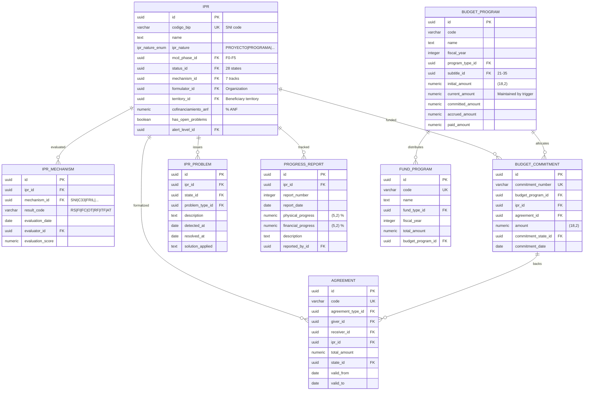

# GORE_OS v3.0 - Entity-Relationship Diagrams

**Modelo**: GORE_OS v3.0 - Sistema de Gestión Institucional para Gobiernos Regionales
**Fecha**: 2026-01-27
**Total Entidades**: 50 tablas en 4 schemas

---

## Resumen de Schemas

| Schema | Tablas | Propósito |
|--------|--------|-----------|
| `meta` | 5 | Átomos fundamentales - Role, Process, Entity, Story |
| `ref` | 3 | Vocabularios controlados - Category Pattern (Gist 14.0) |
| `core` | 40 | Entidades de negocio - IPR, Agreements, Budget, Work Items |
| `txn` | 2 | Event Sourcing - Eventos y Magnitudes (particionadas) |

---

## 1. ERD Completo - Vista General


---

## 2. ERD por Dominio

### 2.1 Dominio: Meta (Átomos Fundamentales)


### 2.2 Dominio: IPR y Presupuesto



### 2.3 Dominio: Convenios y Rendiciones


### 2.4 Dominio: Gobernanza


### 2.5 Dominio: Work Items (Gestión Operativa)


### 2.6 Dominio: Event Sourcing (Transacciones)


---

## 3. Data Dictionary - Entidades Principales

### 3.1 core.ipr (Iniciativa de Inversión Pública Regional)

| Column | Type | Null | Key | Description |
|--------|------|------|-----|-------------|
| id | UUID | No | PK | Identificador único |
| codigo_bip | VARCHAR(20) | No | UK | Código SNI/BIP |
| name | TEXT | No | | Nombre de la iniciativa |
| ipr_nature | ipr_nature_enum | No | | PROYECTO\|PROGRAMA\|PROGRAMA_INVERSION\|ESTUDIO_BASICO\|ANF |
| ipr_type_id | UUID | Yes | FK→ref.category | Tipo funcional |
| mcd_phase_id | UUID | Yes | FK→ref.category | Fase MCD (F0-F5) |
| status_id | UUID | Yes | FK→ref.category | Estado operativo (28 estados) |
| budget_subtitle_id | UUID | Yes | FK→ref.category | Subtítulo presupuestario (21-35) |
| funding_source_id | UUID | Yes | FK→ref.category | Fuente de financiamiento |
| mechanism_id | UUID | Yes | FK→ref.category | Mecanismo de evaluación |
| formulator_id | UUID | Yes | FK→core.organization | Organización formuladora |
| executor_id | UUID | Yes | FK→core.organization | Unidad técnica ejecutora |
| territory_id | UUID | Yes | FK→core.territory | Territorio beneficiario |
| assignee_id | UUID | Yes | FK→core.user | Analista asignado |
| has_open_problems | BOOLEAN | No | | Tiene problemas abiertos |
| alert_level_id | UUID | Yes | FK→ref.category | Nivel de alerta |
| created_at | TIMESTAMPTZ | No | | Fecha creación |
| updated_at | TIMESTAMPTZ | No | | Fecha actualización |
| deleted_at | TIMESTAMPTZ | Yes | | Soft delete |

**Índices:**
- `pk_ipr` (id) - Primary
- `uk_ipr_bip` (codigo_bip) - Unique
- `idx_ipr_phase` (mcd_phase_id)
- `idx_ipr_status` (status_id)
- `idx_ipr_mechanism` (mechanism_id)
- `idx_ipr_phase_mechanism` (mcd_phase_id, mechanism_id) - Composite

### 3.2 core.work_item (Ítem de Trabajo)

| Column | Type | Null | Key | Description |
|--------|------|------|-----|-------------|
| id | UUID | No | PK | Identificador único |
| code | VARCHAR(32) | Yes | UK | Código generado (WI-YYYY-NNNNN) |
| title | TEXT | No | | Título descriptivo |
| description | TEXT | Yes | | Descripción detallada |
| item_type_id | UUID | No | FK→ref.category | Tipo (TAREA\|HITO\|REVISION\|APROBACION) |
| status_id | UUID | No | FK→ref.category | Estado (6 estados con transiciones) |
| assignee_id | UUID | Yes | FK→core.user | Usuario asignado |
| division_id | UUID | Yes | FK→core.organization | División responsable |
| priority_id | UUID | Yes | FK→ref.category | Prioridad |
| due_date | DATE | Yes | | Fecha límite |
| story_id | UUID | Yes | FK→meta.story | Historia origen |
| commitment_id | UUID | Yes | FK→core.operational_commitment | Compromiso origen |
| ipr_id | UUID | Yes | FK→core.ipr | IPR relacionada |
| agreement_id | UUID | Yes | FK→core.agreement | Convenio relacionado |
| parent_id | UUID | Yes | FK→core.work_item | Ítem padre (jerarquía) |
| blocked_by_item_id | UUID | Yes | FK→core.work_item | Bloqueado por |
| blocked_reason | TEXT | Yes | | Razón del bloqueo |
| started_at | TIMESTAMPTZ | Yes | | Inicio real |
| completed_at | TIMESTAMPTZ | Yes | | Finalización |
| verified_by_id | UUID | Yes | FK→core.user | Verificador |
| verified_at | TIMESTAMPTZ | Yes | | Fecha verificación |
| tags | TEXT[] | Yes | | Etiquetas |

**Índices:**
- `idx_work_item_assignee` (assignee_id)
- `idx_work_item_status` (status_id)
- `idx_work_item_due` (due_date)
- `idx_work_item_blocked` (blocked_by_item_id) WHERE blocked_by_item_id IS NOT NULL
- `idx_workitem_tags` (tags) USING GIN

### 3.3 ref.category (Patrón Category - Gist 14.0)

| Column | Type | Null | Key | Description |
|--------|------|------|-----|-------------|
| id | UUID | No | PK | Identificador único |
| scheme | VARCHAR(32) | No | UK(1) | Esquema/namespace (75+ schemes) |
| code | VARCHAR(32) | No | UK(2) | Código dentro del scheme |
| label | TEXT | No | | Etiqueta visible |
| description | TEXT | Yes | | Descripción |
| parent_id | UUID | Yes | FK→ref.category | Categoría padre (jerarquía) |
| parent_code | VARCHAR(32) | Yes | | Código del padre (para seed) |
| phase_id | UUID | Yes | FK→ref.category | Fase asociada (para ipr_state) |
| valid_transitions | JSONB | Yes | | Estados destino válidos |
| sort_order | INTEGER | Yes | | Orden de presentación |

**Schemes principales:**
- `mcd_phase` - Fases MCD (F0-F5)
- `ipr_state` - Estados IPR (28)
- `ipr_nature` - Naturaleza IPR
- `mechanism` - Mecanismos de evaluación (7 tracks)
- `work_item_status` - Estados work item (6)
- `commitment_state` - Estados compromiso (6)
- `agreement_state` - Estados convenio (10)
- `event_type` - Tipos de evento
- `aspect` - Aspectos presupuestarios

---

## 4. Relaciones Clave

### 4.1 Cardinalidades Principales

| Relación | Cardinalidad | Descripción |
|----------|--------------|-------------|
| Organization → Person | 1:M | Una organización emplea muchas personas |
| Person → User | 1:1 | Una persona tiene exactamente un usuario (UNIQUE) |
| IPR → Agreement | 1:M | Una IPR puede tener múltiples convenios |
| IPR → Budget_Commitment | 1:M | Una IPR puede tener múltiples compromisos |
| Agreement → Installment | 1:M | Un convenio tiene múltiples cuotas |
| Committee → Session | 1:M | Un comité celebra múltiples sesiones |
| Session → Session_Agreement | 1:M | Una sesión produce múltiples acuerdos |
| Story → Work_Item | 1:M | Una historia origina múltiples ítems |
| Work_Item → Work_Item | 1:M | Jerarquía padre-hijo |
| Category → Category | 1:M | Jerarquía de categorías |

### 4.2 Polimorfismo (subject_type/subject_id)

Las siguientes tablas usan el patrón polimórfico:

| Tabla | subject_type values | Descripción |
|-------|---------------------|-------------|
| txn.event | ipr, agreement, budget_commitment, work_item | Eventos sobre cualquier entidad |
| txn.magnitude | ipr, budget_program, agreement | Magnitudes financieras |
| core.alert | ipr, agreement, work_item, commitment | Alertas sobre cualquier entidad |
| core.risk | ipr, agreement, project | Riesgos identificados |

---

## 5. Constraints de Integridad

### 5.1 CHECK Constraints

```sql
-- HAIC: Agentes no-humanos requieren humano accountable
CONSTRAINT chk_human_accountable CHECK (
    agent_type = 'HUMAN' OR human_accountable_id IS NOT NULL
)

-- Person-User: Relación 1:1
CONSTRAINT uk_user_person UNIQUE (person_id)

-- Category: Unicidad scheme+code
CONSTRAINT uk_category_scheme_code UNIQUE (scheme, code)

-- Budget Program: Unicidad code+year
CONSTRAINT uk_budget_program UNIQUE (code, fiscal_year)
```

### 5.2 Transiciones de Estado (valid_transitions)

El campo `valid_transitions` en `ref.category` define las transiciones permitidas:

```sql
-- Ejemplo: work_item_status
PENDIENTE → [EN_PROGRESO, CANCELADO]
EN_PROGRESO → [COMPLETADO, BLOQUEADO, CANCELADO]
BLOQUEADO → [EN_PROGRESO]
COMPLETADO → [VERIFICADO, EN_PROGRESO]
VERIFICADO → [] (terminal)
CANCELADO → [] (terminal)
```

---

## 6. Notas de Implementación

### 6.1 Particionamiento

| Tabla | Estrategia | Columna | Particiones |
|-------|------------|---------|-------------|
| txn.event | RANGE | occurred_at | 12 mensuales + default |
| txn.magnitude | RANGE | as_of_date | 4 trimestrales + default |

### 6.2 Índices Especiales

| Tipo | Tablas | Propósito |
|------|--------|-----------|
| GIN | work_item(tags) | Búsqueda en arrays |
| GIN | ipr(metadata), agreement(metadata) | Búsqueda JSONB |
| GIN FTS | ipr(name), work_item(title+description) | Full-text search |
| Partial | *_active WHERE deleted_at IS NULL | Registros activos |

### 6.3 ENUMs

| ENUM | Valores | Usado en |
|------|---------|----------|
| agent_type_enum | HUMAN, AI, ALGORITHMIC, ORGANIZATIONAL, MACHINE, MIXED | meta.role, ref.actor |
| ipr_nature_enum | PROYECTO, PROGRAMA, PROGRAMA_INVERSION, ESTUDIO_BASICO, ANF | core.ipr |
| cognition_level_enum | C0, C1, C2, C3 | meta.role |
| delegation_mode_enum | M1, M2, M3, M4, M5, M6 | meta.role |
| process_layer_enum | STRATEGIC, TACTICAL, OPERATIONAL | meta.process |
| story_status_enum | DRAFT, ENRICHED, APPROVED, RETIRED | meta.story, meta.story_entity |

---

**Fin del Documento ERD**

*Generado: 2026-01-27*
*Modelo: GORE_OS v3.0*
