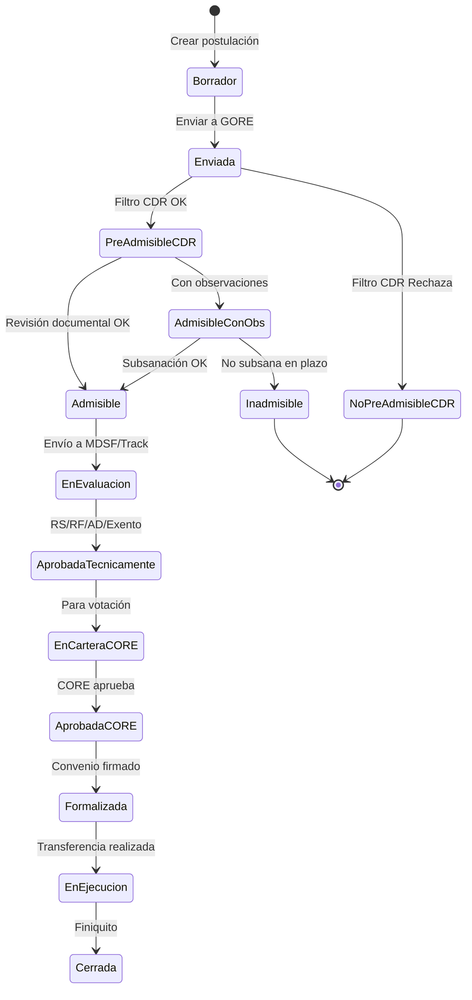

# NEXO GORE — User Journeys, Necesidades y Flujos de Trabajo

## Documento de Diseño UX para Sistema de Gestión de Crisis y Compromisos IPR

**Versión:** 1.0.0  
**Fecha:** 2025-12-03  
**Basado en:** agent_gestor_ipr_360.yaml + kb_gn_018 + kb_gn_019 + kb_gn_020

---

## 1. Perfiles de Usuario del Sistema

El sistema identifica **5 perfiles de usuario** con necesidades, contextos y flujos diferenciados:

| Perfil | Sigla | Contexto Principal | Tono Esperado |
|--------|-------|-------------------|---------------|
| **Formulador Externo** | FE | Municipios, Servicios Públicos, Corporaciones | Didáctico, paso a paso |
| **Analista DIPIR** | AD | Preinversión, Cartera, Evaluación | Operativo, procesos y estados |
| **Profesional DAF** | PD | Presupuesto, Convenios, Rendiciones | Técnico-financiero, clasificadores |
| **Consejero Regional** | CR | CORE, Fiscalización, Transparencia | Formal, síntesis ejecutiva |
| **Jefatura Divisional** | JD | Coordinación, Decisiones, Gobernador | Orientado a decisión, ejecutivo |

---

## 2. Formulador Externo (FE)

### 2.1 Perfil y Contexto

```yaml
Rol: Usuario externo que postula IPR al GORE
Entidades: Municipalidades, Servicios Públicos, Corporaciones, Universidades
Frecuencia_Uso: Esporádica (durante formulación y seguimiento)
Conocimiento_Sistema: Bajo-Medio
Pain_Points:
  - No sabe qué mecanismo de financiamiento usar
  - Desconoce requisitos específicos por tipo de fondo
  - No tiene visibilidad del estado de su postulación
  - Dificultad para subsanar observaciones a tiempo
```

### 2.2 User Journey: Postulación de IPR

```
┌─────────────────────────────────────────────────────────────────────────────┐
│                    JOURNEY: FORMULADOR EXTERNO                               │
├─────────────────────────────────────────────────────────────────────────────┤
│                                                                              │
│  [1. IDEACIÓN]        [2. SELECCIÓN]       [3. FORMULACIÓN]                 │
│       │                    │                     │                          │
│  "Tengo una idea     "¿FNDR? ¿FRIL?       "Completo ficha    "Subo a BIP   │
│   de proyecto"        ¿8%? ¿FRPD?"          IDI/PPR"          y presento"   │
│       │                    │                     │                 │        │
│       ▼                    ▼                     ▼                 ▼        │
│  ┌─────────┐         ┌─────────┐           ┌─────────┐       ┌─────────┐   │
│  │ Consulta│         │ Selector│           │Formulario│      │Postulación│  │
│  │  ERD    │         │Mecanismo│           │  Guiado │       │  Formal │   │
│  └─────────┘         └─────────┘           └─────────┘       └─────────┘   │
│       │                    │                     │                 │        │
│       └────────────────────┴─────────────────────┴─────────────────┘        │
│                                    │                                         │
│  [4. ADMISIBILIDAD]         [5. EVALUACIÓN]          [6. APROBACIÓN]        │
│       │                          │                        │                  │
│  "¿Paso el filtro          "Estado: En MDSF"        "¡Aprobado              │
│   documental?"              "Pendiente RS"           por CORE!"             │
│       │                          │                        │                  │
│       ▼                          ▼                        ▼                  │
│  ┌─────────┐              ┌─────────┐              ┌─────────┐              │
│  │Notificac│              │Seguimien│              │ Convenio│              │
│  │Observac.│              │to Estado│              │  Firma  │              │
│  └─────────┘              └─────────┘              └─────────┘              │
│       │                          │                        │                  │
│  [7. EJECUCIÓN]            [8. RENDICIÓN]           [9. CIERRE]             │
│       │                          │                        │                  │
│  "Reporto avance"          "Rindo gastos            "Proyecto               │
│                             en SISREC"               terminado"             │
│       ▼                          ▼                        ▼                  │
│  ┌─────────┐              ┌─────────┐              ┌─────────┐              │
│  │Informe  │              │Rendición│              │ Finiquito│             │
│  │Avance   │              │Mensual  │              │ Ex-Post │              │
│  └─────────┘              └─────────┘              └─────────┘              │
│                                                                              │
└─────────────────────────────────────────────────────────────────────────────┘
```

### 2.3 Necesidades Funcionales

| ID | Necesidad | Prioridad | Pantalla/Módulo |
|----|-----------|-----------|-----------------|
| FE-001 | Consultar mecanismos de financiamiento disponibles | Alta | `/selector-mecanismo` |
| FE-002 | Ver requisitos específicos por tipo de fondo | Alta | `/requisitos/{fondo}` |
| FE-003 | Formulario guiado de postulación | Alta | `/postulacion/nueva` |
| FE-004 | Subir documentos de respaldo | Alta | `/postulacion/{id}/documentos` |
| FE-005 | Ver estado de mi postulación | Alta | `/mis-postulaciones` |
| FE-006 | Recibir notificaciones de observaciones | Alta | Notificaciones push/email |
| FE-007 | Subsanar observaciones online | Media | `/postulacion/{id}/subsanar` |
| FE-008 | Ver historial de eventos de mi IPR | Media | `/iniciativa/{id}/timeline` |
| FE-009 | Descargar convenio para firma | Media | `/convenio/{id}/descargar` |
| FE-010 | Ingresar rendición mensual | Alta | `/rendicion/nueva` |

### 2.4 Flujo de Trabajo: Postulación



---

## 3. Analista DIPIR (AD)

### 3.1 Perfil y Contexto

```yaml
Rol: Profesional de División de Presupuesto e Inversión Regional
Funciones: Admisibilidad, Evaluación, Seguimiento de cartera, Coordinación BIP
Frecuencia_Uso: Diaria
Conocimiento_Sistema: Alto
Pain_Points:
  - Gestionar cartera grande sin visibilidad consolidada
  - Coordinar múltiples tracks de evaluación en paralelo
  - Detectar proyectos con riesgo de rezago
  - Preparar información para sesiones CORE
```

### 3.2 User Journey: Gestión de Cartera IPR

```
┌─────────────────────────────────────────────────────────────────────────────┐
│                    JOURNEY: ANALISTA DIPIR                                   │
├─────────────────────────────────────────────────────────────────────────────┤
│                                                                              │
│  [1. RECEPCIÓN]        [2. TRIAJE CDR]        [3. ADMISIBILIDAD]            │
│       │                     │                       │                        │
│  "Tengo 15 nuevas      "Preparo tabla       "Reviso requisitos              │
│   postulaciones"        para CDR"            documentales"                   │
│       │                     │                       │                        │
│       ▼                     ▼                       ▼                        │
│  ┌─────────┐          ┌─────────┐            ┌─────────┐                    │
│  │Bandeja  │          │ Sesión  │            │Checklist│                    │
│  │Ingreso  │          │  CDR    │            │Admisib. │                    │
│  └─────────┘          └─────────┘            └─────────┘                    │
│                                                                              │
│  [4. EVALUACIÓN]       [5. CARTERA CORE]      [6. SEGUIMIENTO]              │
│       │                     │                       │                        │
│  "Envío a MDSF,        "Armo carpeta         "Monitoreo avance              │
│   sigo estado RS"       para votación"        de ejecución"                  │
│       │                     │                       │                        │
│       ▼                     ▼                       ▼                        │
│  ┌─────────┐          ┌─────────┐            ┌─────────┐                    │
│  │ Tracks  │          │ Cartera │            │Dashboard│                    │
│  │Evaluac. │          │  CORE   │            │Ejecución│                    │
│  └─────────┘          └─────────┘            └─────────┘                    │
│                                                                              │
│  [7. PROBLEMAS]        [8. MODIFICACIONES]    [9. CIERRE]                   │
│       │                     │                       │                        │
│  "Detecto proyecto     "Tramito aumento      "Verifico carpeta              │
│   con rezago"           de costo/plazo"       ex-post en BIP"               │
│       │                     │                       │                        │
│       ▼                     ▼                       ▼                        │
│  ┌─────────┐          ┌─────────┐            ┌─────────┐                    │
│  │Gestión  │          │Modifica-│            │ Cierre  │                    │
│  │Problemas│          │ ciones  │            │ IPR     │                    │
│  └─────────┘          └─────────┘            └─────────┘                    │
│                                                                              │
└─────────────────────────────────────────────────────────────────────────────┘
```

### 3.3 Necesidades Funcionales

| ID | Necesidad | Prioridad | Pantalla/Módulo |
|----|-----------|-----------|-----------------|
| AD-001 | Dashboard de cartera con estados consolidados | Alta | `/dashboard/cartera` |
| AD-002 | Bandeja de postulaciones nuevas por asignar | Alta | `/bandeja/ingreso` |
| AD-003 | Checklist de admisibilidad por mecanismo | Alta | `/admisibilidad/{id}` |
| AD-004 | Vista de tracks de evaluación en paralelo | Alta | `/evaluacion/tracks` |
| AD-005 | Alertas de vencimiento de plazos MDSF | Alta | Notificaciones |
| AD-006 | Generador de carpeta CORE (oficios, fichas) | Alta | `/core/preparar-cartera` |
| AD-007 | Semáforos de ejecución (verde/amarillo/rojo) | Alta | `/ejecucion/semaforos` |
| AD-008 | Registro de problemas/nudos por IPR | Alta | `/problemas/registrar` |
| AD-009 | Tramitador de modificaciones | Media | `/modificaciones/tramitar` |
| AD-010 | Verificador de cierre (ex-post BIP) | Media | `/cierre/verificar` |
| AD-011 | Exportar reportes para CGR/DIPRES | Media | `/reportes/exportar` |

### 3.4 Flujo de Trabajo: Gestión de Problemas IPR

```
┌─────────────────────────────────────────────────────────────────────────────┐
│           FLUJO: GESTIÓN DE PROBLEMAS/NUDOS EN EJECUCIÓN                     │
├─────────────────────────────────────────────────────────────────────────────┤
│                                                                              │
│  ┌──────────────┐     ┌──────────────┐     ┌──────────────┐                 │
│  │ 1. DETECTAR  │────►│ 2. REGISTRAR │────►│ 3. CLASIFICAR│                 │
│  │   Problema   │     │   Problema   │     │   Severidad  │                 │
│  └──────────────┘     └──────────────┘     └──────────────┘                 │
│         │                    │                    │                          │
│    Fuentes:             Datos:              Categorías:                      │
│    - Informe UT         - IPR afectada      - CRITICO                       │
│    - Visita ITO         - Descripción       - ALTO                          │
│    - Alerta sistema     - Causa raíz        - MEDIO                         │
│    - Comunicación EE    - Impacto ppto      - BAJO                          │
│                         - Impacto plazo                                      │
│                                                                              │
│  ┌──────────────┐     ┌──────────────┐     ┌──────────────┐                 │
│  │ 4. ASIGNAR   │────►│ 5. GESTIONAR │────►│ 6. RESOLVER  │                 │
│  │  Responsable │     │   Acciones   │     │   o Escalar  │                 │
│  └──────────────┘     └──────────────┘     └──────────────┘                 │
│         │                    │                    │                          │
│    Roles:               Acciones:            Resultados:                     │
│    - Analista DIPIR     - Reunión UT         - RESUELTO                     │
│    - Jefe Preinversión  - Oficio EE          - ESCALADO_JEFATURA            │
│    - RTF               - Modif. ppto         - ESCALADO_GOBERNADOR          │
│    - ITO               - Aumento plazo       - JUDICIALIZADO                │
│                                                                              │
│  ┌──────────────┐                                                            │
│  │ 7. CERRAR    │                                                            │
│  │  Problema    │                                                            │
│  └──────────────┘                                                            │
│         │                                                                    │
│    Documentar:                                                               │
│    - Lección aprendida                                                       │
│    - Acción correctiva                                                       │
│    - Impacto final                                                           │
│                                                                              │
└─────────────────────────────────────────────────────────────────────────────┘
```

---

## 4. Profesional DAF (PD)

### 4.1 Perfil y Contexto

```yaml
Rol: Profesional de División de Administración y Finanzas
Funciones: Presupuesto, CDPs, Convenios, Rendiciones, SIGFE
Frecuencia_Uso: Diaria
Conocimiento_Sistema: Alto (financiero-contable)
Pain_Points:
  - Coordinar múltiples modificaciones presupuestarias
  - Controlar rendiciones pendientes de múltiples ejecutores
  - Cumplir plazos de cierre presupuestario
  - Mantener coherencia SIGFE-BIP-SISREC
```

### 4.2 User Journey: Gestión Financiera IPR

```
┌─────────────────────────────────────────────────────────────────────────────┐
│                    JOURNEY: PROFESIONAL DAF                                  │
├─────────────────────────────────────────────────────────────────────────────┤
│                                                                              │
│  [1. CDP]              [2. CONVENIO]          [3. TRANSFERENCIA]            │
│       │                     │                       │                        │
│  "Emito CDP para       "Elaboro borrador      "Programo pago                │
│   iniciativa aprobada"  de convenio"           según devengo"               │
│       │                     │                       │                        │
│       ▼                     ▼                       ▼                        │
│  ┌─────────┐          ┌─────────┐            ┌─────────┐                    │
│  │Emisión  │          │Generador│            │Programa-│                    │
│  │  CDP    │          │Convenios│            │ción Pago│                    │
│  └─────────┘          └─────────┘            └─────────┘                    │
│                                                                              │
│  [4. RENDICIÓN]        [5. OBSERVACIONES]     [6. CONTABILIZACIÓN]          │
│       │                     │                       │                        │
│  "Reviso rendición     "Comunico obs.         "Contabilizo en               │
│   en SISREC"            al ejecutor"           SIGFE"                       │
│       │                     │                       │                        │
│       ▼                     ▼                       ▼                        │
│  ┌─────────┐          ┌─────────┐            ┌─────────┐                    │
│  │Control  │          │ Gestión │            │Registro │                    │
│  │Rendic.  │          │  Obs.   │            │ SIGFE   │                    │
│  └─────────┘          └─────────┘            └─────────┘                    │
│                                                                              │
│  [7. MODIFICACIONES]   [8. CIERRE ANUAL]      [9. DEUDA FLOTANTE]           │
│       │                     │                       │                        │
│  "Proceso reasignación "Verifico              "Calculo y tramito            │
│   o suplemento"         compromisos"           deuda flotante"              │
│       │                     │                       │                        │
│       ▼                     ▼                       ▼                        │
│  ┌─────────┐          ┌─────────┐            ┌─────────┐                    │
│  │Modifica-│          │ Cierre  │            │  Deuda  │                    │
│  │ ciones  │          │  Anual  │            │Flotante │                    │
│  └─────────┘          └─────────┘            └─────────┘                    │
│                                                                              │
└─────────────────────────────────────────────────────────────────────────────┘
```

### 4.3 Necesidades Funcionales

| ID | Necesidad | Prioridad | Pantalla/Módulo |
|----|-----------|-----------|-----------------|
| PD-001 | Emisión de CDP con validación de disponibilidad | Alta | `/cdp/emitir` |
| PD-002 | Generador de convenios desde plantillas | Alta | `/convenios/generar` |
| PD-003 | Programación de pagos con reglas de devengo | Alta | `/pagos/programar` |
| PD-004 | Dashboard de rendiciones pendientes | Alta | `/rendiciones/dashboard` |
| PD-005 | Vista integrada SISREC (API o embebida) | Alta | `/rendiciones/sisrec` |
| PD-006 | Alertas de ejecutores con rendición vencida | Alta | Notificaciones |
| PD-007 | Registro de observaciones a rendiciones | Media | `/rendiciones/{id}/observar` |
| PD-008 | Tramitador de modificaciones presupuestarias | Alta | `/modificaciones/tramitar` |
| PD-009 | Verificador de requisitos CORE vs excepciones | Media | `/modificaciones/verificar-core` |
| PD-010 | Calculadora de deuda flotante | Media | `/cierre/deuda-flotante` |
| PD-011 | Sincronización con SIGFE | Alta | Integración backend |

### 4.4 Flujo de Trabajo: Control de Rendiciones

```
┌─────────────────────────────────────────────────────────────────────────────┐
│              FLUJO: CONTROL DE RENDICIONES (UCR/DAF)                         │
├─────────────────────────────────────────────────────────────────────────────┤
│                                                                              │
│  ┌──────────────────────────────────────────────────────────────────────┐   │
│  │                    MODALIDAD SISREC (ESTÁNDAR)                        │   │
│  ├──────────────────────────────────────────────────────────────────────┤   │
│  │                                                                       │   │
│  │  [Ejecutor]           [RTF]              [Jefe DAF]         [UCR]    │   │
│  │      │                  │                    │                │       │   │
│  │  Crea informe      Revisa técnica       Firma FEA       Contabiliza  │   │
│  │  en SISREC         y financiera         aprobación       en SIGFE    │   │
│  │      │                  │                    │                │       │   │
│  │      ▼                  ▼                    ▼                ▼       │   │
│  │  ┌───────┐         ┌───────┐           ┌───────┐        ┌───────┐   │   │
│  │  │15 días│         │7 días │           │1 día  │        │2 días │   │   │
│  │  │hábiles│         │hábiles│           │hábil  │        │hábiles│   │   │
│  │  └───────┘         └───────┘           └───────┘        └───────┘   │   │
│  │                         │                                            │   │
│  │                    ¿Observa?                                         │   │
│  │                    /        \                                        │   │
│  │                  Sí          No                                      │   │
│  │                  │            │                                      │   │
│  │            Devuelve a     Aprueba                                    │   │
│  │            Ejecutor                                                  │   │
│  │                                                                       │   │
│  └──────────────────────────────────────────────────────────────────────┘   │
│                                                                              │
│  ┌──────────────────────────────────────────────────────────────────────┐   │
│  │                    MODALIDAD LEGADO (PAPEL)                           │   │
│  ├──────────────────────────────────────────────────────────────────────┤   │
│  │                                                                       │   │
│  │  [Ejecutor] → [Of.Partes] → [UCR] → [RTF] → [UCR] → [Archivo]       │   │
│  │                                                                       │   │
│  │  Presenta     Registra     Deriva   Revisa   Contabiliza  Guarda    │   │
│  │  en papel     y deriva             técnico   en SIGFE     expediente│   │
│  │                                                                       │   │
│  └──────────────────────────────────────────────────────────────────────┘   │
│                                                                              │
└─────────────────────────────────────────────────────────────────────────────┘
```

---

## 5. Consejero Regional (CR)

### 5.1 Perfil y Contexto

```yaml
Rol: Miembro electo del Consejo Regional (CORE)
Funciones: Aprobar/rechazar financiamiento, Fiscalizar, Normar
Frecuencia_Uso: Semanal (sesiones) + consultas ad-hoc
Conocimiento_Sistema: Variable (político, no técnico)
Pain_Points:
  - Recibir información muy técnica y difícil de digerir
  - No tener visibilidad territorial de impacto
  - Preparar sesiones con carpetas voluminosas
  - Verificar cumplimiento de acuerdos anteriores
```

### 5.2 User Journey: Sesión CORE

```
┌─────────────────────────────────────────────────────────────────────────────┐
│                    JOURNEY: CONSEJERO REGIONAL                               │
├─────────────────────────────────────────────────────────────────────────────┤
│                                                                              │
│  [1. PRE-SESIÓN]       [2. ANÁLISIS]          [3. VOTACIÓN]                 │
│       │                     │                       │                        │
│  "Recibo carpeta       "Reviso fichas         "Voto en sesión               │
│   digital de cartera"   de mi provincia"       plenaria"                    │
│       │                     │                       │                        │
│       ▼                     ▼                       ▼                        │
│  ┌─────────┐          ┌─────────┐            ┌─────────┐                    │
│  │Carpeta  │          │ Vista   │            │Sistema  │                    │
│  │Digital  │          │Provincia│            │Votación │                    │
│  └─────────┘          └─────────┘            └─────────┘                    │
│                                                                              │
│  [4. FISCALIZACIÓN]    [5. TRANSPARENCIA]     [6. CONSULTA]                 │
│       │                     │                       │                        │
│  "Consulto estado      "Verifico publicación  "Pregunto por IPR             │
│   de proyectos"         de acuerdos"           específica"                  │
│       │                     │                       │                        │
│       ▼                     ▼                       ▼                        │
│  ┌─────────┐          ┌─────────┐            ┌─────────┐                    │
│  │Dashboard│          │Portal   │            │ Buscador│                    │
│  │Ejecución│          │Transpare│            │  IPR    │                    │
│  └─────────┘          └─────────┘            └─────────┘                    │
│                                                                              │
└─────────────────────────────────────────────────────────────────────────────┘
```

### 5.3 Necesidades Funcionales

| ID | Necesidad | Prioridad | Pantalla/Módulo |
|----|-----------|-----------|-----------------|
| CR-001 | Carpeta digital de cartera para votación | Alta | `/core/carpeta-sesion` |
| CR-002 | Fichas resumen ejecutivo por IPR | Alta | `/core/ficha/{id}` |
| CR-003 | Vista por provincia (mis comunas) | Alta | `/core/mi-provincia` |
| CR-004 | Mapa territorial de inversiones | Media | `/core/mapa` |
| CR-005 | Dashboard de ejecución regional | Alta | `/core/dashboard` |
| CR-006 | Histórico de votaciones y acuerdos | Media | `/core/acuerdos` |
| CR-007 | Verificador de cumplimiento de acuerdos | Media | `/core/seguimiento-acuerdos` |
| CR-008 | Buscador de IPR por código/nombre | Alta | `/buscar` |
| CR-009 | Portal de transparencia (Glosa 16) | Alta | `/transparencia` |
| CR-010 | Exportar información a PDF/Excel | Media | Exportación |

### 5.4 Flujo de Trabajo: Preparación Sesión CORE

```
┌─────────────────────────────────────────────────────────────────────────────┐
│              FLUJO: PREPARACIÓN Y VOTACIÓN CARTERA CORE                      │
├─────────────────────────────────────────────────────────────────────────────┤
│                                                                              │
│  [DIPIR]                           [GOBERNADOR]         [CORE]              │
│     │                                   │                  │                 │
│     ▼                                   │                  │                 │
│  ┌──────────────────┐                   │                  │                 │
│  │ Analiza cartera  │                   │                  │                 │
│  │ con RS/RF/AD     │                   │                  │                 │
│  └────────┬─────────┘                   │                  │                 │
│           │                             │                  │                 │
│           ▼                             │                  │                 │
│  ┌──────────────────┐                   │                  │                 │
│  │ Elabora carpeta  │                   │                  │                 │
│  │ (oficios, fichas)│                   │                  │                 │
│  └────────┬─────────┘                   │                  │                 │
│           │                             │                  │                 │
│           ▼                             ▼                  │                 │
│  ┌──────────────────┐          ┌──────────────────┐       │                 │
│  │ Presenta cartera │─────────►│ V°B° y firma     │       │                 │
│  │ a Gobernador     │          │ oficio a CORE    │       │                 │
│  └──────────────────┘          └────────┬─────────┘       │                 │
│                                         │                  │                 │
│                                         ▼                  ▼                 │
│                                ┌──────────────────────────────┐             │
│                                │   CARTERA ENVIADA A CORE     │             │
│                                └───────────────┬──────────────┘             │
│                                                │                             │
│                                                ▼                             │
│                                ┌──────────────────────────────┐             │
│                                │  Análisis en Comisiones      │             │
│                                │  (Comisión de Inversiones)   │             │
│                                └───────────────┬──────────────┘             │
│                                                │                             │
│                                                ▼                             │
│                                ┌──────────────────────────────┐             │
│                                │  Votación en Sesión Plenaria │             │
│                                │  (Aprueba / Rechaza)         │             │
│                                └───────────────┬──────────────┘             │
│                                                │                             │
│                                                ▼                             │
│                                ┌──────────────────────────────┐             │
│                                │  Secretario emite Certificado│             │
│                                │  de Acuerdo CORE             │             │
│                                └──────────────────────────────┘             │
│                                                                              │
└─────────────────────────────────────────────────────────────────────────────┘
```

---

## 6. Jefatura Divisional (JD)

### 6.1 Perfil y Contexto

```yaml
Rol: Jefe/a de División (DIPIR, DAF, DIPLADE, DIDESOH, DIFROL, etc.)
Funciones: Coordinar equipos, Tomar decisiones, Reportar a Gobernador
Frecuencia_Uso: Diaria
Conocimiento_Sistema: Alto (estratégico-operativo)
Pain_Points:
  - Visibilidad consolidada de la gestión divisional
  - Identificar cuellos de botella y problemas escalados
  - Preparar información para reuniones con Gobernador
  - Coordinar con otras divisiones
```

### 6.2 User Journey: Gestión Ejecutiva

```
┌─────────────────────────────────────────────────────────────────────────────┐
│                    JOURNEY: JEFATURA DIVISIONAL                              │
├─────────────────────────────────────────────────────────────────────────────┤
│                                                                              │
│  [1. INICIO DÍA]       [2. MONITOREO]         [3. DECISIONES]               │
│       │                     │                       │                        │
│  "Reviso dashboard     "Identifico IPR        "Resuelvo problemas           │
│   de gestión"           con alertas"           escalados"                   │
│       │                     │                       │                        │
│       ▼                     ▼                       ▼                        │
│  ┌─────────┐          ┌─────────┐            ┌─────────┐                    │
│  │Dashboard│          │ Alertas │            │Bandeja  │                    │
│  │Ejecutivo│          │ y KPIs  │            │Escalados│                    │
│  └─────────┘          └─────────┘            └─────────┘                    │
│                                                                              │
│  [4. COORDINACIÓN]     [5. REPORTES]          [6. CDR/COMITÉS]              │
│       │                     │                       │                        │
│  "Reúno con otras      "Preparo informe       "Participo en CDR             │
│   divisiones"           para Gobernador"       y comités internos"          │
│       │                     │                       │                        │
│       ▼                     ▼                       ▼                        │
│  ┌─────────┐          ┌─────────┐            ┌─────────┐                    │
│  │Agenda   │          │Generador│            │ Sesiones│                    │
│  │Reuniones│          │Reportes │            │CDR/Comit│                    │
│  └─────────┘          └─────────┘            └─────────┘                    │
│                                                                              │
└─────────────────────────────────────────────────────────────────────────────┘
```

### 6.3 Necesidades Funcionales

| ID | Necesidad | Prioridad | Pantalla/Módulo |
|----|-----------|-----------|-----------------|
| JD-001 | Dashboard ejecutivo con KPIs divisionales | Alta | `/ejecutivo/dashboard` |
| JD-002 | Alertas de problemas escalados | Alta | `/ejecutivo/escalados` |
| JD-003 | Vista de carga de trabajo por analista | Media | `/ejecutivo/equipo` |
| JD-004 | Semáforos de ejecución presupuestaria | Alta | `/ejecutivo/ejecucion` |
| JD-005 | Generador de informes para Gobernador | Alta | `/ejecutivo/informes` |
| JD-006 | Agenda de sesiones CDR y comités | Media | `/ejecutivo/agenda` |
| JD-007 | Seguimiento de compromisos Gobernador | Alta | `/compromisos/seguimiento` |
| JD-008 | Comparativo histórico (año actual vs anterior) | Media | `/ejecutivo/comparativo` |
| JD-009 | Exportar información a presentaciones | Media | Exportación |
| JD-010 | Vista de coordinación interdivisional | Media | `/ejecutivo/coordinacion` |

### 6.4 Flujo de Trabajo: Gestión de Compromisos

```
┌─────────────────────────────────────────────────────────────────────────────┐
│              FLUJO: GESTIÓN DE COMPROMISOS OPERATIVOS                        │
├─────────────────────────────────────────────────────────────────────────────┤
│                                                                              │
│  ┌──────────────┐     ┌──────────────┐     ┌──────────────┐                 │
│  │ 1. ORIGEN    │────►│ 2. REGISTRAR │────►│ 3. ASIGNAR   │                 │
│  │  Compromiso  │     │  Compromiso  │     │  Responsable │                 │
│  └──────────────┘     └──────────────┘     └──────────────┘                 │
│         │                    │                    │                          │
│    Fuentes:             Datos:               Asignación:                     │
│    - Reunión Gobernador - Descripción        - División                      │
│    - Sesión CORE        - Plazo              - Persona                       │
│    - Prensa            - IPR vinculada       - Fecha límite                  │
│    - Visita terreno    - Tipo compromiso                                     │
│                                                                              │
│  ┌──────────────┐     ┌──────────────┐     ┌──────────────┐                 │
│  │ 4. EJECUTAR  │────►│ 5. REPORTAR  │────►│ 6. CERRAR    │                 │
│  │   Acciones   │     │   Avance     │     │  Compromiso  │                 │
│  └──────────────┘     └──────────────┘     └──────────────┘                 │
│         │                    │                    │                          │
│    Acciones:            Reportes:            Cierre:                         │
│    - Gestiones         - Avance %            - Verificar cumplimiento        │
│    - Reuniones         - Dificultades        - Documentar resultado          │
│    - Oficios           - Próximos pasos      - Lección aprendida             │
│                                                                              │
└─────────────────────────────────────────────────────────────────────────────┘
```

---

## 7. Matriz de Pantallas por Perfil

| Pantalla | FE | AD | PD | CR | JD |
|----------|:--:|:--:|:--:|:--:|:--:|
| Dashboard Cartera | - | ✅ | - | - | ✅ |
| Dashboard Ejecución | - | ✅ | ✅ | ✅ | ✅ |
| Dashboard Rendiciones | - | - | ✅ | - | ✅ |
| Dashboard Ejecutivo | - | - | - | - | ✅ |
| Mis Postulaciones | ✅ | - | - | - | - |
| Bandeja Ingreso | - | ✅ | - | - | - |
| Checklist Admisibilidad | - | ✅ | - | - | - |
| Tracks Evaluación | - | ✅ | - | - | - |
| Cartera CORE | - | ✅ | - | ✅ | - |
| Emisión CDP | - | - | ✅ | - | - |
| Generador Convenios | - | - | ✅ | - | - |
| Control Rendiciones | - | - | ✅ | - | - |
| Gestión Problemas | - | ✅ | - | - | ✅ |
| Modificaciones Ppto | - | ✅ | ✅ | - | - |
| Compromisos | - | - | - | - | ✅ |
| Mapa Territorial | - | - | - | ✅ | ✅ |
| Portal Transparencia | ✅ | - | - | ✅ | - |
| Buscador IPR | ✅ | ✅ | ✅ | ✅ | ✅ |

---

## 8. KPIs por Perfil

### 8.1 Formulador Externo
- Tiempo promedio de respuesta a observaciones
- % de postulaciones admitidas a la primera

### 8.2 Analista DIPIR
- Tiempo promedio ciclo IPR (ingreso → aprobación CORE)
- % cartera con semáforo verde
- N° de problemas activos por analista

### 8.3 Profesional DAF
- % ejecución presupuestaria mensual
- N° de rendiciones pendientes >30 días
- Tiempo promedio de contabilización

### 8.4 Consejero Regional
- N° de IPR aprobadas por sesión
- % ejecución por provincia
- Cumplimiento de acuerdos anteriores

### 8.5 Jefatura Divisional
- Cumplimiento de compromisos en plazo
- N° de problemas escalados sin resolver
- Desviación presupuestaria vs. programado

---

## 9. Implementación Actual

### 9.1 Artefactos Creados

| Artefacto | Ruta | Descripción |
|-----------|------|-------------|
| `DashboardService` | `app/services/dashboard_service.py` | Lógica de dashboards por perfil |
| `KPIService` | `app/services/kpi_service.py` | Cálculo de KPIs operacionales |
| `ejecutivo_bp` | `app/routes/ejecutivo.py` | Rutas de dashboard ejecutivo |
| Template Jefatura | `app/templates/dashboard/ejecutivo.html` | Dashboard para Jefaturas |

### 9.2 Rutas Disponibles

| Ruta | Método | Perfil | Descripción |
|------|--------|--------|-------------|
| `/ejecutivo/dashboard` | GET | Todos | Dashboard adaptado al perfil |
| `/ejecutivo/api/kpis/<perfil>` | GET | API | KPIs por perfil (JSON) |
| `/ejecutivo/api/alertas` | GET | API | Alertas activas (JSON) |
| `/ejecutivo/api/compromisos-vencidos-division` | GET | API | Vencidos por división |
| `/compromisos/` | GET | AD, PD, JD | Lista de compromisos |
| `/compromisos/nuevo` | GET/POST | AD, PD, JD | Crear compromiso |
| `/compromisos/<id>` | GET | Todos | Ver detalle |
| `/problemas/` | GET | AD, JD | Lista de problemas |
| `/ipr/` | GET | Todos | Lista de IPR |

### 9.3 Modelos de Datos Utilizados

```
gore_inversion.iniciativa (Iniciativa)
    ├── responsable_id → Usuario
    ├── division_responsable_id → Division
    ├── nivel_alerta (NORMAL, ATENCION, ALTO, CRITICO)
    └── tiene_problemas_abiertos

gore_ejecucion.problema_ipr (ProblemaIPR)
    ├── iniciativa_id → Iniciativa
    ├── tipo (TECNICO, FINANCIERO, LEGAL, ...)
    ├── impacto (BAJO, MEDIO, ALTO, CRITICO)
    └── estado (ABIERTO, EN_GESTION, RESUELTO, CERRADO)

gore_ejecucion.compromiso_operativo (CompromisoOperativo)
    ├── iniciativa_id → Iniciativa (derivado)
    ├── problema_id → ProblemaIPR
    ├── tipo_id → TipoCompromisoOperativo
    ├── responsable_id → Usuario
    ├── division_id → Division
    └── estado (PENDIENTE, EN_PROGRESO, COMPLETADO, VERIFICADO)

gore_ejecucion.alerta_ipr (AlertaIPR)
    ├── iniciativa_id → Iniciativa
    ├── target_tipo + target_id (discriminador)
    ├── tipo (RENDICION_VENCIDA, CUOTA_PROXIMA_VENCER, ...)
    └── nivel (INFO, ATENCION, ALTO, CRITICO)
```

---

## 10. Próximos Pasos

1. ✅ **Documentar journeys** - Completado
2. ✅ **Crear servicios de dashboard** - `DashboardService`, `KPIService`
3. ✅ **Crear rutas ejecutivas** - `ejecutivo_bp`
4. ✅ **Template dashboard jefatura** - `ejecutivo.html`
5. 🔄 **Crear templates restantes** - DIPIR, DAF, Consejero
6. 🔄 **Integrar con gore_presupuesto** - Para KPIs de ejecución
7. 🔄 **Integrar con gore_territorial** - Para vista por provincia
8. 🔄 **Integrar con gore_gobernanza** - Para acuerdos CORE
9. 📋 **Validar con usuarios** - Testing con perfiles reales
